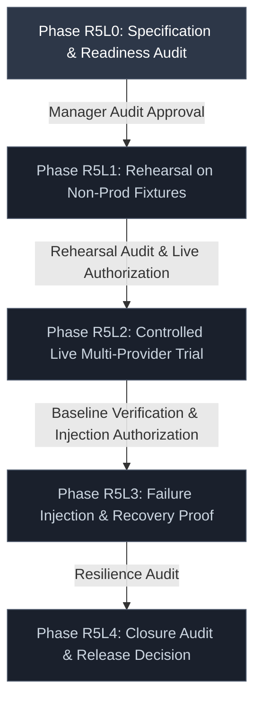

# Milestone R5L: Production Trial Specification & Operational Readiness Audit

> **Document Status**: `DRAFT / SPECIFICATION UNDER AUDIT (HOLD)`
> **Milestone Family**: `R5L (Phases R5L0 through R5L4)`
> **Authoritative Baseline Commit**: `0dbf81ad74a7b630c65e232ab85add90a7e0a082`
> **Baseline Git Tree SHA**: `e6afe8d9bcd84f15638a54e442bd196c89db29b1`
> **Historical Verification Evidence**: Workflow Run [35180140476](https://github.com/thanhtuyen662002/Agent-Forge/actions/runs/35180140476)
> **Trial Branch**: `docs/r5l0-production-trial-readiness`
> **Pull Request**: [#56](https://github.com/thanhtuyen662002/Agent-Forge/pull/56) (Draft)

---

## A. Purpose & Authority Boundaries

This document establishes the formal specification, operational protocol, and readiness criteria for the **AgentForge R5L Production Trial** milestone family.

The production trial provides empirical verification of the multi-role, multi-account, and context-continuous agent architecture implemented across milestones **R5A through R5J**.


### Strict Authority Boundary
1. **R5L0 Authority Limit**: Milestone R5L0 is strictly restricted to specification authoring, operational planning, and readiness auditing. Merging R5L0 does **not** authorize executing live trials, resolving real credentials, consuming external provider tokens, dispatching external agent subprocesses, or mutating production data.
2. **Phase Decoupling & Future-Safe Source Identity**: Commit `0dbf81ad74a7b630c65e232ab85add90a7e0a082` serves strictly as the authoritative planning baseline for R5L0. Every subsequent execution phase (R5L1 through R5L4) must explicitly record its own approved phase source commit and Git tree SHA containing the merged R5L0 plan. Any downstream commit drift requires an independent manager audit before execution. Historical workflow run `35180140476` documents R5J closure and is not the CI authority for future phases.
3. **No Fabricated Capabilities**: Every lifecycle capability, entity, table, state, tool, and error code asserted in this plan is verified against active repository code in `src/core/`, `src/mcp/`, and schema migrations 1–24.
4. **Classification Taxonomy**: All entities, evidence fields, and trial procedures are classified into four explicit categories:
   - `[IMPLEMENTED AND SOURCE-VERIFIED]`: Active runtime code or database schema.
   - `[OPERATOR-PRODUCED TRIAL ARTIFACT]`: Manifests, logs, or reports compiled by human operators.
   - `[PROPOSED — REQUIRES IMPLEMENTATION]`: Tooling or harnesses needed before specific phases.
   - `[UNRESOLVED READINESS INPUT]`: Operational configurations, accounts, or approvals not yet provisioned.

---

## B. Phase Model

The R5L trial framework is structured into five sequential phases. Progression between phases is non-automatic and requires formal managerial review and recorded approval.



### 1. Phase R5L0 — Specification and Readiness Audit `[CURRENT PHASE]`
- **Entry Criteria**: Milestones R5A–R5J merged to `main`; post-merge CI green; baseline commit `0dbf81ad74a7b630c65e232ab85add90a7e0a082` audited.
- **Permitted Actions**: Architectural analysis; documentation authoring; schema inspection; operational topology modeling; readiness gap cataloging.
- **Required Evidence**:
  - Authoritative `docs/R5L_PRODUCTION_TRIAL_PLAN.md` (this document);
  - Reconciled `docs/R5_AGENT_FABRIC_ARCHITECTURE.md` showing R5A–R5J `CLOSED_SUCCESSFULLY`, R5K `DEFERRED_OPTIONAL`, and R5L0 as `CURRENT_GATE`;
  - Clean validation command reports (`git diff --check`, `npx tsc --noEmit`, `npm test`, `npm run build`, repository-reference audit).
- **Stop Conditions**: Discovery of contract contradictions between plan and source; unverified baseline commit; runtime code modification.
- **Exit Criteria**: Approved Pull Request merging R5L0 documentation to `main`.
- **Approval Required**: Project Lead and Security Auditor.

### 2. Phase R5L1 — Rehearsal Using Controlled / Non-Production Fixtures `[UNAUTHORIZED — REQUIRES MANAGER DECISION]`
- **Nature of Actions**:
  - *Automated Product Action*: Execution of implemented lifecycle steps against local synthetic Git repositories and isolated SQLite test databases.
  - *Explicit Human / Operator Action*: Setting up synthetic test fixtures, executing manual bridge steps (if exercised), initiating verification admission, issuing reviewer session tokens, and recording observations.
  - *Audit-Only Observation*: Observing reviewer MCP reads via Stdio; verifying zero database mutation.
  - *Capability Gaps*: Evidence bundle compilation is an operator-produced artifact; failure injection harness is not yet implemented.
- **Entry Criteria**: R5L0 merged to `main`; explicit manager decision authorizing R5L1; approved rehearsal source commit and Git tree SHA recorded; synthetic fixtures provisioned without external network or real API credentials.
- **Permitted Actions**: Rehearsal execution of the 15-step lifecycle using non-production test projects, synthetic commits, and isolated SQLite database instances.
- **Required Evidence**:
  - Operator-compiled rehearsal evidence manifest (sufficient for R5L1 exit);
  - Zero-mutation verification check during reviewer read (`SELECT total_changes()` unchanged);
  - Clean teardown receipt for rehearsal worktrees and temporary databases.
- **Stop Conditions**: Any unexpected crash, schema migration failure, deadlock, assertion failure, or worktree leak.
- **Exit Criteria**: All implemented lifecycle steps complete successfully in rehearsal with valid durable records and zero database corruption.
- **Approval Required**: Trial Lead and Principal Engineer.

### 3. Phase R5L2 — Controlled Live Multi-Provider Trial `[UNAUTHORIZED — REQUIRES SEPARATE AUTHORIZATION]`
- **Nature of Actions**:
  - *Automated Product Action*: Live CLI adapter dispatch (e.g., Gemini CLI, Claude CLI); automated verification test suite execution; adjudication settlement.
  - *Explicit Human / Operator Action*: Preflight checklist sign-off; credential profile verification; task creation; manual bridge relay (if used); owner adjudication admission; reviewer MCP client connection.
  - *Audit-Only Observation*: Reviewer package inspection via Stdio MCP; log redaction verification.
  - *Capability Gaps*: Automated evidence bundle collector is optional; verified operator-produced bundle matching SQLite hashes byte-for-byte is acceptable.
- **Entry Criteria**: Phase R5L1 completed and audited; formal manager decision authorizing R5L2; approved live trial source commit and packaging artifact recorded; at least two distinct authenticated provider accounts verified in isolation.
- **Permitted Actions**: Single-task live execution through authentic CLI providers; live reviewer read via Stdio MCP server.
- **Required Evidence**:
  - Operator-compiled live trial evidence manifest matching durable SQLite records byte-for-byte;
  - Coder submission receipt and adjudication event log;
  - Reviewer MCP zero-mutation confirmation;
  - Reviewer projection hash matching stored session hash.
- **Stop Conditions**: Any plaintext secret emitted to logs or DB; self-review detection; worktree dirty state leak; unhandled provider rate limit.
- **Exit Criteria**: Successful automated verification, independent reviewer evaluation, and durable settlement.
- **Approval Required**: Project Lead and Executive Sponsor.

### 4. Phase R5L3 — Failure Injection, Recovery, and Continuity Proof `[UNAUTHORIZED — HARNESS NOT IMPLEMENTED]`
- **Nature of Actions**:
  - *Automated Product Action*: Recovery scanner execution (`CoderSubmissionAdjudicationRecoveryScanner`, `CrashRecoveryService`); health observation ordering; cooldown backoff.
  - *Explicit Human / Operator Action*: Injecting supported fault scenarios via public service APIs; inspecting recovery audit events; resolving `NEEDS_HUMAN` fallback states.
  - *Audit-Only Observation*: Verification that invalid inputs fail closed without mutating persistent state.
  - *Capability Gaps*: Automated deterministic failure injection harness is currently `BLOCKED — NOT IMPLEMENTED`.
- **Entry Criteria**: Phase R5L2 completed successfully; baseline database snapshot archived; safe failure injection plan approved.
- **Permitted Actions**: Execution of supported, non-destructive failure scenarios.
- **Required Evidence**:
  - Structured event logs proving fail-closed rejection for tested faults;
  - Monotonic health observation ordering (`account_order`);
  - Restart recovery verification proving state machine resumption and fail-closed branching without duplicate side effects or automatic verification re-execution.
- **Stop Conditions**: Data loss, split-brain task ownership, leaked credentials, or non-deterministic recovery.
- **Exit Criteria (Mandatory Rule)**: Every mandatory failure scenario (FI-01 through FI-15) MUST have:
  1. Concrete empirical test evidence produced through a supported, safe interface; OR
  2. An explicitly recorded manager scope decision formally waiving or deferring the scenario.
  Closing Phase R5L3 by testing only whichever scenarios happen to be supported is strictly prohibited. Any unexecuted mandatory scenario without a recorded manager waiver keeps R5L3 in a **`HOLD`** state.
- **Approval Required**: Security Lead and Trial Lead.

### 5. Phase R5L4 — Closure Audit and Release Decision `[UNAUTHORIZED]`
- **Nature of Actions**:
  - *Automated Product Action*: Execution of Windows packaging and verification gates (`verify-demo-rc-win.ps1`, `smoke-installed-production-win.ps1`).
  - *Explicit Human / Operator Action*: Comprehensive review of all trial evidence manifests, hash verification, packaging receipt audit, and drafting the final release recommendation.
  - *Audit-Only Observation*: Final cryptographic verification of all recorded commit SHAs, installer hashes, and database states.
- **Entry Criteria**: Phases R5L0 through R5L3 completed; all evidence bundles collected and verified.
- **Permitted Actions**: Final audit of trial artifacts; verification of hash chains; packaging receipt validation; release readiness assessment.
- **Required Evidence**:
  - Consolidated Production Trial Audit Report;
  - Operator-signed evidence manifest;
  - Windows Release Candidate verification receipt (`demo-rc-receipt.txt`).
- **Stop Conditions**: Any unresolved security gap; unverified hash; missing audit trail.
- **Exit Criteria**: Formal sign-off on Production Release Readiness or issuance of a corrective HOLD.

---

## C. End-to-End Trial Lifecycle

The trial lifecycle is derived strictly from implemented contracts in `src/core/` and `src/mcp/`. Every step identifies its authority owner, durable records, security fence, expected state transitions (using exact `TaskStateEnum` values), required evidence, and rollback behavior.

```mermaid
sequenceDiagram
    autonumber
    actor Owner as Human Owner
    participant TS as TaskService / TaskStateMachine
    participant CB as ContextBuilderService
    participant Router as RoleAwareRoutingService
    participant Sched as ConcurrentExecutionScheduler
    participant GW as GitWorktreeService
    participant Disp as ProviderDispatch / ProcessRunner
    participant MCP_Sub as McpSubmissionAuthorityService
    participant Handoff as HandoffTransferService
    participant Adj as CoderSubmissionAdjudicationService
    participant Rev as ReviewerAuthorityService
    participant MCP_Rev as ReviewerServer (stdio-review)

    Owner->>TS: 1. Create Project & Task (state: CREATED)
    Owner->>TS: 2. Plan & Approve Task (CREATED -> PLANNED -> APPROVED)
    TS->>CB: 3. Compile Context Snapshot & Manifest (context_snapshots)
    TS->>Router: 4. Role-Aware Coder Routing (ROLE_AWARE_ROUTING_DECISION)
    Router->>Sched: 5. Allocate Slot & Concurrency Lease (account_leases)
    Sched->>Disp: 6. Resolve Profile (GEMINI_CLI_HOME) & Authorize (execution_authorizations)
    Sched->>GW: 7. Provision Isolated Git Worktree (git worktree add)
    Disp->>TS: 8. Dispatch & Execute Coder (APPROVED -> QUEUED -> DISPATCHED -> CODING)
    Disp->>MCP_Sub: 9. Submit Coder Claim (state remains CODING, sub: QUARANTINED)
    opt Mid-Task Handoff (if quota / policy triggered)
        Disp->>Handoff: 10. Record Handoff Transfer (handoff_transfers, epoch + 1, state: HANDOFF_REQUIRED)
    end
    Owner->>Adj: 11. Admit Submission for Verification (CODING -> VALIDATING, status: ADMITTED -> VERIFYING)
    Adj->>Adj: 12. Run Tests & Settle (status: VERIFIED, disp: SETTLED:ACCEPTED_VERIFIED, task: REVIEW_READY)
    Owner->>Rev: 13. Issue Reviewer Session Token (mcp_reviewer_sessions)
    actor Reviewer as External Reviewer Agent
    Reviewer->>MCP_Rev: 14. Call agentforge_get_review_package / agentforge://reviews/packages/{adjudication_id} (read-only, zero DB writes)
    Owner->>Owner: 15. Observational Audit & Trial Evidence Compilation (task remains REVIEW_READY)
```



### Lifecycle Specification Table

| Step | Lifecycle Step | Authority Owner | Durable Records Created / Read | Security Fence | Expected State Transition | Required Evidence | Rollback & Failure Behavior | Implementation Status |
| :--- | :--- | :--- | :--- | :--- | :--- | :--- | :--- | :--- | :--- |
| **1** | **Project & Task Creation** | Human Owner / `ProjectService` / `TaskService` | Read: `projects`<br>Write: `tasks` | Project root must be an existing, accessible Git repository directory. | Task created with `state = 'CREATED'`. | `tasks.id`, repository base commit SHA. | Task is not created; zero repository modification. | `IMPLEMENTED AND SOURCE-VERIFIED` |
| **2** | **Task Planning & Approval** | Human Owner / `TaskStateMachine` | Read: `tasks`<br>Write: `tasks` | Explicit owner action required to approve task execution. | `CREATED` $\rightarrow$ `PLANNED` $\rightarrow$ `APPROVED`. | `tasks.state == 'APPROVED'`. | Task moves to `CANCELLED` if rejected by owner. | `IMPLEMENTED AND SOURCE-VERIFIED` |
| **3** | **Context Compilation & Snapshot** | `ContextBuilderService` | Read: `project_memories`, `task_memories`<br>Write: `context_snapshots`, `context_items`, `context_manifests` | Snapshot items canonicalized; SHA-256 manifest hash computed. | Context frozen into immutable snapshot. | `context_snapshots.id`, `context_manifests.manifest_hash`. | Invalidation of corrupt memory entries; abort dispatch. | `IMPLEMENTED AND SOURCE-VERIFIED` |
| **4** | **Role-Aware Coder Routing** | `RoleAwareRoutingService` | Read: `role_profiles`, `route_policies`, `separation_policies`<br>Write: `events` (`ROLE_AWARE_ROUTING_DECISION`) | Provider account must satisfy capabilities; separation policy checked. | Routing decision recorded with frozen policy snapshot. | `events.id`, frozen `failover_policy_authority_snapshot_json`. | Fallback to next candidate or task moves to `NEEDS_HUMAN`. | `IMPLEMENTED AND SOURCE-VERIFIED` |
| **5** | **Slot & Concurrency Lease Allocation** | `WorkerSlotLeaseService` / `ConcurrentExecutionScheduler` | Read: `worker_slots`, `provider_accounts`<br>Write: `agent_assignments`, `account_leases` | Unique index `idx_active_slot_lease` on `account_leases(worker_slot_id) WHERE released_at IS NULL`. | Slot moves to `LEASED`; assignment moves to `ASSIGNED`. | `account_leases.id`, `account_leases.lease_token`. | Release lease (`released_at = now`); abort task dispatch. | `IMPLEMENTED AND SOURCE-VERIFIED` |
| **6** | **Credential & Profile Resolution** | `NativeProfileResolver` / `ExecutionAuthorizationService` | Read: `provider_accounts.credential_ref`, `profile_ref`<br>Write: `execution_authorizations` | Plaintext secrets never enter SQLite. Native profile environment variables mapped (e.g., `GEMINI_CLI_HOME`, `CODEX_HOME`, `CLAUDE_CONFIG_DIR`). | Authorization created with `status = 'DISPATCHED'`. | `execution_authorizations.id`, `instruction_payload_hash`. | Fail-closed with `CREDENTIAL_RESOLUTION_FAILED`. | `IMPLEMENTED AND SOURCE-VERIFIED` |
| **7** | **Coder Worktree Provisioning** | `GitWorktreeService` | Read: `projects.repository_path`<br>Write: Filesystem worktree directory | Worktree created via `git worktree add` in managed path outside primary repository working tree. | Filesystem worktree directory provisioned for coder subprocess `cwd`. | Worktree path, `git status` clean verification receipt. | Prune temporary worktree via Git CLI; zero database lease created at this step. | `IMPLEMENTED AND SOURCE-VERIFIED` |
| **8** | **Coder Dispatch & Execution** | `ProviderDispatchService` / `ProcessRunner` | Read: `execution_authorizations`<br>Write: `process_runs`, `tasks`, `events` | Supervised execution with bounded timeout; stdout/stderr captured; heartbeats tracked. | Task transitions: `APPROVED` $\rightarrow$ `QUEUED` (trigger: `ENQUEUE`) $\rightarrow$ `DISPATCHED` (trigger: `DISPATCH`) $\rightarrow$ `CODING` (trigger: `START_CODING`). | `process_runs.id`, PID, exit code. | Emergency stop terminates process tree cleanly (gated by `allTerminatedProven`); attempt marked `FAILED`. | `IMPLEMENTED AND SOURCE-VERIFIED` |
| **9** | **Durable Quarantined Submission** | `McpSubmissionAuthorityService.submitCoderClaim()` | Read: `mcp_submission_sessions`<br>Write: `coder_submissions`, `coder_submission_dispositions`, `events` (`CODER_SUBMISSION_QUARANTINED`) | 28-field envelope validated; claim content hashed; replay causes zero mutations. **Task remains in `CODING`** (claim submission does NOT mutate task state). | Submission stored with `status = 'QUARANTINED'`, disposition `QUARANTINED:QUARANTINED_CLAIM_SUBMITTED`. Task state **unchanged** (`CODING`). | `coder_submissions.id`, `claim_content_hash`, `canonical_envelope_hash`. | Rejection with `SUBMISSION_INTEGRITY_CONFLICT` on tampered input. | `IMPLEMENTED AND SOURCE-VERIFIED` |
| **10** | **Mid-Task Handoff Transfer** *(Conditional)* | `HandoffTransferService` | Read: `coder_submissions`, `tasks`<br>Write: `handoff_transfers`, `handoff_contexts`, `task_attempts` | Predecessor relinquishment verified; `task_ownership_epoch` incremented monotonically. | Task transitions: `CODING` $\rightarrow$ `HANDOFF_REQUIRED` (trigger: `QUOTA_EXHAUSTED`) $\rightarrow$ `QUEUED` $\rightarrow$ `DISPATCHED`. | `handoff_transfers.id`, incremented `task_ownership_epoch`. | Predecessor reinstated if successor unavailable; task moves to `NEEDS_HUMAN`. | `IMPLEMENTED AND SOURCE-VERIFIED` |
| **11** | **Owner Adjudication Admission** | `CoderSubmissionAdjudicationService.admitSubmissionForVerification()` | Read: `coder_submissions`, `tasks`<br>Write: `coder_submission_adjudications`, `coder_submission_workspace_leases`, `tasks`, `events` | Short BEGIN IMMEDIATE transaction. Validates submission integrity and authorized HEAD SHA. | **Task transitions: `CODING` $\rightarrow$ `VALIDATING`** (trigger: `SUBMIT_REPORT`). Adjudication created in `status = 'ADMITTED'`, acquires lease in `coder_submission_workspace_leases` (`state = 'ACQUIRED'`), then advances to `status = 'VERIFYING'`. | `coder_submission_adjudications.id`, `coder_submission_workspace_leases.id` (`ACQUIRED`), adjudication event `VERIFICATION_CLAIMED`. | If pre-execution checks fail, adjudication moves to `RECOVERY_FENCED`; workspace lease released or fenced (`FENCED`). | `IMPLEMENTED AND SOURCE-VERIFIED` |
| **12** | **Test Execution & Terminal Settlement** | `VerificationService` / `CoderSubmissionAdjudicationService` | Read: Verification results<br>Write: `coder_submission_dispositions`, `tasks`, `coder_submission_adjudications`, `coder_submission_workspace_leases`, `events` | Runs frozen test commands in isolated worktree. Exactly one deterministic disposition ID created (`deriveDeterministicDispositionId(submissionId, adjudicationId, 3)`). | **Success Path**: Adjudication `VERIFIED`, disposition `SETTLED:ACCEPTED_VERIFIED` (`actor_type = 'OPERATOR'`, `actor_id = 'OWNER_LOCAL_UI'`), task transitions `VALIDATING` $\rightarrow$ `REVIEW_READY` (trigger: `EVIDENCE_GATHERED`). Workspace lease `RELEASED`.<br>**Failure Path**: Adjudication `VERIFICATION_FAILED`, disposition `REJECTED:FENCED_PRECONDITION` (or `INTEGRITY_MISMATCH`, `actor_type = 'SYSTEM'`), task transitions `VALIDATING` $\rightarrow$ `NEEDS_HUMAN` (if `revisionCount + 1 >= maxRevisions`) or `CODING` (if revisions remain) via trigger `TESTS_FAILED`. Workspace lease `RELEASED`. | `coder_submission_dispositions.id`, `tasks.state == 'REVIEW_READY'`, `test_runs.id`. | Recovery scanner reconciles interrupted executions without duplicate side effects. | `IMPLEMENTED AND SOURCE-VERIFIED` |
| **13** | **Reviewer Session Issuance** | `ReviewerAuthorityService.issueReviewerSession()` | Read: `coder_submission_adjudications`, `coder_submission_dispositions`, `tasks`<br>Write: `mcp_reviewer_sessions` | Requires adjudication `status == 'VERIFIED'`, disposition `SETTLED:ACCEPTED_VERIFIED`, task state `REVIEW_READY`. Self-review check strictly enforced (`reviewer_agent_id !== coderAttempt.agent_id`). Duration bounded [60s, 86400s]. | Constructs canonical frozen projection JSON, computes SHA-256 `projection_hash`, inserts session row into `mcp_reviewer_sessions`. | `mcp_reviewer_sessions.id`, `token_hash`, `projection_hash`. | Fails closed with typed error (`ADJUDICATION_NOT_VERIFIED`, `SELF_REVIEW_FORBIDDEN`, `TASK_STATE_INVALID`). | `IMPLEMENTED AND SOURCE-VERIFIED` |
| **14** | **Reviewer Read via Stdio MCP** | `runReviewerStdioServer()` / `buildAgentForgeReviewerMcpServer()` | Read: `mcp_reviewer_sessions`, `coder_submission_adjudications`<br>Write: *Zero database writes* | Dual protocol endpoints: tool `agentforge_get_review_package` and resource template `agentforge://reviews/packages/{adjudication_id}`. Token verified on authenticated tool/resource read (not transport handshake). `expires_at` check is strictly zero-write (does NOT write `revoked_at`). | *Zero database writes*. Validates `computeSha256(projection_json) === projection_hash` and returns `StrictFrozenProjection` JSON. | Tool / resource response JSON; proof of zero database writes (`SELECT total_changes()` unchanged). | Unauthorized read attempt or hash drift raises typed MCP error (`TOKEN_EXPIRED`, `TOKEN_REVOKED`, `PROJECTION_HASH_MISMATCH`, `AUTH_FAILED`). | `IMPLEMENTED AND SOURCE-VERIFIED` |
| **15** | **External Observational Audit & Closure** | Human Operator / Trial Lead | Read: All trial evidence, test receipts, reviewer output<br>Write: *Operator Trial Manifest* | Task remains in `REVIEW_READY`. AgentForge R5J7 provides **zero** reviewer verdict ingestion, **zero** feedback mutation, and **zero** post-review owner settlement channel. Post-review evaluation is an external observational audit. | Task remains in `REVIEW_READY` until manual owner intervention. | Operator-compiled trial evidence manifest, database backup receipt. | If review reveals defects, human owner manually orders rework attempt via standard task state machine. | `OPERATOR-PRODUCED TRIAL ARTIFACT` |

---

## D. Provider and Identity Matrix

### 1. Minimum Valid Trial Topology
A valid production trial requires configuring a minimum of **two distinct provider accounts** and enforcing strict separation between Coder and Reviewer identities:

```mermaid
graph LR
    subgraph Account_A [Provider Account A: Coder Scope]
        CoderProfile[Agent Profile: Coder Persona]
        WorkerSlotA[Worker Slot 1]
    end

    subgraph Account_B [Provider Account B: Reviewer Scope]
        ReviewerProfile[Agent Profile: Reviewer Persona]
        WorkerSlotB[Worker Slot 1]
    end

    Task[Task in AgentForge] -->|Routes Coder Role| CoderProfile
    CoderProfile -->|Allocates| WorkerSlotA
    WorkerSlotA -->|Isolated Execution| Worktree[Git Worktree Directory]

    Worktree -->|Quarantined Submission| Adjudication[Adjudication Engine]
    Adjudication -->|Frozen Review Projection| ReviewerProfile
    ReviewerProfile -->|Allocates| WorkerSlotB
    ReviewerProfile -->|Read-Only Stdio MCP| Adjudication
```



- **Separation Constraint**: `CoderProfile.id !== ReviewerProfile.id` AND `SelectedAccount(Coder) !== SelectedAccount(Reviewer)`.
- **Credential Reference Constraint**: `credential_ref` values are symbolic handles (e.g., `gemini-prod-key-1`, `anthropic-review-key-1`) resolving via Windows Credential Manager or native CLI configuration profiles (`GEMINI_CLI_HOME`, `CLAUDE_CONFIG_DIR`, `CODEX_HOME`). Plaintext secret values MUST NOT appear in configuration files, databases, or logs.

### 2. Readiness Worksheet
All topology elements below are placeholders that MUST be verified on the target host before Phase R5L1 or R5L2:

| Topology Element | Symbolic Handle / Placeholder | Role Binding | Current Status | Evidence Requirement for Verification | Source Classification |
| :--- | :--- | :--- | :--- | :--- | :--- |
| **Provider A** | `<provider-a-id>` (e.g., `google`) | `CODER` | `NOT_VERIFIED` | CLI binary accessible in PATH; version and health verified. | `UNRESOLVED READINESS INPUT` |
| **Account A1** | `<account-coder-01>` | `CODER` | `NOT_VERIFIED` | Native profile directory configured (e.g. via `GEMINI_CLI_HOME`). | `UNRESOLVED READINESS INPUT` |
| **Model Resource A** | `<model-resource-coder>` | `CODER` | `NOT_VERIFIED` | Model capability verified for code editing and diff generation. | `UNRESOLVED READINESS INPUT` |
| **Agent Profile A** | `<profile-coder-01>` | `CODER` | `NOT_VERIFIED` | Coder system prompt audited and bound to `CODER` role profile. | `UNRESOLVED READINESS INPUT` |
| **Worker Slot A** | `<slot-coder-01>` | `CODER` | `NOT_VERIFIED` | Worker slot created in `worker_slots` table with `status = 'IDLE'`. | `UNRESOLVED READINESS INPUT` |
| **Provider B** | `<provider-b-id>` (e.g., `anthropic`) | `REVIEWER` | `NOT_VERIFIED` | CLI binary or bridge accessible; provider distinct from Provider A. | `UNRESOLVED READINESS INPUT` |
| **Account B1** | `<account-reviewer-01>` | `REVIEWER` | `NOT_VERIFIED` | Isolated profile directory configured (e.g. via `CLAUDE_CONFIG_DIR`). | `UNRESOLVED READINESS INPUT` |
| **Model Resource B** | `<model-resource-reviewer>` | `REVIEWER` | `NOT_VERIFIED` | Model capability verified for read-only code review. | `UNRESOLVED READINESS INPUT` |
| **Agent Profile B** | `<profile-reviewer-01>` | `REVIEWER` | `NOT_VERIFIED` | Reviewer prompt audited and bound to `REVIEWER` role profile. | `UNRESOLVED READINESS INPUT` |
| **Worker Slot B** | `<slot-reviewer-01>` | `REVIEWER` | `NOT_VERIFIED` | Worker slot created in `worker_slots` table with `status = 'IDLE'`. | `UNRESOLVED READINESS INPUT` |
| **Separation Policy** | `policy-strict-anti-self` | `ALL` | `NOT_VERIFIED` | Requires database query proving policy exists and is active in target trial database. | `IMPLEMENTED AND SOURCE-VERIFIED` *(code exists; trial instance unverified)* |
| **Reviewer MCP Server** | `src/mcp/stdio-review.ts` | `REVIEWER` | `NOT_VERIFIED` | Requires build verification and live stdio tool/resource read proof on target host. | `IMPLEMENTED AND SOURCE-VERIFIED` *(server exists; trial instance unverified)* |

---

## E. Success Criteria

The trial outcome is evaluated against three distinct categories of criteria. A failure in any Mandatory criterion immediately terminates the trial in a `HOLD` state.

### 1. Mandatory Success Criteria (Fail-Closed)
1. **Separation Policy Compliance**: 100% of routing decisions enforce `coder != reviewer`. Any attempt to assign the coder account to review its own work MUST fail closed with `SELF_REVIEW_FORBIDDEN`.
2. **Zero Plaintext Secrets in AgentForge Persistence**: Zero credential tokens, API keys, or private key fragments in SQLite databases, logs, error messages, test receipts, or exported manifests.
3. **Workspace Isolation**: Primary Git repository HEAD and working tree remain clean and unmutated throughout coder execution. All edits occur exclusively within the isolated worktree provisioned by `GitWorktreeService`.
4. **Context Continuity & Successor Provenance**: Successor context snapshot is deterministically created and bound to the successor attempt (`transfer.successor_context_snapshot_id`), with valid manifest integrity (`manifest_hash` matching descriptor embedding `attempt_id` and `purpose = 'HANDOFF'`), preserved task memories, and idempotent recovery on handoff retry. (Note: snapshot and manifest hashes before and after handoff are inherently distinct because `attempt_id` and `purpose` are embedded into the canonical manifest descriptor).
5. **Durable Ingestion Precedence**: Provider health observations conform strictly to monotonic `account_order` sequence.
6. **Fail-Closed Submission Quarantine**: Unadmitted coder submissions remain in `QUARANTINED` status and cannot mutate task settlement state.
7. **Read-Only MCP Reviewer Surface**: Reviewer reads through `stdio-review` verify zero database changes (`total_changes` before == `total_changes` after).
8. **Frozen Projection Authority**: Reviewer receives only the immutable projection hash computed during session issuance. Direct live worktree reads are strictly rejected.
9. **Deterministic Settlement**: Exactly one terminal disposition record (`SETTLED` or `REJECTED`) is created per adjudication, matching the deterministic ID derived from `deriveDeterministicDispositionId()`.

### 2. Informational Measurements
1. Duration of context compilation and snapshot generation (ms).
2. End-to-end task duration from `APPROVED` to `REVIEW_READY` (ms).
3. Process execution duration per coder attempt.
4. Total SQLite file growth per completed task run (bytes).

### 3. Non-Blocking Operational Tolerances
1. Transient rate limit handled successfully by policy backoff or account failover within configured retry limits.
2. Minor stdout/stderr buffering delays during heavy test execution, provided all bytes are captured truthfully upon process exit.

---

## F. Deterministic Failure-Injection Scenarios (Phase R5L3)

The following 15 failure scenarios evaluate fault containment.
In accordance with phase rules, every mandatory scenario must have concrete empirical test evidence or an explicitly recorded manager scope decision. Unsupported injection mechanisms remain `BLOCKED`.

| Scenario ID | Scenario Name | Injection Fault Description | Target Component | Expected State Machine & System Response | User / Auditor Observable Outcome | Durable Audit Evidence | Safe Recovery Procedure | Harness Status |
| :--- | :--- | :--- | :--- | :--- | :--- | :--- | :--- | :--- |
| **FI-01** | **Account Exhaustion Failover** | Inject rate-limit error into active provider account. | `RoleAwareRoutingService` / `FailoverNextRoutePolicyService` / `ProviderHealthObservationService`. | Account health recorded as `RATE_LIMITED` in `provider_health_observations` with monotonic `account_order`. During pre-dispatch routing evaluation, `RoleAwareRoutingService` excludes rate-limited account and selects next eligible candidate according to route policy. | Coder dispatched to secondary account; task progresses without user intervention. | `provider_health_observations` row with `account_order`; `events` table: `ROLE_AWARE_ROUTING_DECISION` (`outcome: 'SELECTED'`, `appliedExclusions`). | Cooldown backoff expires; health restored to `AVAILABLE`. | `SAFE FOR REHEARSAL ONLY` *(mock provider)* |
| **FI-02** | **Provider Outage / Execution Failure Handling** | Simulate provider process failure / auth rejection during dispatch. | `ProviderDispatchService` / `RoleAwareRoutingService`. | **Pre-dispatch**: If provider is marked `UNHEALTHY` prior to routing, router selects fallback candidate via `ROLE_AWARE_ROUTING_DECISION`.<br>**Post-dispatch**: `ProviderDispatchService` executes selected provider exactly once (zero automatic retry or failover post-dispatch; `ProviderDispatchService.ts:1342`). Failure returns `status: 'FAILED'`, records `PROVIDER_RUNTIME_EXECUTION_RESULT` with `status: 'FAILED'`, and writes health observation. Task moves to `NEEDS_HUMAN` (or attempt fails).<br>**Mid-dispatch automatic failover**: `BLOCKED — NOT IMPLEMENTED / ARCHITECTURALLY PROHIBITED`. (Event `PROVIDER_FAILOVER_DISPATCHED` does not exist). | Pre-dispatch: routed to alternate provider. Post-dispatch: execution failure acknowledged truthfully; zero unauthorized secondary dispatch without new routing decision. | `events` table: `PROVIDER_RUNTIME_EXECUTION_RESULT` (`status: 'FAILED'`); `provider_health_observations` row; task in `NEEDS_HUMAN` or attempt failed. | Resolve provider outage / credentials; re-route on successor attempt. | `SAFE FOR REHEARSAL ONLY` *(post-dispatch failure handling)*; `BLOCKED — mid-dispatch transparent failover not implemented/supported` |
| **FI-03** | **Separation Policy Violation** | Attempt to issue reviewer session where `reviewer_agent_id === coderAttempt.agent_id`. | `ReviewerAuthorityService.issueReviewerSession`. | Synchronous validation fails closed. Session issuance rejected. | Error returned: `[SELF_REVIEW_FORBIDDEN] Reviewer agent cannot be coder agent`. | Zero session rows written in `mcp_reviewer_sessions`. | Assign distinct reviewer profile; re-request session issuance. | `SAFE FOR REHEARSAL & LIVE` |
| **FI-04** | **Malformed Coder Claim Arguments** | Submit claim with argument size > 64 KiB or malformed schema. | `McpSubmissionAuthorityService.submitCoderClaim`. | Argument cap or schema validation rejects submission. | MCP tool returns `CLAIM_ARGUMENTS_TOO_LARGE` or `SCHEMA_VALIDATION_FAILED`. | Zero submission rows written in `coder_submissions`. | Re-submit compliant claim within 64 KiB cap. | `SAFE FOR REHEARSAL & LIVE` |
| **FI-05** | **Agent Process Termination** | Coder process killed via OS signals during execution. | Active coder execution in `ProcessRunner`. | Non-zero exit code or process termination recorded in `process_runs`. Adapter catches termination and returns `status: 'FAILED'`. Task transitions via `TaskStateMachine` to `NEEDS_HUMAN` (or `CODING` if attempts remain). Slot lease release requires explicit lease management invocation. | User notified of agent exit; task transitions to fail-closed state (`NEEDS_HUMAN`). | `process_runs.exit_code != 0`, `process_runs.status == 'FAILED'`. | Slot lease released via `WorkerSlotLeaseService.release(leaseId, leaseToken)`; fresh attempt allocated if attempts remain. | `SAFE FOR REHEARSAL ONLY` |
| **FI-06** | **Cancellation During Execution** | Task actively executing in `CODING` state. | `ProcessRunner.cancel(executionId)`, `TaskService.applyManagerDecision()`, and `WorkerSlotLeaseService.release(leaseId, leaseToken)`. | `ProcessRunner.cancel(executionId)` terminates OS child processes and returns typed `ProcessTerminationTruth` (`PROCESS_TREE_TERMINATED_PROVEN`, `TERMINATION_UNRESOLVED`, or `NOT_APPLICABLE`). Process termination is strictly decoupled from task state and lease release: `ProcessRunner.cancel()` does not mutate `tasks.state` or release slot leases. Task cancellation requires an explicit call to `TaskService.applyManagerDecision(managerMsg, rawPayload)` with `managerMsg.decision === 'CANCEL'` (requires manager authority, idempotency on `message_id`, matching `project_id`, valid expected state/revision; supported from `CREATED`, `PLANNED`, `APPROVED`, `QUEUED`, `DISPATCHED`, `CODING`, `VALIDATING`, `BLOCKED`, `NEEDS_HUMAN` $\rightarrow$ `CANCELLED`). Slot lease release requires an explicit call to `WorkerSlotLeaseService.release(leaseId, leaseToken)` (verifying active unreleased lease, matching `leaseToken`, slot status `LEASED`, and assignment binding invariant). Runtime services do not auto-coordinate across process, task, and lease boundaries. Under operator safety rules, lease release and worktree cleanup are strictly prohibited if process termination returned `TERMINATION_UNRESOLVED`. | Child process terminated. If operator call paths executed: task moves to `CANCELLED`, lease released. If `TERMINATION_UNRESOLVED`: alert operator of unconfirmed process state. | `ProcessRunner` return value (`ProcessTerminationTruth`); if call paths run: `tasks.state == 'CANCELLED'`, `account_leases.released_at IS NOT NULL`. | If process proven dead: call `WorkerSlotLeaseService.release(leaseId, leaseToken)` and prune worktree. If `TERMINATION_UNRESOLVED`: conduct manual host process audit before lease release. | `SAFE FOR REHEARSAL & LIVE` *(process cancellation verified; task cancellation and lease release require separate caller invocations)* |
| **FI-07** | **Worktree Precondition Conflict** | Uncommitted untracked files or HEAD drift in worktree. | Workspace pre-execution check in `CoderSubmissionAdjudicationService`. | Admission rejected with `WORKTREE_DRIFT`. | Adjudication halted; task flagged for cleanup. | Adjudication moves to `RECOVERY_FENCED`; failure code `WORKTREE_DRIFT`. | Clean untracked files from worktree; re-admit submission. | `BLOCKED — deterministic injection harness not implemented` |
| **FI-08** | **Ownership Epoch Drift** | Task ownership epoch changed concurrently before claim admission. | Precondition check in `CoderSubmissionAdjudicationService`. | Admission rejected with `PRECONDITION_FENCED` (epoch mismatch). | Adjudication blocked; stale claim rejected. | Precondition failure recorded in event ledger. | Successor assumes ownership; stale submission discarded. | `BLOCKED — deterministic injection harness not implemented` |
| **FI-09** | **Handoff Interruption** | Process crash or severing during mid-task handoff dispatch. | `HandoffTransferService` / `ExecutionRecoveryScanner`. | Predecessor process ceases. Task state does not advance to active successor execution. The durable handoff record truthfully reflects the exact interruption checkpoint in `HandoffTransferStatusEnum` and corresponding task state: (1) If severed after predecessor ownership relinquishment before successor initialization: transfer `status = 'RELINQUISHED'` (task remains in `HANDOFF_REQUIRED` if quota-triggered, or `CODING` if preemption-triggered); (2) If severed after successor preparation (attempt $N+1$ created in `PENDING` and bound to snapshot `successor_context_snapshot_id`) before routing/dispatch: transfer `status = 'SUCCESSOR_PREPARED'` (task state unmutated by preparation, retaining incoming `HANDOFF_REQUIRED` or `CODING`); (3) If severed after routing authorization before dispatch acceptance: transfer `status = 'AUTHORIZED'` (for automated dispatch `outcome = 'SELECTED'`, downstream dispatch enforces `task.state === 'CODING'`; for manual bridge, `CODING` or `HANDOFF_REQUIRED`). Task never runs successor process until dispatch is accepted. | Task paused safely in its respective pre-dispatch state (`HANDOFF_REQUIRED` or `CODING`); predecessor execution halted; zero split-brain execution. | `tasks.state` in (`'HANDOFF_REQUIRED'`, `'CODING'`); `handoff_transfers.status` in (`'RELINQUISHED'`, `'SUCCESSOR_PREPARED'`, `'AUTHORIZED'`). | Idempotent resumption via `HandoffTransferService.prepareHandoffSuccessor()` (if `RELINQUISHED`) or `routeHandoffSuccessor()` / `resumeHandoffSuccessor()` (if `SUCCESSOR_PREPARED`). Pre-relinquishment cancellation via `HandoffTransferService.cancelHandoff(params)` is strictly restricted to transfer statuses `REQUESTED`, `FROZEN`, or `QUIESCING` (requiring `expectedVersion` match; rejected with `ALREADY_RELINQUISHED` once `relinquished_at` is non-null). Post-relinquishment task abort requires manager-level task cancellation via `TaskService.applyManagerDecision()` with decision `'CANCEL'`, not transfer-level `cancelHandoff()`. | `BLOCKED — deterministic injection harness not implemented` |
| **FI-10** | **Verification Failure (Non-Zero Exit)** | Syntax or assertion error present in coder diff. | Frozen test command execution in isolated worktree. | Adjudication moves to `VERIFICATION_FAILED`; task transitions via `TaskStateMachine` to `NEEDS_HUMAN` (if revisions exhausted) or `CODING` (if revisions remain). | Submission rejected; failure diagnostics presented to human owner. | `coder_submission_dispositions.disposition_event == 'REJECTED'`, `disposition_reason == 'FENCED_PRECONDITION'`. | Human owner reviews failure and orders rework attempt. | `SAFE FOR REHEARSAL & LIVE` |
| **FI-11** | **Reviewer Projection Hash Drift** | Stored projection hash tampered with in database. | Reviewer read call (tool `agentforge_get_review_package` or resource `agentforge://reviews/packages/{adjudication_id}`). | MCP server rejects read with `PROJECTION_HASH_MISMATCH`. | Reviewer client receives clear error; zero context leaked. | Reviewer error response with code `PROJECTION_HASH_MISMATCH`. | Invalidate tampered session; re-issue from authentic adjudication. | `BLOCKED — deterministic injection harness not implemented` |
| **FI-12** | **Reviewer Token Expiry / Revocation** | Issue session with minimum TTL (`duration_seconds = 60`) or revoke via `ReviewerAuthorityService.revokeReviewerSession()`. | Authenticated read via tool `agentforge_get_review_package` and resource `agentforge://reviews/packages/{adjudication_id}`. | Read rejected with `TOKEN_EXPIRED` (zero DB writes) or `TOKEN_REVOKED`. Transport handshake succeeds. | Reviewer client blocked from reading projection data. | Expired: read fails zero-write. Revoked: `mcp_reviewer_sessions.revoked_at` timestamp. | Issue fresh authorized reviewer session via owner bridge. | `SAFE FOR REHEARSAL & LIVE` |
| **FI-13** | **Application Restart Recovery Branches** | Terminate and relaunch AgentForge during various adjudication stages. | Startup recovery in `CoderSubmissionAdjudicationRecoveryScanner.scanAndReconcile()`. | Scanner evaluates exact durable state and branches faithfully:<br>1. **`ADMITTED` (pre-verification)**: Classified as `PRE_VERIFICATION_NOT_STARTED`, action `KEPT_ADMITTED`. Does NOT auto-run verification commands; preserves state in `VALIDATING` / `ADMITTED` pending Owner action.<br>2. **`VERIFYING` (interrupted in-flight)**: Classified as `VERIFICATION_IN_FLIGHT_UNRESOLVED` when process completion is unproven. Action `FENCED`: transitions adjudication to `RECOVERY_FENCED` with `failure_code = 'ORPHANED_VERIFICATION_INTERRUPTED'`, fences/releases workspace lease, transitions task to `NEEDS_HUMAN`. **Never** automatically re-runs verification.<br>3. **`VERIFYING` (complete durable evidence)**: Classified as `VERIFICATION_RESULT_STATE_INCOMPLETE`. Reconciles missing settlement (`SETTLED`) ONLY if ALL 11 Section 10 conditions are satisfied (proven termination, matching envelope/manifest hashes, intact evidence). Settles to `VERIFIED` (task -> `REVIEW_READY`) if tests passed, or `VERIFICATION_FAILED` (task -> `CODING` / `NEEDS_HUMAN`) if failed.<br>4. **Terminal Adjudications (`VERIFIED`, `VERIFICATION_FAILED`, `RECOVERY_FENCED`)**: Classified as `ALREADY_RECONCILED`, action `NO_OP`.<br>*Rule*: Restart does NOT default all adjudications to `REVIEW_READY`. | State resumes truthfully: un-started runs stay `ADMITTED`; interrupted tests fail closed to `NEEDS_HUMAN`; fully evidenced tests settle without re-execution. | `AdjudicationRecoveryScanReport`, audit log `SYSTEM_STARTUP_RECOVERY`, `coder_submission_adjudication_events` with sequence 3, `coder_submission_dispositions`. | For `NEEDS_HUMAN`: human owner reviews failure diagnostics and decides whether to cancel or re-admit submission. | `SAFE FOR REHEARSAL & LIVE` |
| **FI-14** | **Duplicate Coder Submission** | Re-submit identical coder payload with same ID. | `McpSubmissionAuthorityService.submitCoderClaim`. | Replay path engaged; zero database mutations verified. | Returns original submission receipt idempotently. | `SELECT total_changes()` identical before and after call. | Normal execution; duplicate safely acknowledged. | `SAFE FOR REHEARSAL & LIVE` |
| **FI-15** | **Evidence Store Inconsistency** | Evidence payload hash mismatch on disk. | Evidence integrity check in `ArtifactStore.read()`. | Verification fails closed with integrity error. | Submission quarantined permanently as untrusted. | Integrity error thrown; zero state corruption. | Reject submission; force full resubmission. | `BLOCKED — deterministic injection harness not implemented` |

---

## G. Evidence Bundle Contract

At the conclusion of a trial phase, all durable evidence is compiled by the trial operator into a trial evidence manifest.

### 1. Evidence Classification & Producer Mapping

Every field in the evidence bundle MUST be mapped to its authoritative producer:

| Field Group | Field Name | Producer / Authority | Source Classification |
| :--- | :--- | :--- | :--- |
| **Trial Metadata** | `trial_id`, `schema_version`, `phase` | Assigned by Trial Operator | `OPERATOR-PRODUCED TRIAL ARTIFACT` |
| **Environment** | `os_version`, `node_version`, `git_version`, `application_version` | Captured from host environment by operator | `OPERATOR-PRODUCED TRIAL ARTIFACT` |
| **Provenance** | `source_commit`, `git_tree_sha` | `git rev-parse HEAD`, `git write-tree` | `IMPLEMENTED AND SOURCE-VERIFIED` |
| **Provenance** | `ci_run_id` | GitHub Actions workflow execution ID on trial commit | `IMPLEMENTED AND SOURCE-VERIFIED` |
| **Provenance** | `installer_sha256`, `installed_app_asar_sha256` | SHA-256 computed on generated packaging artifacts | `OPERATOR-PRODUCED TRIAL ARTIFACT` |
| **Lifecycle IDs** | `project_id`, `task_id`, `task_ownership_epoch` | `tasks` table columns in SQLite | `IMPLEMENTED AND SOURCE-VERIFIED` |
| **Lifecycle IDs** | `coder_assignment_id`, `reviewer_assignment_id` | `agent_assignments` table columns in SQLite | `IMPLEMENTED AND SOURCE-VERIFIED` |
| **Lifecycle IDs** | `coder_submission_id` | `coder_submissions.id` in SQLite | `IMPLEMENTED AND SOURCE-VERIFIED` |
| **Lifecycle IDs** | `adjudication_id` | `coder_submission_adjudications.id` in SQLite | `IMPLEMENTED AND SOURCE-VERIFIED` |
| **Lifecycle IDs** | `workspace_lease_id` | `coder_submission_workspace_leases.id` in SQLite | `IMPLEMENTED AND SOURCE-VERIFIED` |
| **Lifecycle IDs** | `reviewer_session_id` | `mcp_reviewer_sessions.id` in SQLite | `IMPLEMENTED AND SOURCE-VERIFIED` |
| **Hashes** | `context_manifest_hash` | `context_manifests.manifest_hash` in SQLite | `IMPLEMENTED AND SOURCE-VERIFIED` |
| **Hashes** | `coder_claim_content_hash` | `coder_submissions.claim_content_hash` in SQLite | `IMPLEMENTED AND SOURCE-VERIFIED` |
| **Hashes** | `verification_artifact_manifest_hash` | `coder_submission_adjudications.artifact_manifest_hash` | `IMPLEMENTED AND SOURCE-VERIFIED` |
| **Hashes** | `verification_result_envelope_hash` | `coder_submission_adjudications.verification_result_envelope_hash` | `IMPLEMENTED AND SOURCE-VERIFIED` |
| **Hashes** | `reviewer_frozen_projection_hash` | `mcp_reviewer_sessions.projection_hash` in SQLite | `IMPLEMENTED AND SOURCE-VERIFIED` |
| **Terminal Outcome**| `adjudication_status`, `disposition_event`, `disposition_reason` | `coder_submission_dispositions` table in SQLite | `IMPLEMENTED AND SOURCE-VERIFIED` |
| **Sign-off** | `trial_lead`, `security_lead`, `manifest_sha256` | Operator signatures and SHA-256 hash of manifest JSON | `OPERATOR-PRODUCED TRIAL ARTIFACT` |

### 2. Example Evidence Manifest `[PROPOSED — NON-NORMATIVE TRIAL ARTIFACT]`
```json
{
  "trial_id": "trial-20260917-r5l-live-01",
  "schema_version": 1,
  "phase": "R5L2",
  "environment": {
    "os_version": "Microsoft Windows 11 Pro 10.0.22631",
    "node_version": "v22.14.0",
    "git_version": "git version 2.47.1.windows.1",
    "application_version": "0.1.0"
  },
  "provenance": {
    "source_commit": "304be9641bdf95f74e8953e2db4ba92164e8c1a6",
    "git_tree_sha": "git_tree_sha_placeholder",
    "ci_run_id": "35206493999",
    "installer_sha256": "placeholder_sha256_hash",
    "installed_app_asar_sha256": "placeholder_sha256_hash"
  },
  "lifecycle_identifiers": {
    "project_id": "proj-uuid",
    "task_id": "task-uuid",
    "task_ownership_epoch": 1,
    "coder_assignment_id": "asgn-coder-uuid",
    "coder_submission_id": "sub-uuid",
    "adjudication_id": "adj-uuid",
    "workspace_lease_id": "lease-uuid",
    "reviewer_session_id": "rev-session-uuid"
  },
  "cryptographic_hashes": {
    "context_manifest_hash": "a1b2c3...",
    "coder_claim_content_hash": "d4e5f6...",
    "verification_artifact_manifest_hash": "7a8b9c...",
    "verification_result_envelope_hash": "1d2e3f...",
    "reviewer_frozen_projection_hash": "4a5b6c..."
  },
  "terminal_outcome": {
    "adjudication_status": "VERIFIED",
    "disposition_event": "SETTLED",
    "disposition_reason": "ACCEPTED_VERIFIED",
    "task_state": "REVIEW_READY"
  },
  "sign_off": {
    "trial_lead": "Vo Thanh Tuyen",
    "security_lead": "Lead Auditor",
    "manifest_sha256": "placeholder_manifest_sha256"
  }
}
```

---

## H. Immediate Stop / HOLD Conditions

Execution of any trial phase MUST immediately halt upon encountering any of the following conditions:

1. **Security / Credential Containment Breach**: Any plaintext secret emitted to logs, console, or database.
2. **Separation Policy Failure**: Any occurrence where `reviewer_agent_id === coder_agent_id` or `reviewer_account_id === coder_account_id`.
3. **Workspace Corruption / Escape**: Primary Git repository dirty state detected during or after coder execution.
4. **Adjudication Hash Discrepancy**: Reviewer MCP `projection_hash` mismatching the stored adjudication envelope hash.
5. **Database Mutation During Reviewer Read**: `SELECT total_changes()` changing during an authenticated review read.
6. **Concurrent Lease Collision**: Attempt to acquire more than one active lease per worker slot or worktree.
7. **Monotonic Sequence Violation**: Out-of-order health observation sequence or backwards `task_ownership_epoch`.
8. **Unverified Head Drift**: Commit SHA or Git tree SHA of target installation differing from audited phase head.

---

## I. Rollback and Recovery Policy

Trial rollback procedures utilize supported service APIs only. Direct raw SQLite mutations and destructive filesystem reset commands (such as manual worktree deletion or raw working tree cleaning) are strictly prohibited.

### 1. State Partitioning & Mutability Rules
- **Immutable Claim & Binding Fields**: Columns such as `id`, `project_id`, `task_id`, `worktree_identity_hash`, and initial hashes are protected by schema triggers (`trg_coder_submission_workspace_leases_immutable`, `trg_mcp_reviewer_sessions_immutable_update`) and cannot be altered.
- **Append-Only Event Ledgers**: Tables `events`, `coder_submission_adjudication_events`, and `coder_submission_dispositions` are append-only. Rows cannot be modified or deleted.
- **Lifecycle Rows with Permitted Transitions**: Status columns on `tasks`, `coder_submission_adjudications`, and `coder_submission_workspace_leases` advance strictly through authorized state machines with monotonic `lifecycle_version` increments.
- **Disposable Filesystem Worktrees**: Worktrees created under managed paths can be pruned safely via `git worktree remove` without impacting repository history.

### 2. Active Process Termination
If a coder or verification process hangs or must be aborted:
- Call supported public API `ProcessRunner.cancel(executionId)`.
- `ProcessRunner` awaits process tree death proof and records typed `ProcessTerminationTruth`:
  - `PROCESS_TREE_TERMINATED_PROVEN`: Child process tree verified dead via OS signal/exit check.
  - `TERMINATION_UNRESOLVED`: Process could not be proven terminated within timeout (e.g. signal failure or orphaned grandchild process).
  - `NOT_APPLICABLE`: No active process entry exists for execution ID.
- **Strict Separation of Concerns & Service Decoupling**:
  Runtime services do **not** automatically coordinate across process, task, and lease boundaries. No single API magically cancels the process, mutates the task state, and releases the slot lease simultaneously:
  1. **OS Process Termination**:
     - `ProcessRunner.cancel(executionId)` operates exclusively on the host OS process tree and returns typed `ProcessTerminationTruth` (`PROCESS_TREE_TERMINATED_PROVEN`, `TERMINATION_UNRESOLVED`, or `NOT_APPLICABLE`).
     - It does **not** inspect or mutate SQLite task states, and does **not** release worker slot leases or workspace leases.
  2. **Task State Cancellation**:
     - `TaskService` does not have a generic `transitionTaskState()` method.
     - Authoritative task cancellation driven by management decision executes via `TaskService.applyManagerDecision(managerMsg: ManagerProtocol, rawPayload: string)`:
       - **Authority**: Must be an authentic `manager.v1` protocol message signed/issued by the manager role.
       - **Preconditions**:
         - Idempotency check: `managerMsg.message_id` has not been processed previously (`protocol_messages` table).
         - Target task exists and cross-project guard passes (`managerMsg.project_id === task.project_id`).
         - Stale state guard: `managerMsg.expected_task_state` matches `task.state` (if provided).
         - Stale revision guard: `managerMsg.expected_revision` matches `task.revision_count` (if provided).
       - **Parameters**: `managerMsg: ManagerProtocol` (with `decision: 'CANCEL'`) and `rawPayload: string`.
       - **Supported Transitions**: Evaluates `TaskStateMachine.transition(task.state, 'CANCEL')`. Valid only from: `CREATED`, `PLANNED`, `APPROVED`, `QUEUED`, `DISPATCHED`, `CODING`, `VALIDATING`, `BLOCKED`, and `NEEDS_HUMAN` $\rightarrow$ `CANCELLED`. (Calling with task in `REVIEW_READY`, `REVIEWING`, `FIX_REQUIRED`, `HANDOFF_REQUIRED`, or terminal states throws a state machine error).
       - Note: `applyManagerDecision()` does not terminate OS processes or release slot leases.
     - For recovery-fenced submissions, human owner cancellation executes via `CoderSubmissionAdjudicationService.acknowledgeRecoveryFenced(params)`:
       - **API Signature**: `acknowledgeRecoveryFenced(params: { requestId: string, submissionId: string, adjudicationId: string, expectedLifecycleVersion: number, decision: 'ACKNOWLEDGE' | 'CANCEL', resolverId?: string })`.
       - **Preconditions**: Adjudication exists and matches `submissionId`; status must be `RECOVERY_FENCED`; lifecycle version matches `expectedLifecycleVersion`; idempotent if already resolved with matching decision.
       - **Decoupled Scope**: `acknowledgeRecoveryFenced()` operates strictly on the adjudication record and live task state. It does **not** manage worker slot leases (`account_leases`, which belong to agent assignments and are governed separately by `WorkerSlotLeaseService`), does not release workspace leases (`coder_submission_workspace_leases`, whose terminal state `FENCED` or `RELEASED` was already committed during the adjudication lifecycle or startup recovery scan), and does not terminate OS processes.
  3. **Worker Slot Lease Release**:
     - `WorkerSlotLeaseService` does not have `releaseLease(leaseId)`. Releasing a lease by ID alone without ownership token proof is prohibited.
     - **Authoritative API**: `WorkerSlotLeaseService.release(leaseId: string, leaseToken: string): ReleaseLeaseResult`.
     - **Runtime Enforcement**:
       - Verified that lease exists and `released_at IS NULL` (otherwise `LEASE_NOT_FOUND`).
       - Verified that `lease.lease_token === leaseToken` (otherwise `LEASE_TOKEN_MISMATCH`).
       - Verified that worker slot status is `LEASED` for the assignment (`SLOT_STATE_MISMATCH`).
       - Verified durable binding invariant: assignment `selected_worker_slot_id === lease.worker_slot_id` (`DURABLE_BINDING_INVARIANT_FAILURE`).
       - Sets `account_leases.released_at = nowIso` and resets worker slot to `IDLE` (`current_assignment_id = null`).
       - Note: `release(leaseId, leaseToken)` enforces SQLite invariants only; it does not check host process death.
  4. **Operator Safety Rule vs Runtime Enforcement**:
     > [!CAUTION]
     > **Operator Safety Rule**: Slot lease release (`release(leaseId, leaseToken)`) and worktree directory removal are **strictly prohibited** if `ProcessRunner.cancel()` returned `TERMINATION_UNRESOLVED`. Reallocating worker slots or deleting worktrees while an untracked child process may still be executing on disk risks file corruption, credential leakage, and split-brain modifications. Operators must manually verify the OS process table before calling `release()`.
- **Emergency Stop & Confirmation Gate**:
  - In a systemic failure, `EmergencyStopService.triggerEmergencyStop(reason)` executes global termination:
    1. Invokes `ProcessRunner.terminateAllProcesses()`, truthfully awaiting cancellation across all tracked child processes, returning `{ count, unproven, allTerminatedProven }`.
    2. Transitions all `RUNNING` projects to `PAUSED`.
    3. Transitions all active in-progress tasks (`DISPATCHED`, `CODING`, `VALIDATING`, `REVIEWING`) to `PAUSED` (recording `pausedFromState` and emitting `TASK_PAUSED` events).
    4. Emits canonical `EMERGENCY_STOP` events per affected project, recording `{ reason, processesTerminated, unprovenProcesses, allTerminatedProven }`.
    5. Returns typed `EmergencyStopResult`: `{ processesTerminated, tasksPaused, projectsPaused, timestamp, unprovenProcesses, allTerminatedProven }`.
  - **Mandatory Confirmation Gate**:
    > [!IMPORTANT]
    > **Task or project state transitioning to `PAUSED` is an orchestration/state-machine transition only — it is NOT empirical evidence that child processes have died.**
    > The sole valid confirmation gate that execution has safely ceased is:
    > $$\text{allTerminatedProven} === \text{true} \quad \land \quad \text{unprovenProcesses} === 0$$
    > If $\text{allTerminatedProven} === \text{false}$ or $\text{unprovenProcesses} > 0$, unconfirmed processes (`TERMINATION_UNRESOLVED`) remain in the host environment. The trial is halted in a fenced `HOLD` state; operators MUST perform manual host-level process table verification (e.g. Windows PowerShell `Get-Process` / `tasklist`) to locate and terminate rogue processes before any project is resumed or worktrees are touched.

### 3. Session and Token Revocation
- Active reviewer sessions are revoked via `ReviewerAuthorityService.revokeReviewerSession(sessionId, reason)`, setting `revoked_at` and rendering tokens instantly inert.

---

## J. Preflight Checklists

### Part 1: Phase R5L1 (Rehearsal) Preflight Checklist
*Synthetic fixtures, local isolated test DB, no live API credits required.*

- [ ] **1. Exact Rehearsal Source Commit**: Verified `git rev-parse HEAD` equals the approved rehearsal commit containing merged R5L0 plan.
- [ ] **2. Clean Worktree**: Confirmed `git status --short` is completely empty.
- [ ] **3. CI Validation Status**: Verified all mandatory CI jobs on the approved commit passed.
- [ ] **4. Database Baseline Backup**: Captured backup of trial database before rehearsal initialization.
- [ ] **5. Synthetic Provider Config**: Configured two distinct mock / synthetic provider accounts.
- [ ] **6. Separation Policy Enabled**: Confirmed via SQLite query that `same_account_policy = REQUIRE_DIFFERENT` is active.
- [ ] **7. Synthetic Test Project**: Designated an isolated test Git repository with pre-verified unit tests.
- [ ] **8. Stdio MCP Reviewer Built**: Verified `npm run build` completed and `src/mcp/stdio-review.ts` is operational.
- [ ] **9. Operator Rehearsal Assignment**: Named human operator assigned responsibility for monitoring and logs.
- [ ] **10. Management Sign-Off**: Recorded manager approval to commence Phase R5L1.

### Part 2: Phase R5L2 (Controlled Live Trial) Preflight Checklist
*Real external provider credentials, live network, Windows Credential Manager.*

- [ ] **1. Exact Live Source Commit & Packaging Artifact**: Verified installer SHA-256 and binary match the approved live trial source commit.
- [ ] **2. Clean Working Tree**: Verified host system has no uncommitted changes or active locks.
- [ ] **3. Full Database Backup**: Captured immutable snapshot of production SQLite database.
- [ ] **4. Provider Account Separation**: Confirmed Account A (Coder) and Account B (Reviewer) utilize distinct credential references.
- [ ] **5. Credential Resolution Health**: Tested resolution of credential handles via secure store without plaintext output.
- [ ] **6. Disk Space & Worktree Paths**: Verified target drive has $\ge 5\text{ GB}$ free space and clean temporary directory.
- [ ] **7. Redaction Active**: Verified logger masks sensitive tokens and credentials.
- [ ] **8. Network Stability & Quota**: Confirmed stable provider API access and sufficient remaining token quota.
- [ ] **9. Designated Sign-off Authorities**: Named Trial Lead and Security Auditor present for live monitoring.
- [ ] **10. Formal Executive Authorization**: Recorded sign-off from Project Lead authorizing Phase R5L2 execution.

---

## K. Decision Record

1. **R5J Closed Successfully**:
   - Milestones R5J1 through R5J7 were implemented, audited, and merged into `main` at commit `0dbf81ad74a7b630c65e232ab85add90a7e0a082`.
   - Security contracts for quarantined coder submissions, multi-event adjudication state machines, and independent read-only reviewer MCP contexts are fully active in source.
2. **Post-Merge CI Resolution**:
   - Post-merge workflow run [35180140476](https://github.com/thanhtuyen662002/Agent-Forge/actions/runs/35180140476) experienced an initial timeout in test 344 on Windows during Attempt 1.
   - Upon clean rerun of the failed jobs, both `Validate (windows-latest, Node 22.x)` and dependent `Package Windows (windows-latest, Node 22.x)` passed completely with `success`.
   - Detailed diagnosis: Test 344 executes an observed workload of 30 synchronous `git` CLI subprocesses and 138 SQLite schema migrations within a single test block. Under Windows CI runner load, scheduling latency and filesystem filtering are possible contributors that caused the test to exceed Vitest's 30s threshold. The failure did not reproduce on rerun. In accordance with policy, zero code changes were made, and the run is classified as a transient Windows timing observation.
3. **R5K Deferral**:
   - Milestone R5K (Optional Local LLM Gateway) is formally deferred by management decision.
   - R5K is **not** a prerequisite for R5L. AgentForge multi-role agent fabric operates against authenticated external CLI providers and manual bridges. R5K will only be considered if production trials demonstrate a concrete requirement for local offline inference.
4. **R5L0 Scope Containment**:
   - R5L0 is strictly restricted to specification authoring and readiness auditing.
   - Merging R5L0 does not authorize live trials or execution.

---

## L. Open Readiness Gaps

The following operational and technical gaps are formally tracked. They represent unresolved inputs or missing trial infrastructure:

| Gap ID | Readiness Gap Description | Blocking Phase | Required Resolution | Authority Owner | Source Classification |
| :--- | :--- | :--- | :--- | :--- | :--- |
| **GAP-01** | **Absence of Reviewer Verdict Ingestion (Intentional Boundary)** | Post-R5L / Milestone Future | In R5J7, Reviewer MCP server (`stdio-review`) is strictly read-only. There is no API or schema for ingesting reviewer verdicts back into task state. The trial treats reviewer output as an external observational audit. | Architect | `UNRESOLVED READINESS INPUT` |
| **GAP-02** | **Automated Evidence Bundle Collector Not Implemented** | Phase R5L1 & R5L2 *(Optional Enhancement)* | No automated CLI tool aggregates trial metadata into a hashed bundle manifest. Operator-compiled evidence manifests matching SQLite hashes byte-for-byte are acceptable for R5L1 and R5L2. | Trial Lead | `PROPOSED — REQUIRES IMPLEMENTATION` |
| **GAP-03** | **Deterministic Failure-Injection Harness Not Implemented** | Phase R5L3 | Scenarios FI-07, FI-08, FI-09, FI-11, and FI-15 lack safe, non-destructive public injection interfaces. Executing them requires a dedicated injection harness or explicit manager waiver. | Test Lead | `PROPOSED — REQUIRES IMPLEMENTATION` |
| **GAP-04** | **Phase-Specific Exact-Head & Installer Binding Mechanism** | Phase R5L1 & R5L2 | A formal protocol must be established to record the exact source commit SHA and installer hash for each specific trial phase after R5L0 merges. | Release Eng | `PROPOSED — REQUIRES IMPLEMENTATION` |
| **GAP-05** | **Trial Identity & Run Tracking Model** | Phase R5L1 & R5L2 | SQLite contains tables for projects, tasks, submissions, and adjudications, but no `trials` table exists. Trial identity is tracked in the operator-produced JSON manifest bound to the SQLite database file hash. No schema migration is required. | Architect | `UNRESOLVED READINESS INPUT` |
| **GAP-06** | **Redacted Log Collector** | Phase R5L2 | An automated tool to extract and sanitize application logs for inclusion in the trial evidence bundle is not yet implemented. | Security Lead | `PROPOSED — REQUIRES IMPLEMENTATION` |
| **GAP-07** | **Trial Evidence Retention Location** | Phase R5L2 | Secure, durable storage location for archiving trial evidence bundles must be formally designated. | Security Lead | `UNRESOLVED READINESS INPUT` |
| **GAP-08** | **Live Provider Accounts & Credentials** | Phase R5L2 | Provisioning and configuration of at least two distinct, funded provider accounts on the trial host machine. Required for R5L2 live trial only; synthetic fixtures used for R5L1. | Trial Operator | `UNRESOLVED READINESS INPUT` |
| **GAP-09** | **Designated Operator & Approval Identities** | Phase R5L1 & R5L2 | Named human operators and auditors must be assigned responsibility for trial monitoring, manual bridge steps, and sign-offs. | Management | `UNRESOLVED READINESS INPUT` |

---

## Appendix: Repository Contract Cross-Reference & Traceability Matrix

### 1. Methodological Note: String Audits vs Semantic Source Parity
Automated text and regular-expression audit scripts (such as `scratch/audit_repository_references.cjs` or static token matchers) verify identifier names, exact schema tokens, and absence of forbidden legacy strings. **Such string-checking scripts do NOT prove semantic source parity, architectural correctness, or runtime behavioral invariants.**

True semantic parity is established exclusively through:
1. Defining source implementation symbols and state machine transition rules;
2. Empirical regression and unit tests asserting exact runtime behavior and fail-closed branches;
3. Cryptographic state verification (SHA-256 hashes of manifests, envelopes, and fingerprints) recorded in immutable database ledgers.

The following traceability matrix maps each core trial requirement to its defining source symbol, its empirical test or durable evidence, and its architectural scope and known limitations.

### 2. Requirement → Source Symbol → Test/Evidence → Limitation Traceability Matrix

| Requirement / Invariant Area | Defining Source Symbol | Empirical Test / Durable Evidence | Architectural Scope & Known Limitations |
| :--- | :--- | :--- | :--- |
| **Reviewer Read-Only Surface** | `buildAgentForgeReviewerMcpServer()` (`src/mcp/reviewerServer.ts`), `ReviewerAuthorityService.authenticateAndFetchProjection()` (`src/mcp/reviewerAuthority.ts:280`) | `tests/r5j7McpReviewerProtocol.test.ts` (test 23: `SELECT total_changes()` unchanged before and after read); tool `agentforge_get_review_package`; resource `agentforge://reviews/packages/{adjudication_id}` | Reviewer server is strictly read-only. In R5J7, no API or schema exists for ingesting reviewer verdicts back into task state; verdict is an external observational audit. |
| **Reviewer Token Expiry Zero-Write** | `ReviewerAuthorityService.authenticateAndFetchProjection()` (`src/mcp/reviewerAuthority.ts:251`) | `tests/r5j7McpReviewerProtocol.test.ts` (test 14: expired token read rejected with `TOKEN_EXPIRED`, zero DB writes confirmed via `total_changes`) | Revocation records `revoked_at` in `mcp_reviewer_sessions`; passive expiration produces strictly zero database mutations. |
| **Quarantined Coder Submission** | `McpSubmissionAuthorityService.submitCoderClaim()` (`src/core/services/McpSubmissionAuthorityService.ts:167`), Migration 22 (`trg_coder_submissions_immutable_update`) | `tests/r5jMcpCoderSubmissionAuthority.test.ts`; `SELECT quarantine_status FROM coder_submissions` equals `QUARANTINED` | Unadmitted coder submissions cannot mutate task settlement state; submission remains quarantined until human owner admission. |
| **Verification Admission & Task Transition** | `CoderSubmissionAdjudicationService.admitSubmissionForVerification()` (`src/core/services/CoderSubmissionAdjudicationService.ts:1800`) | `tests/r5j5QuarantinedSubmissionAdjudication.test.ts` (task moves `CODING` $\rightarrow$ `VALIDATING`, adjudication moves `ADMITTED` $\rightarrow$ `VERIFYING`) | `CODING` $\rightarrow$ `VALIDATING` task transition is exclusively triggered by `admitSubmissionForVerification()`; coder dispatch cannot trigger it. |
| **Deterministic Settlement & Single Disposition** | `buildCanonicalTerminalDisposition()` (`src/core/services/CoderSubmissionAdjudicationService.ts:565`), `deriveDeterministicDispositionId()` | `tests/r5j5QuarantinedSubmissionAdjudication.test.ts`; `coder_submission_dispositions` row with deterministic ID, sequence 3 | Exactly one terminal disposition per adjudication (`SETTLED` or `REJECTED`). Test failures transition task to `CODING` (if revisions remain) or `NEEDS_HUMAN`. |
| **Recovery Scanner Branch Fidelity** | `CoderSubmissionAdjudicationRecoveryScanner.scanAndReconcile()` (`src/core/services/CoderSubmissionAdjudicationRecoveryScanner.ts:51–1419`) | `tests/r5j5QuarantinedSubmissionAdjudication.test.ts` (test 97: `ADMITTED` $\rightarrow$ `KEPT_ADMITTED`; test 98: `VERIFYING` interrupted $\rightarrow$ `RECOVERY_FENCED`, `ORPHANED_VERIFICATION_INTERRUPTED`, task `NEEDS_HUMAN`; test 99: `ALREADY_RECONCILED`) | Scanner never automatically re-executes tests or re-launches processes; interrupted in-flight verification requires human review. Restart does NOT default to `REVIEW_READY`. |
| **Process Termination vs Task/Lease Lifecycle** | `ProcessRunner.cancel()` (`src/core/services/ProcessRunner.ts:1033`), `TaskService.applyManagerDecision()` (`src/core/services/TaskService.ts:95–260`), `WorkerSlotLeaseService.release(leaseId, leaseToken)` (`src/core/services/WorkerSlotLeaseService.ts:451–511`), `CoderSubmissionAdjudicationService.acknowledgeRecoveryFenced()` (`src/core/services/CoderSubmissionAdjudicationService.ts:5003–5130`) | `tests/processRunner.test.ts` (returns typed `ProcessTerminationTruth`: `PROCESS_TREE_TERMINATED_PROVEN`, `TERMINATION_UNRESOLVED`, `NOT_APPLICABLE`); `tests/taskStateMachine.test.ts` (`CANCEL` from valid states); `tests/workerSlotLeaseService.test.ts` (token-gated release); `tests/r5j5QuarantinedSubmissionAdjudication.test.ts` (`acknowledgeRecoveryFenced`) | Complete decoupling: `ProcessRunner.cancel()` only terminates OS process tree; `TaskService.applyManagerDecision()` requires manager authority, idempotency, and supported trigger (`CANCEL` valid from `CREATED`, `PLANNED`, `APPROVED`, `QUEUED`, `DISPATCHED`, `CODING`, `VALIDATING`, `BLOCKED`, `NEEDS_HUMAN`); `WorkerSlotLeaseService.release()` enforces `leaseToken` match and slot/assignment binding invariants. No single API cross-coordinates these concerns. Operator safety rule prohibits lease release/worktree cleanup if `TERMINATION_UNRESOLVED`. |
| **Emergency Stop Confirmation Gate** | `EmergencyStopService.triggerEmergencyStop()` (`src/core/services/EmergencyStopService.ts:22–93`), `ProcessRunner.terminateAllProcesses()` | `tests/emergencyStop.test.ts`; `EMERGENCY_STOP` event payload (`allTerminatedProven`, `unprovenProcesses`) | Project/task `PAUSED` state is an orchestration state, NOT proof of process termination. Truthful confirmation gate requires `allTerminatedProven === true` and `unprovenProcesses === 0`. |
| **Role Separation Enforcement** | `RoleAwareRoutingService.route()` (`src/core/services/RoleAwareRoutingService.ts`), `ReviewerAuthorityService.issueReviewerSession()` (`src/mcp/reviewerAuthority.ts:166`, `SELF_REVIEW_FORBIDDEN`) | `tests/r5j7McpReviewerProtocol.test.ts` (test 13); `tests/roleAwareRouting.test.ts` | Enforced synchronously at session issuance and routing; static policy configuration must be present in database. |
| **Pre-Dispatch Routing vs Post-Dispatch Failover** | `RoleAwareRoutingService.route()` (`src/core/services/RoleAwareRoutingService.ts:1174`), `ProviderDispatchService.dispatch()` (`src/core/services/ProviderDispatchService.ts:1342`) | `tests/providerRouting.test.ts` (test 14, 15: pre-dispatch routing bypasses unhealthy accounts; test 28, 29, 30: zero post-dispatch failover); event `ROLE_AWARE_ROUTING_DECISION` | Pre-dispatch routing selects fallback candidates when accounts are rate-limited. Post-dispatch `ProviderDispatchService` executes selected provider exactly once (zero automatic failover/retry). Event `PROVIDER_FAILOVER_DISPATCHED` does not exist. |
| **Active Workspace Lease Concurrency Index** | Migration 23 (`src/core/database/migrations.ts:1986–1988`) | `idx_coder_submission_workspace_leases_active` ON `coder_submission_workspace_leases(worktree_identity_hash) WHERE state IN ('ACQUIRED', 'VERIFYING')` | Strictly bounds active adjudication leases per worktree. Distinct from worker slot lease index (`idx_active_slot_lease` on `account_leases(worker_slot_id) WHERE released_at IS NULL`, Migration 8:661). |
| **Context Continuity, Provenance & Successor Snapshot Binding** | `HandoffTransferService.prepareHandoffSuccessor()` (`src/core/services/HandoffTransferService.ts:1029–1310`), `ContextBuilderService.buildContextSnapshot()` (`src/core/services/ContextBuilderService.ts:430–485`), Migration 18 (`018_r5i_successor_context_authority`) | `tests/r5iSuccessorPreparationContextRebinding.test.ts` (tests 1–14: binding `transfer.successor_context_snapshot_id`, schema authority, and retry idempotency); `tests/r5iSuccessorResumeAndIdempotency.test.ts`; `tests/r5iCrossProviderSuccessorRouting.test.ts` | Snapshot and manifest hashes before and after handoff are **inherently non-identical** because `ContextBuilderService` explicitly embeds `attempt_id` (which advances on handoff) and `purpose = 'HANDOFF'` into the canonical `manifestDescriptor` before computing `manifest_hash`. Invariant guarantees: (1) deterministic creation and binding of successor snapshot to successor attempt (`successor_context_snapshot_id`), (2) canonical SHA-256 item and manifest integrity, (3) preservation of task memory items, and (4) idempotent return of identical snapshot/manifest on handoff transfer retry without state corruption. |

### 3. Repository Entity Cross-Reference

This appendix maps every capability, service, table, state, tool, and error code asserted in this plan to its authoritative source implementation in the repository:

| Asserted Plan Entity | Entity Type | Authoritative Source File | Authoritative Symbol / Table / Definition |
| :--- | :--- | :--- | :--- |
| **Task States** (`CREATED`, `PLANNED`, `APPROVED`, `QUEUED`, `DISPATCHED`, `CODING`, `VALIDATING`, `REVIEW_READY`, `REVIEWING`, `PAUSED`, `FIX_REQUIRED`, `HANDOFF_REQUIRED`, `WAITING_FOR_CAPACITY`, `WAITING_FOR_AUTHORITY`, `BLOCKED`, `NEEDS_HUMAN`, `DONE`, `FAILED`, `CANCELLED`) | Domain Enum | `src/core/types/domain.ts` | `TaskStateEnum` (lines 23–43) |
| **Task State Machine** | Service / State Logic | `src/core/state/taskStateMachine.ts` | `class TaskStateMachine`, `TaskTrigger` |
| **Projects Table** | SQLite Schema | `src/core/database/migrations.ts` | `CREATE TABLE IF NOT EXISTS projects` (Migration 1) |
| **Tasks Table** | SQLite Schema | `src/core/database/migrations.ts` | `CREATE TABLE IF NOT EXISTS tasks` (Migration 1) |
| **Role Profiles Table** | SQLite Schema | `src/core/database/migrations.ts` | `CREATE TABLE IF NOT EXISTS role_profiles` (Migration 8) |
| **Agent Profiles Table** | SQLite Schema | `src/core/database/migrations.ts` | `CREATE TABLE IF NOT EXISTS agent_profiles` (Migration 8) |
| **Provider Accounts Table** | SQLite Schema | `src/core/database/migrations.ts` | `CREATE TABLE IF NOT EXISTS provider_accounts` (Migration 8) |
| **Worker Slots Table** | SQLite Schema | `src/core/database/migrations.ts` | `CREATE TABLE IF NOT EXISTS worker_slots` (Migration 8) |
| **Agent Assignments Table** | SQLite Schema | `src/core/database/migrations.ts` | `CREATE TABLE IF NOT EXISTS agent_assignments` (Migration 8) |
| **Account Leases Table** | SQLite Schema | `src/core/database/migrations.ts` | `CREATE TABLE IF NOT EXISTS account_leases` (Migration 8) |
| **Active Slot Lease Unique Index** | SQLite Index | `src/core/database/migrations.ts` | `idx_active_slot_lease` ON `account_leases(worker_slot_id) WHERE released_at IS NULL` (Migration 8) |
| **Separation Policies Table** | SQLite Schema | `src/core/database/migrations.ts` | `CREATE TABLE IF NOT EXISTS separation_policies` (Migration 8) |
| **Route Policies Table** | SQLite Schema | `src/core/database/migrations.ts` | `CREATE TABLE IF NOT EXISTS route_policies` (Migration 8) |
| **Execution Authorizations Table** | SQLite Schema | `src/core/database/migrations.ts` | `CREATE TABLE IF NOT EXISTS execution_authorizations` (Migration 6) |
| **Coder Submissions Table** | SQLite Schema | `src/core/database/migrations.ts` | `CREATE TABLE coder_submissions` (Migration 22) |
| **Coder Submission Dispositions Table** | SQLite Schema | `src/core/database/migrations.ts` | `CREATE TABLE coder_submission_dispositions` (Migration 22) |
| **Coder Submission Adjudications Table** | SQLite Schema | `src/core/database/migrations.ts` | `CREATE TABLE coder_submission_adjudications` (Migration 23) |
| **Workspace Leases Table** | SQLite Schema | `src/core/database/migrations.ts` | `CREATE TABLE coder_submission_workspace_leases` (Migration 23) |
| **Active Workspace Lease Unique Index** | SQLite Index | `src/core/database/migrations.ts` | `idx_coder_submission_workspace_leases_active` ON `coder_submission_workspace_leases(worktree_identity_hash) WHERE state IN ('ACQUIRED', 'VERIFYING')` (Migration 23) |
| **Adjudication Events Table** | SQLite Schema | `src/core/database/migrations.ts` | `CREATE TABLE coder_submission_adjudication_events` (Migration 23) |
| **Adjudication Statuses** (`ADMITTED`, `VERIFYING`, `VERIFIED`, `VERIFICATION_FAILED`, `RECOVERY_FENCED`, `REJECTED`, `SUPERSEDED`) | Domain Enum | `src/core/types/adjudication.ts` | `AdjudicationStatusEnum` (lines 16–25) |
| **Reviewer Sessions Table** | SQLite Schema | `src/core/database/migrations.ts` | `CREATE TABLE mcp_reviewer_sessions` (Migration 24) |
| **Reviewer Session Token Hash Index** | SQLite Index | `src/core/database/migrations.ts` | `idx_mcp_reviewer_sessions_token_hash` ON `mcp_reviewer_sessions(token_hash)` (Migration 24) |
| **Provider Health Observations Table** | SQLite Schema | `src/core/database/migrations.ts` | `CREATE TABLE IF NOT EXISTS provider_health_observations` (Migration 11) |
| **Provider Health Statuses** (`AVAILABLE`, `BUSY`, `LOW_QUOTA`, `RATE_LIMITED`, `QUOTA_EXHAUSTED`, `AUTH_ERROR`, `OFFLINE`, `UNHEALTHY`, `COOLDOWN`, `DISABLED`, `UNKNOWN`) | Domain Enum | `src/core/types/domain.ts` | `ProviderHealthStatusEnum` (lines 86–99) |
| **Handoff Transfers Table** | SQLite Schema | `src/core/database/migrations.ts` | `CREATE TABLE IF NOT EXISTS handoff_transfers` (Migration 16) |
| **Context Snapshots & Manifests Tables** | SQLite Schema | `src/core/database/migrations.ts` | `context_snapshots`, `context_manifests` (Migration 9) |
| **Domain Events Table** | SQLite Schema | `src/core/database/migrations.ts` | `CREATE TABLE IF NOT EXISTS events` (Migration 1) |
| **Context Builder Service** | Core Service | `src/core/services/ContextBuilderService.ts` | `class ContextBuilderService` |
| **Role-Aware Router** | Core Service | `src/core/services/RoleAwareRoutingService.ts` | `class RoleAwareRoutingService` |
| **Concurrent Execution Scheduler** | Core Service | `src/core/services/ConcurrentExecutionScheduler.ts` | `class ConcurrentExecutionScheduler` |
| **Worker Slot Lease Service** | Core Service | `src/core/services/WorkerSlotLeaseService.ts` | `class WorkerSlotLeaseService` |
| **Git Worktree Service** | Core Service | `src/core/services/GitWorktreeService.ts` | `class GitWorktreeService` |
| **Native Profile Resolver** | Credentials Service | `src/core/credentials/NativeProfileResolver.ts` | `class NativeProfileResolver`, `GEMINI_CLI_HOME` |
| **Provider Dispatch Service** | Core Service | `src/core/services/ProviderDispatchService.ts` | `class ProviderDispatchService` |
| **Process Runner** | Core Service | `src/core/services/ProcessRunner.ts` | `class ProcessRunner`, `cancel()`, `execute()` |
| **Emergency Stop Service** | Core Service | `src/core/services/EmergencyStopService.ts` | `class EmergencyStopService`, `triggerEmergencyStop(reason)`, `resumeProject(projectId)` |
| **Coder Submission MCP Service** | MCP Authority Service | `src/core/services/McpSubmissionAuthorityService.ts` | `class McpSubmissionAuthorityService`, `submitCoderClaim()` |
| **Coder Submission Tool Name** | MCP Protocol Constant | `src/mcp/submissionProtocol.ts` | `agentforge_submit_coder_claim` |
| **Handoff Transfer Service** | Core Service | `src/core/services/HandoffTransferService.ts` | `class HandoffTransferService` |
| **Adjudication Service** | Core Service | `src/core/services/CoderSubmissionAdjudicationService.ts` | `class CoderSubmissionAdjudicationService`, `admitSubmissionForVerification()` |
| **Canonical Terminal Disposition Helper** | Utility Function | `src/core/services/CoderSubmissionAdjudicationService.ts` | `buildCanonicalTerminalDisposition()` (line 565) |
| **Deterministic Disposition ID Helper** | Utility Function | `src/core/services/CoderSubmissionAdjudicationService.ts` | `deriveDeterministicDispositionId()` |
| **Adjudication Recovery Scanner** | Core Service | `src/core/services/CoderSubmissionAdjudicationRecoveryScanner.ts` | `class CoderSubmissionAdjudicationRecoveryScanner`, `scanAndReconcile()` |
| **Reviewer Authority Service** | MCP Authority Service | `src/mcp/reviewerAuthority.ts` | `class ReviewerAuthorityService`, `issueReviewerSession()`, `revokeReviewerSession()` |
| **Reviewer Stdio Entrypoint** | MCP Stdio Executable | `src/mcp/stdio-review.ts` | `runReviewerStdioServer()` |
| **Reviewer Server Builder & Context** | MCP Protocol Implementation | `src/mcp/reviewerServer.ts` | `buildAgentForgeReviewerMcpServer()`, `registerReviewerCapabilities()`, `class ReviewerMcpAuthorityContext` |
| **Reviewer Tool Name** | MCP Protocol Constant | `src/mcp/reviewerProtocol.ts` / `src/types/reviewer.ts` | `agentforge_get_review_package` (`REVIEWER_TOOL_NAME`) |
| **Reviewer Resource Template** | MCP Protocol Constant | `src/mcp/reviewerProtocol.ts` / `src/types/reviewer.ts` | `agentforge://reviews/packages/{adjudication_id}` (`REVIEWER_URI_TEMPLATE` / `RESOURCE_TEMPLATE`) |
| **Reviewer Token Prefix & Scope** | MCP Protocol Constants | `src/types/reviewer.ts` | `af-rev-`, `AUTHORIZED_REVIEW_READ` |
| **Strict Frozen Projection Schema** | Zod Schema | `src/types/reviewer.ts` | `StrictFrozenProjectionSchema`, `StrictFrozenProjection` |
| **Reviewer Error Codes** | Error Class | `src/mcp/reviewerAuthority.ts` | `TOKEN_EXPIRED`, `TOKEN_REVOKED`, `PROJECTION_HASH_MISMATCH`, `SELF_REVIEW_FORBIDDEN`, `ADJUDICATION_NOT_VERIFIED`, `TASK_STATE_INVALID` |
| **Artifact Store** | Evidence Service | `src/core/services/ArtifactStore.ts` | `class ArtifactStore` |
| **Verification Service** | Core Service | `src/core/services/VerificationService.ts` | `class VerificationService` |
| **Crash Recovery Service** | Core Service | `src/core/services/CrashRecoveryService.ts` | `class CrashRecoveryService` |
