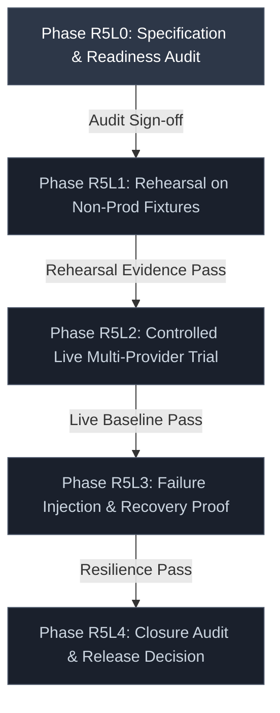

# R5L Production Trial Specification & Readiness Audit

## Document Metadata

- **Document ID**: `AF-R5L-SPEC-001`
- **Revision**: `1.0.0`
- **Status**: `PROPOSED — R5L0 PLANNING`
- **Milestone Gate**: `R5L0` (Planning & Readiness Audit Only)
- **Authoritative Baseline Commit**: `0dbf81ad74a7b630c65e232ab85add90a7e0a082`
- **Authoritative Git Tree SHA**: `e6afe8d9bcd84f15638a54e442bd196c89db29b1`
- **Baseline CI Reference**: Workflow Run [35180140476](https://github.com/thanhtuyen662002/Agent-Forge/actions/runs/35180140476) (`success`)
- **Parent Architectural Framework**: [R5 Role-Agnostic Agent Fabric Architecture](R5_AGENT_FABRIC_ARCHITECTURE.md)

---

## A. Purpose and Authority Boundary

### 1. Purpose of the R5L Production Trial
The **R5L Production Trial** is the culminating validation gate of the AgentForge R5 release family. Its objective is to prove that the durable domain models, execution routers, isolation supervisors, credential boundaries, handoff protocols, and Model Context Protocol (MCP) review surfaces established across milestones R5A through R5J operate securely, deterministically, and reliably under realistic multi-role and multi-provider operational conditions.

Specifically, the trial MUST prove:
1. **Decoupled Identity Invariance**: Execution adheres strictly to the invariant:
   $$\text{ROLE} \neq \text{AGENT PROFILE} \neq \text{PROVIDER} \neq \text{MODEL RESOURCE} \neq \text{PROVIDER ACCOUNT} \neq \text{WORKER SLOT}$$
2. **Conflict-of-Interest Enforcement**: Anti-self-review separation policies enforce that no agent profile, provider account, or execution session may adjudicate its own output.
3. **Zero Plaintext Secret Exposure**: No plaintext API keys, OAuth tokens, or credential-manager payloads enter SQLite databases, application logs, console streams, or exported evidence manifests.
4. **Isolated Worktree Safety**: Agent code generation executes inside dedicated Git worktrees with strict workspace lease fences, leaving the repository head and primary working directory unmutated until verified settlement.
5. **Context Continuity Across Boundaries**: Task memory, architectural constraints, and accumulated evidence survive mid-task handoffs across heterogeneous AI providers without loss of provenance.
6. **Fail-Closed MCP Submission & Review Authority**: Coder submissions are quarantined until cryptographically validated; reviewer reads receive frozen, read-only verification projections; zero mutations occur during reviewer inspection.

### 2. Authority Boundary of Milestone R5L0
> [!CAUTION]
> **STRICT PLANNING AND READINESS BOUNDARY (R5L0)**:
> Milestone R5L0 authorizes **only** the creation of this auditable trial specification, roadmap reconciliation, and readiness assessment.
>
> **R5L0 DOES NOT AUTHORIZE**:
> - Executing production or rehearsal trials;
> - Using or resolving real third-party API credentials;
> - Dispatching external AI provider processes (Gemini, Codex, Claude);
> - Modifying production databases, schemas, or application configuration;
> - Mutating repository code, tests, or packaging scripts;
> - Publishing release builds or distributions;
> - Injecting destructive failures on live environments.

Merging milestone R5L0 into `main` establishes the normative operational rules for subsequent trial phases. It does **not** grant automatic permission to begin rehearsal (R5L1) or live execution (R5L2). Progression to each subsequent phase requires explicit, recorded authorization from designated management and security audit authorities.

---

## B. Phase Model

The R5L milestone executes in five strictly sequential phases. Advancing to a subsequent phase MUST satisfy all entry criteria, produce all required evidence, and receive formal sign-off.



### 1. Phase R5L0 — Specification and Readiness Audit `[CURRENT PHASE]`
- **Entry Criteria**: Milestones R5A–R5J merged to `main`; all post-merge CI jobs green; Git tree matches `0dbf81ad74a7b630c65e232ab85add90a7e0a082`.
- **Permitted Actions**: Architectural analysis; documentation authoring; schema inspection; operational topology modeling; readiness gap cataloging.
- **Required Evidence**:
  - Authoritative `docs/R5L_PRODUCTION_TRIAL_PLAN.md` (this document);
  - Reconciled `docs/R5_AGENT_FABRIC_ARCHITECTURE.md` showing R5A–R5J `CLOSED_SUCCESSFULLY`, R5K `DEFERRED_OPTIONAL`, and R5L0 as `CURRENT_GATE`;
  - Clean validation reports (`git diff --check`, `npx tsc --noEmit`, `npm test`, `npm run build`).
- **Stop Conditions**: Discovery of unaddressed R5J security vulnerabilities; unresolved architectural contradictions in SQLite schema; unverified base commit.
- **Exit Criteria**: Milestone R5L0 documentation merged to `main` via approved Pull Request.
- **Approval Required**: Project Lead and Security Auditor.

### 2. Phase R5L1 — Rehearsal Using Controlled/Non-Production Fixtures `[PENDING]`
- **Entry Criteria**: R5L0 merged to `main`; clean standalone trial test environment provisioned; synthetic Git fixtures and mock provider CLI adapters ready.
- **Permitted Actions**: End-to-end dry-run execution of the 15-step trial lifecycle using non-production test projects, synthetic commits, and isolated SQLite database instances.
- **Required Evidence**:
  - Rehearsal evidence manifest verifying zero database corruption;
  - Zero-mutation confirmation during reviewer reads;
  - Clean teardown receipt for rehearsal worktrees and temporary databases.
- **Stop Conditions**: Any unexpected crash, schema migration failure, deadlock, assertion failure, or worktree leak.
- **Exit Criteria**: 100% rehearsal test pass across all 15 lifecycle steps without human intervention or data corruption.
- **Approval Required**: Trial Lead and Principal Engineer.

### 3. Phase R5L2 — Controlled Live Multi-Provider Trial `[PENDING]`
- **Entry Criteria**: R5L1 rehearsal evidence formally audited and approved; at least two distinct authenticated provider accounts verified in isolation; trial project and task defined.
- **Permitted Actions**: Single-task live execution through authentic CLI providers (e.g., Gemini CLI for CODER, Claude CLI or Manual Bridge for REVIEWER); live reviewer read via Stdio MCP server.
- **Required Evidence**:
  - Cryptographically verified evidence bundle manifest;
  - Coder submission receipt and adjudication event log;
  - Reviewer MCP audit log proving zero database mutations (`total_changes` unchanged);
  - Reviewer projection hash matching stored adjudication hash.
- **Stop Conditions**: Any plaintext secret emitted to logs or DB; self-review detection; worktree dirty state leak; unhandled provider rate limit.
- **Exit Criteria**: Successful automated verification, independent reviewer evaluation, and owner settlement to `SETTLED`.
- **Approval Required**: Project Lead and Executive Sponsor.

### 4. Phase R5L3 — Failure Injection, Recovery, and Continuity Proof `[PENDING]`
- **Entry Criteria**: Phase R5L2 completed successfully; baseline database snapshot archived; failure injection harness configured.
- **Permitted Actions**: Deterministic injection of the 15 defined failure scenarios (provider outage, rate-limit cooldown, process crashes, worktree conflicts, token revocation, restart recovery).
- **Required Evidence**:
  - Structured event logs proving fail-closed rejection for each injected fault;
  - Durable health observation order proving monotone precedence;
  - Restart recovery verification proving state machine resumption without duplicate side effects.
- **Stop Conditions**: Data loss, split-brain task ownership, leaked credentials, or non-deterministic recovery.
- **Exit Criteria**: All 15 injection scenarios pass with expected durable audit outcomes.
- **Approval Required**: Security Lead and Trial Lead.

### 5. Phase R5L4 — Closure Audit and Release Decision `[PENDING]`
- **Entry Criteria**: Phases R5L0 through R5L3 completed; all evidence bundles collected, hashed, and signed.
- **Permitted Actions**: Final audit of trial artifacts; verification of hash chains; packaging receipt validation; release readiness assessment.
- **Required Evidence**:
  - Consolidated Production Trial Audit Report;
  - Signed evidence manifest hash;
  - Windows Release Candidate verification receipt (`demo-rc-receipt.txt`).
- **Stop Conditions**: Any unresolved security gap; unverified hash; missing audit trail.
- **Exit Criteria**: Formal sign-off on Production Release Readiness or issuance of a corrective HOLD.
- **Approval Required**: Project Lead, Security Auditor, and Executive Sponsor.

---

## C. End-to-End Trial Lifecycle

The production trial executes an authoritative 15-step lifecycle. Every step is bound to a specific authority owner, operates against durable records, enforces an explicit security fence, and defines clear failure/rollback behavior.

| Step | Lifecycle Step | Authority Owner | Durable Records Created / Read | Security Fence | Expected State Transition | Required Evidence | Rollback & Failure Behavior |
| :--- | :--- | :--- | :--- | :--- | :--- | :--- | :--- |
| **1** | **Project & Task Creation** | Human Owner | Read: `projects`<br>Write: `tasks` | Project root must be an existing, clean Git repository. | Task created in state `OPEN` or `READY`. | `tasks.id`, Git HEAD commit SHA, working tree status. | Task marked `CANCELLED`; zero project file modification. |
| **2** | **Context Compilation & Snapshot** | ContextBuilderService | Read: `project_memories`, `task_memories`<br>Write: `context_snapshots`, `context_manifests` | Snapshot items sorted canonicalized; manifest hash computed via SHA-256. | Context frozen into immutable snapshot. | `context_snapshots.id`, `manifest_hash`, canonical items JSON. | Invalidation of corrupt memories; abort dispatch. |
| **3** | **Role-Aware Coder Routing** | RoleAwareRoutingService | Read: `role_profiles`, `route_policies`, `separation_policies`<br>Write: `events` (`ROLE_AWARE_ROUTING_DECISION`) | Selected provider account must satisfy capability constraints; separation policy checked. | Routing decision recorded with frozen policy snapshot. | `routing_decision_id`, frozen `failover_policy_authority_snapshot_json`. | Route fallback to next eligible candidate or fail closed to `NEEDS_HUMAN`. |
| **4** | **Account / Slot Allocation** | SchedulerService | Read: `provider_accounts`, `worker_slots`<br>Write: `agent_assignments`, `account_leases` | Concurrency limit strictly enforced; partial unique index on `account_leases(worker_slot_id)`. | Worker slot moves to `LEASED`; assignment set to `ASSIGNED`. | `assignment_id`, `account_leases.id`, `lease_token`. | Immediate release of worker slot lease; abort task dispatch. |
| **5** | **Credential Resolution** | NativeProfileResolver | Read: `provider_accounts.credential_ref`, `profile_ref`<br>Write: *None* (Memory Only) | Plaintext credentials never touch SQLite or disk; profile paths validated. | Ephemeral execution credentials resolved in child env. | Resolution status (`RESOLVED`), redacted profile path. | Fail-closed with `CREDENTIAL_RESOLUTION_FAILED`; zero plaintext leak. |
| **6** | **Isolated Worktree Creation** | GitWorktreeService | Read: `tasks`, `projects`<br>Write: `workspace_leases` | Worktree created in isolated directory; primary working tree untouched. | Git worktree provisioned; workspace lease locked. | `worktree_path`, `workspace_leases.id`, `worktree_identity_hash`. | Prune failed worktree via `git worktree remove --force`; release lease. |
| **7** | **Coder Execution** | ProcessRunner / Supervisor | Read: `execution_authorizations`<br>Write: `events` (`PROCESS_SPAWNED`, `HEARTBEAT`) | Child process spawned with closed/isolated stdio; bounded execution timeout. | Process transitions: `SPAWNING` $\rightarrow$ `RUNNING` $\rightarrow$ `COMPLETED`. | PID, stdout/stderr streams (redacted), exit code. | Terminate process tree via `EmergencyStopService`; mark attempt `FAILED`. |
| **8** | **Durable Submission** | McpSubmissionAuthorityService | Read: `mcp_submission_sessions`<br>Write: `coder_submissions` | Payload canonicalized; 28 envelope keys validated; stored in `QUARANTINED`. | Coder claim recorded as `QUARANTINED` submission. | `submission_id`, `canonical_envelope_hash`, `claim_content_hash`. | Rejection with `SUBMISSION_INTEGRITY_CONFLICT`; zero mutation on replay. |
| **9** | **Cross-Agent / Cross-Provider Handoff** *(if triggered)* | HandoffService | Read: `coder_submissions`<br>Write: `handoff_contexts`, `task_attempts` | Predecessor relinquishment verified; ownership epoch monotonically incremented. | Task attempt handed off; successor assignment prepared. | `handoff_contexts.id`, `task_ownership_epoch` incremented. | Predecessor reinstated if successor routing fails; task to `NEEDS_HUMAN`. |
| **10** | **Verification Admission** | CoderSubmissionAdjudicationService | Read: `coder_submissions`<br>Write: `coder_submission_adjudications`, `test_runs`, `evidence` | Pre-execution workspace fingerprint captured; verification executed in isolated worktree. | Adjudication state moves to `ADMITTED_VERIFYING` $\rightarrow$ `VERIFIED` or `VERIFICATION_FAILED`. | `adjudication_id`, `verification_execution_id`, `artifact_manifest_hash`. | Recovery fence engaged (`RECOVERY_FENCED`); workspace lease released. |
| **11** | **Reviewer Context Issuance** | ReviewerAuthorityService | Read: `coder_submission_adjudications`<br>Write: `reviewer_sessions` | Ephemeral session token issued to independent reviewer identity; bound to frozen projection. | Reviewer session token generated and active. | `reviewer_sessions.id`, `session_token_hash`, `projection_hash`. | Session revoked; token rendered invalid immediately. |
| **12** | **Reviewer Read via MCP** | ReviewerServer (`stdio-review`) | Read: `VerifiedAdjudicationReviewProjection`<br>Write: *Zero mutations* (`total_changes() = 0`) | Read-only surface strictly enforced; live workspace path blocked; zero SQLite writes. | Projection read by reviewer; audit log recorded. | `adjudication_id`, `projection_hash`, zero-mutation proof (`total_changes`). | Abort session on unauthorized write attempt or projection mismatch. |
| **13** | **Owner Adjudication** | Human Owner | Read: Reviewer evaluation, verification diff<br>Write: `events` (`ADJUDICATION_DECIDED`) | Manual approval required; cannot be bypassed by automated agent processes. | Owner decision recorded (`ACCEPT` or `REJECT`). | Owner decision payload, rationale, timestamp. | Return task to `NEEDS_HUMAN` for manual intervention. |
| **14** | **Terminal Settlement** | CoderSubmissionAdjudicationService | Read: Owner decision<br>Write: `coder_submission_dispositions`, `tasks` | Exactly one terminal disposition created using deterministic disposition ID. | Task moves to terminal state `COMPLETED` or `REJECTED`. | `coder_submission_dispositions.id`, `disposition_event`. | If disposition creation fails, task remains in `AWAITING_SETTLEMENT`. |
| **15** | **Evidence Preservation & Closure** | ArtifactStore | Read: All trial entities<br>Write: `evidence_bundles/manifest.json` | All trial artifacts collected, SHA-256 hashed, and sealed into immutable bundle. | Trial status set to `CLOSED_VERIFIED`. | Canonical evidence bundle manifest, root bundle hash. | Trial marked `HOLD_UNVERIFIED` if evidence hashing fails. |

---

## D. Provider and Identity Matrix

### 1. Minimum Valid Trial Topology
A valid production trial MUST configure a minimum of **two distinct provider accounts** and enforce strict separation between the Coder and Reviewer identities:

```mermaid
graph LR
    subgraph Provider A [Provider: Google Gemini / Account A]
        CoderProfile[AgentProfile: Coder Persona]
        WorkerSlotA[WorkerSlot 1]
    end

    subgraph Provider B [Provider: Anthropic / Account B]
        ReviewerProfile[AgentProfile: Reviewer Persona]
        WorkerSlotB[WorkerSlot 1]
    end

    Task[Task: Target Feature Work] -->|Routes Coder Role| CoderProfile
    CoderProfile -->|Allocates| WorkerSlotA
    WorkerSlotA -->|Isolated Execution| Worktree[Git Worktree]

    Worktree -->|Quarantined Submission| Adjudication[Adjudication Engine]
    Adjudication -->|Frozen Review Projection| ReviewerProfile
    ReviewerProfile -->|Allocates| WorkerSlotB
    ReviewerProfile -->|Read-Only Stdio MCP| Adjudication
```



- **Separation Constraint**: `CoderProfile.id !== ReviewerProfile.id` AND `SelectedAccount(Coder) !== SelectedAccount(Reviewer)`.
- **Credential Reference Constraint**: `credential_ref` values are symbolic handles (e.g., `gemini-prod-key-1`, `anthropic-review-key-1`) resolving solely via Windows Credential Manager or local CLI configuration profiles (`GEMINI_CLI_PROFILE`, `CLAUDE_CONFIG_DIR`). No secrets appear in configuration files or databases.

### 2. Readiness Worksheet
Prior to executing Phase R5L1 or R5L2, the trial operator MUST verify each element and provide the corresponding evidence reference.

| Topology Element | Identifier / Symbolic Handle | Bound Role | Status | Evidence Reference / Requirement |
| :--- | :--- | :--- | :--- | :--- |
| **Provider A** | `google` | `CODER` | `NOT_VERIFIED` | CLI binary `gemini` in PATH; API connectivity verified. |
| **Account A1** | `acc-gemini-coder-01` | `CODER` | `NOT_VERIFIED` | Valid profile in `%USERPROFILE%\.gemini\profiles\coder-01`. |
| **Model Resource A** | `gemini-2.5-pro` | `CODER` | `NOT_VERIFIED` | Verified support for tool calling and diff generation. |
| **Agent Profile A** | `prof-coder-gemini-v1` | `CODER` | `NOT_VERIFIED` | System prompt template audited; no dangerous instructions. |
| **Worker Slot A** | `slot-gemini-01-idx1` | `CODER` | `NOT_VERIFIED` | Concurrency limit = 1; slot index = 1. |
| **Provider B** | `anthropic` | `REVIEWER` | `NOT_VERIFIED` | CLI binary `claude` in PATH or Manual Bridge active. |
| **Account B1** | `acc-claude-reviewer-01` | `REVIEWER` | `NOT_VERIFIED` | Isolated `CLAUDE_CONFIG_DIR` without account overlap. |
| **Model Resource B** | `claude-3-7-sonnet` | `REVIEWER` | `NOT_VERIFIED` | Verified read-only evaluation capability. |
| **Agent Profile B** | `prof-reviewer-claude-v1`| `REVIEWER` | `NOT_VERIFIED` | Review prompt template enforces strict read-only audit. |
| **Worker Slot B** | `slot-claude-01-idx1` | `REVIEWER` | `NOT_VERIFIED` | Concurrency limit = 1; slot index = 1. |
| **Separation Policy**| `policy-strict-anti-self`| `ALL` | `VERIFIED` | Seeded via Migration 008; enforces `same_account_policy = REQUIRE_DIFFERENT`. |
| **Reviewer MCP Server**| `src/mcp/stdio-review.ts` | `REVIEWER` | `VERIFIED` | Unit & integration tested in `tests/r5j7McpReviewerAuthority.test.ts`. |

---

## E. Success Criteria

The trial outcome is evaluated against three distinct categories of criteria. A failure in any Mandatory criterion immediately terminates the trial in a `HOLD` state.

### 1. Mandatory Success Criteria (Fail-Closed)
1. **Separation Policy Compliance**: 100% of routing decisions enforce `coder != reviewer`. Any self-review attempt MUST fail closed with `SEPARATION_POLICY_VIOLATION`.
2. **Zero Plaintext Secrets**: Zero credential tokens, API keys, or private key fragments in SQLite databases, logs, error messages, test receipts, or exported manifests.
3. **Workspace Isolation**: Primary Git repository HEAD and index remain 100% clean and unmutated throughout coder execution. All edits occur exclusively within the isolated worktree.
4. **Context Continuity**: Context snapshot hash and task memories are preserved identically across handoff transitions.
5. **Durable Ingestion Precedence**: Provider health observations conform strictly to monotonic `account_order` sequence.
6. **Fail-Closed Submission Quarantine**: Unadmitted coder submissions remain in `QUARANTINED` status and cannot mutate task settlement state.
7. **Read-Only MCP Reviewer Surface**: Reviewer reads through `stdio-review` verify zero database changes (`total_changes` before == `total_changes` after).
8. **Frozen Projection Authority**: Reviewer receives only the immutable projection hash computed during verification admission. Direct live worktree reads are strictly rejected.
9. **Deterministic Settlement**: Exactly one terminal disposition record (`SETTLED` or `REJECTED`) is created per adjudication, matching the deterministic ID derived from `deriveDeterministicDispositionId()`.
10. **Windows Runtime Validity**: The packaged Windows application (`AgentForge.exe`) executes all installer, startup, and update smoke gates without regression.

### 2. Informational Observations (Non-Blocking Telemetry)
- Total wall-clock execution duration per lifecycle step.
- Token consumption and cost metrics per provider.
- Number of candidate routes evaluated prior to selection.
- Worker slot lease acquisition latency.
- Frequency of provider health polling updates.

### 3. Non-Blocking Performance Measurements
- Subprocess spawning latency under Windows Defender filter driver monitoring.
- SQLite immediate transaction lock contention under concurrency.
- MCP stdio request-response latency for large diff evidence.

---

## F. Failure-Injection Matrix (R5L3 Scope)

During Phase R5L3, the trial operator MUST deterministically execute the following 15 failure scenarios to prove system resilience and fail-closed security.

| Scenario ID | Injected Failure Scenario | Preconditions | Injection Point | Expected Durable State | Operator / User Result | Required Audit Evidence | Recovery Path | Safe Scope |
| :--- | :--- | :--- | :--- | :--- | :--- | :--- | :--- | :--- |
| **FI-01** | **Provider Unavailable Pre-Dispatch** | Provider CLI uninstalled or invalid binary path. | Prior to child process spawn. | Account marked `UNHEALTHY` in `provider_accounts`; observation recorded. | Router falls back to alternate provider or transitions task to `NEEDS_HUMAN`. | `events.type = PROVIDER_HEALTH_OBSERVATION` with error code `BINARY_NOT_FOUND`. | Automatic failover to candidate 2 or manual provider repair. | Rehearsal & Live |
| **FI-02** | **Account Disabled / Unhealthy** | Account administrative `enabled = 0`. | Candidate evaluation in `RoleAwareRoutingService`. | Assignment rejected; account skipped during candidate ranking. | Task routed to remaining enabled account. | `ROLE_AWARE_ROUTING_DECISION` excludes account with reason `ACCOUNT_DISABLED`. | Enable account via admin UI; retry routing. | Rehearsal & Live |
| **FI-03** | **Resource Unavailable** | Model resource marked `DEPRECATED` or `UNHEALTHY`. | Candidate capability filtering. | Candidate filtered out before scoring. | Route selected from remaining compliant resources. | Candidate evaluation log in structured event payload. | Restore resource health status. | Rehearsal & Live |
| **FI-04** | **Quota / Rate Limit Cooldown** | Simulated HTTP 429 / Rate Limit from provider. | ProcessRunner stdout/stderr stream inspection. | Observation recorded; `cooldown_until` set in `provider_accounts`. | Router triggers cooldown backoff; task dispatched to alternate account. | `provider_health_observations` row with action `RECORD_RATE_LIMITED`. | Wait for cooldown expiration; automatic slot reactivation. | Rehearsal & Live |
| **FI-05** | **Agent Process Crash** | Coder process abruptly killed (`SIGKILL` / `taskkill`). | During coder active editing loop. | Lease expires or heartbeat watchdog fires; task attempt marked `FAILED`. | User notified of agent crash; task moves to `NEEDS_HUMAN` or retried. | `events.type = TASK_ATTEMPT_FAILED`; lease state `RELEASED`. | Discard dirty worktree; allocate fresh attempt if retries remaining. | Rehearsal Only |
| **FI-06** | **Cancellation During Execution** | Task actively in `CODING` state. | User clicks Cancel Task in UI. | Task status moves to `CANCELLED`; lease released. | Child process terminated cleanly within 5000ms. | `events.type = TASK_CANCELLED`; process termination confirmed. | Clean up worktree; mark slot `IDLE`. | Rehearsal & Live |
| **FI-07** | **Worktree Mismatch / Dirty State** | Uncommitted untracked files injected into worktree. | Pre-execution worktree validation. | Workspace lease rejected with `DIRTY_WORKTREE_DETECTED`. | Adjudication halted; task flagged for manual cleanup. | `workspace_leases.failure_code = WORKTREE_INTEGRITY_MISMATCH`. | Force clean worktree via `git clean -fdx`; re-admit. | Rehearsal & Live |
| **FI-08** | **Ownership Epoch Change** | Increment task epoch in SQLite during active execution. | Background task lease heartbeat verification. | Heartbeat fails with `OWNERSHIP_EPOCH_MISMATCH`. | Active worker process revoked and fenced. | `events.type = LEASE_HEARTBEAT_REJECTED`. | Process terminates fail-closed; successor assumes ownership. | Rehearsal Only |
| **FI-09** | **Handoff Interruption** | Network severed during mid-task handoff dispatch. | Handoff context transition. | Predecessor marked `RELINQUISHED`; successor not yet `DISPATCHED`. | Task pauses safely in `HANDOFF_PENDING`. | `handoff_contexts` status = `PREPARED`. | Re-dispatch successor or return to human supervisor. | Rehearsal Only |
| **FI-10** | **Verification Failure (Test Exit Non-Zero)** | Injected syntax or assertion error in coder diff. | Verification execution in isolated worktree. | Adjudication moves to `VERIFICATION_FAILED`; task to `NEEDS_HUMAN`. | Task rejected; diff presented to human with failure logs. | `test_runs.exit_code != 0`; terminal disposition `REJECTED`. | Human owner reviews failure and orders rework attempt. | Rehearsal & Live |
| **FI-11** | **Reviewer Authority Drift** | Injected tampering of stored projection hash in DB. | Reviewer MCP `get_review_context` call. | MCP server rejects read with `AUTHORITY_PROJECTION_MISMATCH`. | Reviewer client receives clear error; zero context leaked. | Reviewer audit log records hash divergence. | Invalidate tampered adjudication; trigger recovery scan. | Rehearsal Only |
| **FI-12** | **Reviewer Token Expiry / Revocation** | Set `reviewer_sessions.expires_at = past` or revoke. | Reviewer MCP protocol handshake. | Handshake rejected with `SESSION_EXPIRED` or `SESSION_REVOKED`. | Reviewer MCP client blocked from reading data. | `reviewer_sessions.revoked_at` timestamp. | Issue fresh authorized reviewer session via admin bridge. | Rehearsal & Live |
| **FI-13** | **Application Restart Between Stages** | Kill AgentForge.exe between Step 10 and Step 12. | Adjudication completed, before reviewer read. | SQLite state preserved; restart scanner reconciles pending records. | Upon relaunch, task resumes in exact durable state. | `CrashRecoveryService` startup scan log. | Resumes without re-running verification or mutating hashes. | Rehearsal & Live |
| **FI-14** | **Duplicate / Replayed Submission** | Re-submit identical coder payload with same ID. | McpSubmissionAuthorityService.submitCoderClaim. | Replay path engaged; zero database mutations verified. | Returns original submission receipt idempotently. | `total_changes() before == total_changes() after`. | Normal execution; duplicate ignored. | Rehearsal & Live |
| **FI-15** | **Evidence Store Tampering** | Corrupt byte in artifact evidence file on disk. | Pre-adjudication evidence integrity check. | Verification fails closed with `EVIDENCE_HASH_MISMATCH`. | Submission quarantined permanently as untrusted. | `verifyEvidenceIntegrity()` returns false with mismatched SHA. | Reject submission; force full resubmission. | Rehearsal Only |

---

## G. Evidence Bundle Contract

At the conclusion of a production trial phase, all durable evidence MUST be compiled into an immutable, canonical JSON manifest: `evidence_bundles/<trial_id>/manifest.json`.

### 1. Evidence Manifest Schema
```json
{
  "$schema": "https://agentforge.dev/schemas/v1/trial-evidence-manifest.json",
  "trial_id": "trial-20260917-r5l-live-01",
  "schema_version": 1,
  "phase": "R5L2",
  "environment": {
    "os_version": "Microsoft Windows 11 Pro 10.0.22631",
    "node_version": "v22.14.0",
    "git_version": "git version 2.47.1.windows.1",
    "application_version": "0.1.0"
  },
  "provenance": {
    "source_commit": "0dbf81ad74a7b630c65e232ab85add90a7e0a082",
    "git_tree_sha": "e6afe8d9bcd84f15638a54e442bd196c89db29b1",
    "ci_run_id": "35180140476",
    "installer_sha256": "4a7b...89ef",
    "installed_app_asar_sha256": "c83e...12df"
  },
  "lifecycle_identifiers": {
    "project_id": "proj-uuid",
    "task_id": "task-uuid",
    "task_ownership_epoch": 1,
    "coder_assignment_id": "asgn-coder-uuid",
    "reviewer_assignment_id": "asgn-reviewer-uuid",
    "coder_submission_id": "sub-uuid",
    "adjudication_id": "adj-uuid",
    "reviewer_session_id": "rev-session-uuid"
  },
  "cryptographic_hashes": {
    "context_manifest_hash": "64_hex_chars",
    "routing_decision_payload_hash": "64_hex_chars",
    "pre_execution_fingerprint_hash": "64_hex_chars",
    "post_execution_fingerprint_hash": "64_hex_chars",
    "coder_claim_content_hash": "64_hex_chars",
    "verification_artifact_manifest_hash": "64_hex_chars",
    "verification_result_envelope_hash": "64_hex_chars",
    "reviewer_frozen_projection_hash": "64_hex_chars",
    "terminal_disposition_metadata_hash": "64_hex_chars"
  },
  "audit_verifications": {
    "separation_policy_verified": true,
    "zero_plaintext_secrets_proven": true,
    "reviewer_zero_mutation_verified": true,
    "worktree_isolation_clean": true
  },
  "terminal_outcome": {
    "status": "SETTLED",
    "disposition_event": "SETTLED",
    "disposition_reason": "ACCEPTED_VERIFIED",
    "final_verdict": "PASS"
  },
  "timestamps": {
    "started_at": "2026-09-17T06:00:00.000Z",
    "completed_at": "2026-09-17T06:45:00.000Z"
  },
  "sign_off": {
    "trial_lead": "operator-identity",
    "security_lead": "auditor-identity",
    "manifest_signature": "sha256_root_bundle_hash"
  }
}
```

### 2. Strict Prohibition Invariant
> [!IMPORTANT]
> **PROHIBITED CONTENT IN EVIDENCE BUNDLES**:
> Evidence manifests, logs, and accompanying audit files MUST NOT contain:
> - Plaintext API keys, Bearer tokens, or OAuth refresh tokens;
> - Windows Credential Manager payload blobs;
> - Private keys or SSH identity files;
> - Environment variable dumps containing sensitive keys (`ANTHROPIC_API_KEY`, `OPENAI_API_KEY`, `GEMINI_API_KEY`);
> - User passwords or plaintext session authorization secrets.

---

## H. Stop and HOLD Conditions

The trial supervisor, automated monitor, or reviewing auditor MUST issue an immediate **HOLD** upon detecting any of the following conditions:

1. **Source / Baseline Drift**: The local or remote working tree diverges from the authoritative commit `0dbf81ad74a7b630c65e232ab85add90a7e0a082`.
2. **CI Pipeline Invalidation**: Any mandatory CI job in workflow run `35180140476` (or successor authoritative run) fails, is cancelled, or is unexpectedly skipped.
3. **Identity or Account Overlap**: A single agent identity or provider account is assigned to both CODER and REVIEWER roles for the same task.
4. **Secret Exposure**: Any plaintext secret is observed in database rows, application logs, stdout/stderr captures, or temporary files.
5. **Worktree Isolation Breach**: File modifications occur within the primary repository worktree during active coder execution.
6. **Cryptographic Mismatch**: Any hash mismatch occurs between:
   - Stored context manifest and computed items;
   - Claimed Git diff and verified Git diff;
   - Verification envelope hash and adjudication envelope hash;
   - Stored adjudication projection and reviewer MCP projection read.
7. **Reviewer Mutation Breach**: `SELECT total_changes()` indicates database mutations during an active reviewer session read.
8. **Divergent or Incomplete Settlement**: An adjudication completes without creating a terminal disposition or with duplicate conflicting dispositions.
9. **Uncontained Background Processes**: An agent CLI process continues running after cancellation, timeout, or task completion.
10. **Absence of Evidence**: If required audit evidence cannot be produced or verified, the outcome MUST be classified as **FAILURE**, never as assumed success.

---

## I. Rollback and Recovery Policy

### 1. Ledger Immutability vs Scratch Disposable State
AgentForge enforces a strict separation between immutable audit ledgers and disposable execution scratch state:
- **Append-Only Ledgers (Never Rolled Back)**:
  - `events`, `task_attempts`, `agent_assignments`, `account_leases`;
  - `coder_submissions`, `coder_submission_adjudications`, `coder_submission_adjudication_events`;
  - `coder_submission_dispositions`, `provider_health_observations`.
  Under no circumstances may rows in these tables be deleted, updated out-of-band, or purged to "reset" a trial.
- **Disposable Scratch State (Cleaned & Pruned)**:
  - Temporary Git worktrees (`.git/worktrees/*` and temporary directory trees);
  - Temporary file artifacts in staging directories;
  - Active worker slot concurrency leases (released via `released_at = now`).

### 2. Process Containment
If a trial task hangs or fails:
1. `EmergencyStopService.triggerEmergencyStop()` terminates all active child process trees via OS process group signals.
2. Active worker slot leases are updated to `RELEASED`.
3. Workspace leases are marked `RELEASED` with the appropriate failure code.

### 3. Session and Token Revocation
- Any active `mcp_submission_sessions` or `reviewer_sessions` are revoked immediately via `revoked_at = now`, rendering session tokens instantly inert.

### 4. Manual Owner Adjudication Fallback
If automated reconciliation is blocked by an ambiguous or conflicting state:
- The task is placed in `NEEDS_HUMAN` status.
- Automated routers MUST NOT attempt speculative retries.
- The human owner MUST explicitly review the audit ledger and issue an authoritative manual decision (`ACCEPT`, `REJECT`, or `CANCEL`).

---

## J. Preflight Checklist

The following checklist MUST be executed and verified before launching Phase R5L1 (Rehearsal) and Phase R5L2 (Live Trial):

- [ ] **1. Exact Source Commit**: Verified `git rev-parse HEAD` equals `0dbf81ad74a7b630c65e232ab85add90a7e0a082`.
- [ ] **2. Clean Worktree**: Confirmed `git status --short` is completely empty.
- [ ] **3. Post-Merge CI Status**: Verified GitHub Actions run `35180140476` concluded with `success` across Ubuntu Validate, Windows Validate, and Windows Package.
- [ ] **4. Packaging Smoke Integrity**: Confirmed NSIS installer generated cleanly and passed local installation smoke (`smoke-installed-production-win.ps1`).
- [ ] **5. Database Baseline Backup**: Captured backup of `%APPDATA%\AgentForge\database\agent-forge.db` before trial initialization.
- [ ] **6. Provider Account Separation**: Verified Account A (Coder) and Account B (Reviewer) utilize distinct credential references.
- [ ] **7. Credential Reference Health**: Tested resolution of credential references via secure store without plaintext output.
- [ ] **8. Separation Policy Active**: Confirmed `separation_policies` row enforcing `same_account_policy = REQUIRE_DIFFERENT` is enabled in SQLite.
- [ ] **9. Clean Worktree Directory**: Verified `%TEMP%` and target worktree paths have at least 5 GB free disk space and no stale worktree locks.
- [ ] **10. Stdio MCP Reviewer Tested**: Verified `npm run build` completed and `src/mcp/stdio-review.ts` starts and handshakes cleanly.
- [ ] **11. Test Project & Target Task**: Designated an isolated test Git repository with pre-verified unit tests.
- [ ] **12. Logging Redaction Active**: Verified logger masks sensitive tokens and credential handles.
- [ ] **13. Rollback Owner Designated**: Named human operator assigned responsibility for monitoring and emergency containment.
- [ ] **14. Evidence Storage Path**: Created designated directory `evidence_bundles/<trial_id>/` with write permissions.
- [ ] **15. Network Stability**: Verified stable network access to designated provider APIs with sufficient remaining quota.
- [ ] **16. Formal Management Sign-Off**: Received recorded approval from Project Lead to execute the specific phase.

---

## K. Decision Record

1. **R5J Closed Successfully**:
   - Milestones R5J1 through R5J7 were implemented, audited, and merged into `main` at commit `0dbf81ad74a7b630c65e232ab85add90a7e0a082`.
   - Security contracts for quarantined coder submissions, multi-event adjudication state machines, and independent read-only reviewer MCP contexts are fully active.
2. **Post-Merge CI Resolution**:
   - Post-merge workflow run [35180140476](https://github.com/thanhtuyen662002/Agent-Forge/actions/runs/35180140476) experienced an initial timeout in test 344 on Windows during Attempt 1.
   - Upon clean rerun of the failed jobs, both `Validate (windows-latest, Node 22.x)` and dependent `Package Windows (windows-latest, Node 22.x)` passed completely with `success`.
   - Detailed diagnosis: Test 344 invoked an inner helper executing 30 synchronous `git` CLI subprocesses and 138 SQLite schema migrations within a single test block. Under heavy Windows CI runner load, scheduling latency caused the test to exceed Vitest's 30s threshold. The failure did not reproduce on rerun. In accordance with policy, zero code changes were made, and the run is classified as a transient Windows timing observation.
3. **R5K Deferral**:
   - Milestone R5K (Optional Local LLM Gateway) is formally deferred by management decision.
   - R5K is **not** a prerequisite for R5L. AgentForge multi-role agent fabric operates against authenticated external CLI providers and manual bridges. R5K will only be considered if production trials demonstrate a concrete requirement for local offline inference.
4. **R5L0 Scope Containment**:
   - R5L0 is strictly restricted to specification authoring and readiness auditing.
   - Merging R5L0 does not authorize live trials or execution.

---

## L. Open Readiness Gaps

The following operational inputs cannot be proven from the repository alone and MUST be resolved by human operators prior to commencing Phase R5L1 or R5L2:

| Gap ID | Operational Readiness Gap | Required Resolution | Required Authority | Blocking Phase |
| :--- | :--- | :--- | :--- | :--- |
| **GAP-01** | **Live Provider Account Credentials** | Identify which authentic AI provider accounts (e.g. Gemini, Anthropic, OpenAI) are available and provisioned on the trial host machine. | Trial Operator | Phase R5L2 |
| **GAP-02** | **Host Machine Credential Store Verification** | Confirm that symbolic `credential_ref` handles resolve successfully in the target Windows Credential Manager without error. | System Administrator | Phase R5L2 |
| **GAP-03** | **Provider Account Combination Selection** | Formally decide the exact pairing (e.g., Coder = Gemini 2.5 Pro via Account A; Reviewer = Claude 3.7 Sonnet via Account B). | Project Lead | Phase R5L2 |
| **GAP-04** | **Named Human Trial Operator** | Designate the primary human operator responsible for dispatch monitoring, manual review inspection, and emergency stop triggers. | Management | Phase R5L1 & R5L2 |
| **GAP-05** | **Trial Execution Time Window** | Establish an approved maintenance/trial window to prevent interference with other development tasks. | Project Lead | Phase R5L2 |
| **GAP-06** | **Evidence Bundle Archival Storage** | Specify the secure, durable retention storage location for archiving cryptographic trial evidence bundles. | Security Lead | Phase R5L2 |
| **GAP-07** | **Provider Quota & Rate Limit Headroom** | Verify that participating provider accounts possess sufficient remaining rate limits and financial quota to prevent mid-task throttling. | Account Owner | Phase R5L2 |

---

*This specification is governed by the AgentForge Architectural Review Board. Any modifications to this plan require an audited, signed revision.*
