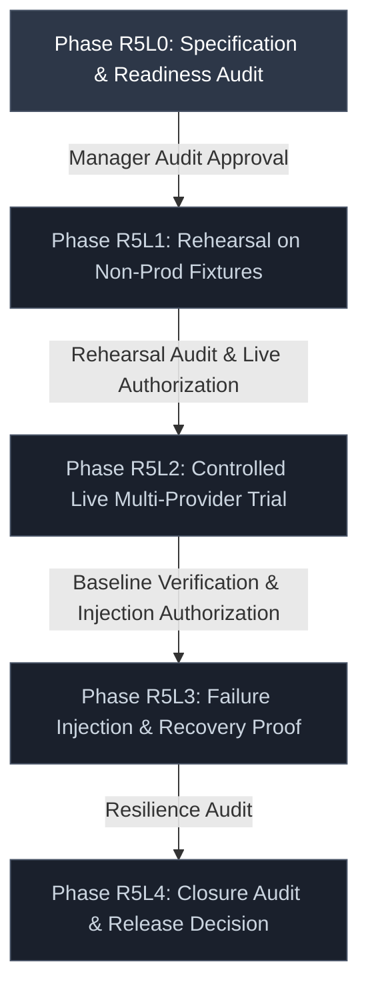

# R5L Production Trial Specification & Readiness Audit

## Document Metadata

- **Document ID**: `AF-R5L-SPEC-001`
- **Revision**: `1.1.0`
- **Status**: `PROPOSED — R5L0 PLANNING`
- **Milestone Gate**: `R5L0` (Planning & Readiness Audit Only)
- **Authoritative Baseline Commit (Planning Baseline)**: `0dbf81ad74a7b630c65e232ab85add90a7e0a082`
- **Authoritative Git Tree SHA (Planning Baseline)**: `e6afe8d9bcd84f15638a54e442bd196c89db29b1`
- **Historical Post-Merge CI Reference**: Workflow Run [35180140476](https://github.com/thanhtuyen662002/Agent-Forge/actions/runs/35180140476) (`success`)
- **Parent Architectural Framework**: [R5 Role-Agnostic Agent Fabric Architecture](R5_AGENT_FABRIC_ARCHITECTURE.md)
- **Document Classification**: Normative Operational Contract

---

## A. Purpose and Authority Boundary

### 1. Purpose of the R5L Production Trial
The **R5L Production Trial** is the validation framework for the AgentForge R5 release family. Its objective is to define an independently auditable method to verify that the durable domain models, execution routers, isolation supervisors, credential boundaries, handoff protocols, and Model Context Protocol (MCP) review surfaces established across milestones R5A through R5J operate securely, deterministically, and reliably under controlled multi-role and multi-provider operational conditions.

Specifically, the trial is designed to verify the following architectural properties:
1. **Decoupled Identity Invariance**: Execution adheres strictly to the invariant:
   $$\text{ROLE} \neq \text{AGENT PROFILE} \neq \text{PROVIDER} \neq \text{MODEL RESOURCE} \neq \text{PROVIDER ACCOUNT} \neq \text{WORKER SLOT}$$
2. **Conflict-of-Interest Enforcement**: Anti-self-review separation policies enforce that no agent profile or provider account may be assigned to review its own coder submission on the same task.
3. **No Plaintext Secrets in AgentForge Persistence**: No plaintext API keys, OAuth access tokens, refresh tokens, or credential-manager payloads enter SQLite databases, application logs, console streams, or exported evidence manifests. (Note: External provider CLI profiles, such as Gemini or Claude configuration directories, are disk-backed by their respective native tools; AgentForge references these via symbolic handles and profile paths without ingesting secret strings into its own persistent state).
4. **Isolated Worktree Safety**: Coder execution occurs within isolated Git worktrees tracked via `coder_submission_workspace_leases`, leaving the repository's primary working tree unmutated during active coding.
5. **Context Continuity Across Boundaries**: Task memory, architectural constraints, and accumulated evidence survive mid-task handoffs across heterogeneous AI providers without loss of provenance.
6. **Fail-Closed MCP Submission Authority**: Coder submissions remain in `QUARANTINED` status until cryptographically validated by `CoderSubmissionAdjudicationService`.
7. **Read-Only, Frozen MCP Reviewer Surface**: Reviewer reads via `stdio-review` (`agentforge_get_review_package`) receive an immutable projection of an already-verified and settled adjudication. Reviewer reads perform strictly zero database writes (`SELECT total_changes()` is identical before and after reading).

### 2. Authority Boundary of Milestone R5L0
> [!CAUTION]
> **STRICT PLANNING AND READINESS BOUNDARY (R5L0)**:
> Milestone R5L0 authorizes **only** the creation of this auditable trial specification, roadmap reconciliation, and readiness assessment.
>
> **R5L0 DOES NOT AUTHORIZE**:
> - Executing production trials or rehearsal runs;
> - Using or resolving real third-party API credentials;
> - Dispatching external AI provider processes (Gemini, Codex, Claude);
> - Modifying production databases, schemas, or application configuration;
> - Mutating repository code, tests, or packaging scripts;
> - Publishing release builds or distributions;
> - Injecting failure scenarios on live host systems or active projects.

Merging milestone R5L0 into `main` establishes the normative specification for subsequent trial phases. It does **not** grant automatic authorization to begin rehearsal (Phase R5L1) or live execution (Phase R5L2). Progression to each subsequent phase requires an independent manager decision following an audit of unresolved readiness gaps and safe test harness availability.

---

## B. Phase Model

The R5L trial framework is structured into five sequential phases. Advancing to each subsequent phase requires satisfying all entry criteria, producing required evidence, and receiving recorded approval.



### 1. Phase R5L0 — Specification and Readiness Audit `[CURRENT PHASE]`
- **Entry Criteria**: Milestones R5A–R5J merged to `main`; post-merge CI green; baseline commit `0dbf81ad74a7b630c65e232ab85add90a7e0a082` audited.
- **Permitted Actions**: Architectural analysis; documentation authoring; schema inspection; operational topology modeling; readiness gap cataloging.
- **Required Evidence**:
  - Authoritative `docs/R5L_PRODUCTION_TRIAL_PLAN.md` (this document);
  - Reconciled `docs/R5_AGENT_FABRIC_ARCHITECTURE.md` showing R5A–R5J `CLOSED_SUCCESSFULLY`, R5K `DEFERRED_OPTIONAL`, and R5L0 as `CURRENT_GATE`;
  - Clean validation command reports (`git diff --check`, `npx tsc --noEmit`, `npm test`, `npm run build`).
- **Stop Conditions**: Discovery of unaddressed R5J security vulnerabilities; unresolved contract contradictions between plan and source; unverified baseline commit.
- **Exit Criteria**: Approved Pull Request merging R5L0 documentation to `main`.
- **Approval Required**: Project Lead and Security Auditor.

### 2. Phase R5L1 — Rehearsal Using Controlled / Non-Production Fixtures `[UNAUTHORIZED — REQUIRES MANAGER DECISION]`
- **Nature of Actions**:
  - *Automated Product Action*: Execution of the implemented lifecycle steps against local synthetic Git repositories and SQLite test databases.
  - *Explicit Human / Operator Action*: Setting up rehearsal test projects, executing manual bridge steps (if exercised), initiating verification admission, issuing reviewer session tokens, and recording observations.
  - *Audit-Only Observation*: Observing reviewer MCP reads; verifying zero database mutation.
  - *Capability Gaps*: Evidence bundle compilation is an operator-produced artifact; failure injection harness is not yet implemented.
- **Entry Criteria**: R5L0 merged to `main`; explicit manager approval to commence R5L1; approved rehearsal source commit and Git tree SHA recorded; synthetic test fixtures provisioned.
- **Permitted Actions**: Rehearsal execution of the 15-step lifecycle using non-production test projects, synthetic commits, and isolated SQLite database instances.
- **Required Evidence**:
  - Operator-compiled rehearsal evidence manifest;
  - Zero-mutation verification check during reviewer read (`SELECT total_changes()` unchanged);
  - Clean teardown receipt for rehearsal worktrees and temporary databases.
- **Stop Conditions**: Any unexpected crash, schema migration failure, deadlock, assertion failure, or worktree leak.
- **Exit Criteria**: All implemented lifecycle steps complete successfully in rehearsal with valid durable records and zero database corruption.
- **Approval Required**: Trial Lead and Principal Engineer.

### 3. Phase R5L2 — Controlled Live Multi-Provider Trial `[UNAUTHORIZED — REQUIRES SEPARATE AUTHORIZATION]`
- **Nature of Actions**:
  - *Automated Product Action*: Live CLI adapter dispatch (e.g., Gemini CLI, Claude CLI); automated verification test suite execution; adjudication settlement.
  - *Explicit Human / Operator Action*: Preflight checklist sign-off; credential profile verification; task creation; manual bridge relay (if used); owner adjudication; reviewer MCP client connection.
  - *Audit-Only Observation*: Reviewer package inspection via Stdio MCP; log redaction verification.
  - *Capability Gaps*: Automated evidence bundle collector and verifier not implemented; must be assembled by operator.
- **Entry Criteria**: Phase R5L1 completed and audited; formal manager decision authorizing R5L2; approved live trial source commit and packaging artifact recorded; at least two distinct authenticated provider accounts verified in isolation.
- **Permitted Actions**: Single-task live execution through authentic CLI providers; live reviewer read via Stdio MCP server.
- **Required Evidence**:
  - Operator-compiled live trial evidence manifest;
  - Coder submission receipt and adjudication event log;
  - Reviewer MCP zero-mutation confirmation;
  - Reviewer projection hash matching stored adjudication hash.
- **Stop Conditions**: Any plaintext secret emitted to logs or DB; self-review detection; worktree dirty state leak; unhandled provider rate limit.
- **Exit Criteria**: Successful automated verification, independent reviewer evaluation, and durable settlement.
- **Approval Required**: Project Lead and Executive Sponsor.

### 4. Phase R5L3 — Failure Injection, Recovery, and Continuity Proof `[UNAUTHORIZED — HARNESS NOT IMPLEMENTED]`
- **Nature of Actions**:
  - *Automated Product Action*: Recovery scanner execution (`CoderSubmissionAdjudicationRecoveryScanner`, `CrashRecoveryService`); health observation ordering; cooldown backoff.
  - *Explicit Human / Operator Action*: Injecting supported fault scenarios via public service APIs; inspecting recovery audit events; resolving `NEEDS_HUMAN` fallback states.
  - *Audit-Only Observation*: Verification that invalid inputs fail closed without mutating persistent state.
  - *Capability Gaps*: Fully automated deterministic failure injection harness is currently `BLOCKED — NOT IMPLEMENTED`. Only scenarios with safe, non-destructive public interfaces may be evaluated.
- **Entry Criteria**: Phase R5L2 completed successfully; baseline database snapshot archived; safe failure injection plan approved.
- **Permitted Actions**: Execution of supported, non-destructive failure scenarios.
- **Required Evidence**:
  - Structured event logs proving fail-closed rejection for each tested fault;
  - Monotonic health observation ordering (`account_order`);
  - Restart recovery verification proving state machine resumption without duplicate side effects.
- **Stop Conditions**: Data loss, split-brain task ownership, leaked credentials, or non-deterministic recovery.
- **Exit Criteria**: All supported injection scenarios pass with expected durable audit outcomes.
- **Approval Required**: Security Lead and Trial Lead.

### 5. Phase R5L4 — Closure Audit and Release Decision `[UNAUTHORIZED]`
- **Nature of Actions**:
  - *Automated Product Action*: Execution of Windows packaging and verification gates (`verify-demo-rc-win.ps1`, `smoke-installed-production-win.ps1`).
  - *Explicit Human / Operator Action*: Comprehensive review of all trial evidence manifests, hash verification, packaging receipt audit, and drafting the final release recommendation.
  - *Audit-Only Observation*: Final cryptographic verification of all recorded commit SHAs, installer hashes, and database states.
- **Entry Criteria**: Phases R5L0 through R5L3 completed; all evidence bundles collected and verified.
- **Permitted Actions**: Final audit of trial artifacts; verification of hash chains; packaging receipt validation; release readiness assessment.
- **Required Evidence**:
  - Consolidated Production Trial Audit Report;
  - Operator-signed evidence manifest;
  - Windows Release Candidate verification receipt (`demo-rc-receipt.txt`).
- **Stop Conditions**: Any unresolved security gap; unverified hash; missing audit trail.
- **Exit Criteria**: Formal sign-off on Production Release Readiness or issuance of a corrective HOLD.
- **Approval Required**: Project Lead, Security Auditor, and Executive Sponsor.

---

## C. End-to-End Trial Lifecycle

The trial lifecycle is derived strictly from implemented contracts in `src/core/` and `src/mcp/`. Every step identifies its authority owner, durable records, security fence, expected state transitions (using exact `TaskStateEnum` values), required evidence, and rollback behavior.

```mermaid
sequenceDiagram
    autonumber
    actor Owner as Human Owner
    participant TS as TaskService / StateMachine
    participant CB as ContextBuilderService
    participant Router as RoleAwareRoutingService
    participant Sched as ConcurrentExecutionScheduler
    participant GW as GitWorktreeService
    participant Disp as ProviderDispatch / ProcessRunner
    participant MCP_Sub as McpSubmissionAuthorityService
    participant Handoff as HandoffTransferService
    participant Adj as CoderSubmissionAdjudicationService
    participant Rev as ReviewerAuthorityService
    participant MCP_Rev as ReviewerServer (stdio-review)

    Owner->>TS: 1. Create Project & Task (state: CREATED)
    Owner->>TS: 2. Plan & Approve Task (CREATED -> PLANNED -> APPROVED)
    TS->>CB: 3. Compile Context Snapshot & Manifest
    TS->>Router: 4. Role-Aware Coder Routing (ROLE_AWARE_ROUTING_DECISION)
    Router->>Sched: 5. Allocate Slot & Concurrency Lease (account_leases)
    Sched->>Disp: 6. Resolve Profile (e.g. GEMINI_CLI_HOME) & Authorize
    Sched->>GW: 7. Provision Isolated Git Worktree (coder_submission_workspace_leases)
    Disp->>TS: 8. Dispatch & Execute Coder (APPROVED -> DISPATCHED -> CODING)
    Disp->>MCP_Sub: 9. Submit Coder Claim (state: VALIDATING, sub: QUARANTINED)
    opt Mid-Task Handoff (if quota / policy triggered)
        Disp->>Handoff: 10. Record Handoff Transfer (epoch + 1, state: HANDOFF_REQUIRED)
    end
    Owner->>Adj: 11. Admit Submission for Verification (status: ADMITTED_VERIFYING)
    Adj->>Adj: 12. Run Tests & Settle (status: VERIFIED, disp: SETTLED, task: REVIEW_READY)
    Owner->>Rev: 13. Issue Reviewer Session Token (mcp_reviewer_sessions)
    actor Reviewer as External Reviewer Agent
    Reviewer->>MCP_Rev: 14. Call agentforge_get_review_package (read-only, zero DB writes)
    Owner->>Owner: 15. Observational Audit & Trial Evidence Compilation (task remains REVIEW_READY)
```



### Lifecycle Specification Table

| Step | Lifecycle Step | Authority Owner | Durable Records Created / Read | Security Fence | Expected State Transition | Required Evidence | Rollback & Failure Behavior | Implementation Status |
| :--- | :--- | :--- | :--- | :--- | :--- | :--- | :--- | :--- |
| **1** | **Project & Task Creation** | Human Owner / `ProjectService` / `TaskService` | Read: `projects`<br>Write: `tasks` | Project root must be an existing, accessible Git repository directory. | Task created with `state = 'CREATED'`. | `tasks.id`, repository base commit SHA. | Task is not created; zero repository modification. | `IMPLEMENTED AND SOURCE-VERIFIED` |
| **2** | **Task Planning & Approval** | Human Owner / `TaskStateMachine` | Read: `tasks`<br>Write: `tasks` | Explicit owner action required to approve task execution. | `CREATED` $\rightarrow$ `PLANNED` $\rightarrow$ `APPROVED`. | `tasks.state == 'APPROVED'`. | Task moves to `CANCELLED` if rejected by owner. | `IMPLEMENTED AND SOURCE-VERIFIED` |
| **3** | **Context Compilation & Snapshot** | `ContextBuilderService` | Read: `project_memories`, `task_memories`<br>Write: `context_snapshots`, `context_items`, `context_manifests` | Snapshot items canonicalized; SHA-256 manifest hash computed. | Context frozen into immutable snapshot. | `context_snapshots.id`, `context_manifests.manifest_hash`. | Invalidation of corrupt memory entries; abort dispatch. | `IMPLEMENTED AND SOURCE-VERIFIED` |
| **4** | **Role-Aware Coder Routing** | `RoleAwareRoutingService` | Read: `role_profiles`, `route_policies`, `separation_policies`<br>Write: `events` (`ROLE_AWARE_ROUTING_DECISION`) | Provider account must satisfy capabilities; separation policy checked. | Routing decision recorded with frozen policy snapshot. | `events.id`, frozen `failover_policy_authority_snapshot_json`. | Fallback to next candidate or task moves to `NEEDS_HUMAN`. | `IMPLEMENTED AND SOURCE-VERIFIED` |
| **5** | **Slot & Concurrency Lease Allocation** | `WorkerSlotLeaseService` / `ConcurrentExecutionScheduler` | Read: `worker_slots`, `provider_accounts`<br>Write: `agent_assignments`, `account_leases` | Unique index `idx_active_slot_lease` on `account_leases(worker_slot_id)`. | Slot moves to `LEASED`; assignment moves to `ASSIGNED`. | `account_leases.id`, `account_leases.lease_token`. | Release lease (`released_at = now`); abort task dispatch. | `IMPLEMENTED AND SOURCE-VERIFIED` |
| **6** | **Credential & Profile Resolution** | `NativeProfileResolver` / `ExecutionAuthorizationService` | Read: `provider_accounts.credential_ref`, `profile_ref`<br>Write: `execution_authorizations` | Plaintext secrets never enter SQLite. Native profile environment variables mapped (e.g., `GEMINI_CLI_HOME`, `CODEX_HOME`, `CLAUDE_CONFIG_DIR`). | Authorization created with `status = 'DISPATCHED'`. | `execution_authorizations.id`, `instruction_payload_hash`. | Fail-closed with `CREDENTIAL_RESOLUTION_FAILED`. | `IMPLEMENTED AND SOURCE-VERIFIED` |
| **7** | **Workspace Lease & Worktree Creation** | `GitWorktreeService` | Read: `projects.repository_path`<br>Write: `coder_submission_workspace_leases` | Worktree created in isolated path outside primary repository working tree. | Workspace lease created with `state = 'ACQUIRED'`. | `coder_submission_workspace_leases.id`, `worktree_identity_hash`. | Release lease; prune temporary worktree via Git CLI. | `IMPLEMENTED AND SOURCE-VERIFIED` |
| **8** | **Coder Dispatch & Execution** | `ProviderDispatchService` / `ProcessRunner` | Read: `execution_authorizations`<br>Write: `process_runs`, `tasks`, `events` | Supervised execution with bounded timeout; stdout/stderr captured; heartbeats tracked. | Task transitions: `APPROVED` $\rightarrow$ `DISPATCHED` $\rightarrow$ `CODING`. | `process_runs.id`, PID, exit code. | Emergency stop terminates process group; attempt marked `FAILED`. | `IMPLEMENTED AND SOURCE-VERIFIED` |
| **9** | **Durable Quarantined Submission** | `McpSubmissionAuthorityService` / Manual Bridge | Read: `mcp_submission_sessions`<br>Write: `coder_submissions`, `tasks`, `events` (`CODER_SUBMISSION_QUARANTINED`) | 28-field envelope validated; claim content hashed; replay causes zero mutations. | Task transitions: `CODING` $\rightarrow$ `VALIDATING`. Submission stored in `QUARANTINED`. | `coder_submissions.id`, `claim_content_hash`, `canonical_envelope_hash`. | Rejection with `SUBMISSION_INTEGRITY_CONFLICT` on tampered input. | `IMPLEMENTED AND SOURCE-VERIFIED` |
| **10** | **Mid-Task Handoff Transfer** *(Conditional)* | `HandoffTransferService` | Read: `coder_submissions`, `tasks`<br>Write: `handoff_transfers`, `handoff_contexts`, `task_attempts` | Predecessor relinquishment verified; `task_ownership_epoch` incremented monotonically. | Task transitions to `HANDOFF_REQUIRED` $\rightarrow$ `QUEUED` $\rightarrow$ `DISPATCHED`. | `handoff_transfers.id`, incremented `task_ownership_epoch`. | Predecessor reinstated if successor unavailable; task to `NEEDS_HUMAN`. | `IMPLEMENTED AND SOURCE-VERIFIED` |
| **11** | **Verification Admission & Execution** | `CoderSubmissionAdjudicationService` | Read: `coder_submissions`<br>Write: `coder_submission_adjudications`, `test_runs`, `evidence` | Pre-execution fingerprint captured; test commands run in isolated worktree. | Adjudication moves from `PENDING` $\rightarrow$ `ADMITTED_VERIFYING`. | `coder_submission_adjudications.id`, `artifact_manifest_hash`. | Recovery scanner fences orphaned adjudications (`RECOVERY_FENCED`). | `IMPLEMENTED AND SOURCE-VERIFIED` |
| **12** | **Adjudication Settlement & Task State** | `CoderSubmissionAdjudicationService` | Read: Verification results<br>Write: `coder_submission_dispositions`, `tasks`, `coder_submission_adjudication_events`, `events` | Exactly one deterministic disposition ID created (`deriveDeterministicDispositionId`). | Task transitions: `VALIDATING` $\rightarrow$ `REVIEW_READY`. Adjudication status: `VERIFIED`. | `coder_submission_dispositions.id` (`SETTLED:ACCEPTED_VERIFIED`), `tasks.state == 'REVIEW_READY'`. | On failure: disposition `REJECTED`, adjudication `VERIFICATION_FAILED`, task to `CODING` or `NEEDS_HUMAN`. | `IMPLEMENTED AND SOURCE-VERIFIED` |
| **13** | **Reviewer Session Issuance** | `ReviewerAuthorityService` | Read: `coder_submission_adjudications`, `coder_submission_dispositions`<br>Write: `mcp_reviewer_sessions` | Requires `status == 'VERIFIED'` and disposition `SETTLED:ACCEPTED_VERIFIED`. Reviewer cannot match Coder (`SELF_REVIEW_FORBIDDEN`). Token has prefix `af-rev-`. | Session row created in `mcp_reviewer_sessions`. | `mcp_reviewer_sessions.id`, `token_hash`, `projection_hash`. | Fails closed with typed error (`ADJUDICATION_NOT_VERIFIED`, `SELF_REVIEW_FORBIDDEN`). | `IMPLEMENTED AND SOURCE-VERIFIED` |
| **14** | **Reviewer Read via Stdio MCP** | `ReviewerServer` (`src/mcp/stdio-review.ts`) | Read: `mcp_reviewer_sessions`, `coder_submission_adjudications`<br>Write: *Zero database writes* | Tool `agentforge_get_review_package` called. Projection hash verified. `total_changes()` checked before and after. Direct worktree access blocked. | *Zero state mutation*. Reviewer receives `StrictFrozenProjection` JSON. | Tool response JSON; proof of zero database writes (`total_changes` unchanged). | Unauthorized write attempt or hash drift raises `PROJECTION_HASH_MISMATCH` or `AUTH_FAILED`. | `IMPLEMENTED AND SOURCE-VERIFIED` |
| **15** | **External Observational Audit & Closure** | Human Operator / Trial Lead | Read: All trial evidence, test receipts, reviewer output<br>Write: *Operator Trial Manifest* | Task remains in `REVIEW_READY`. AgentForge R5J7 does not provide automated reviewer verdict ingestion. All post-review evaluations are external audit activities. | Task remains in `REVIEW_READY` until manual owner intervention. | Operator-compiled trial evidence manifest, database backup receipt. | If review reveals defects, owner transitions task to `REVIEWING` $\rightarrow$ `FIX_REQUIRED` or `NEEDS_HUMAN`. | `OPERATOR-PRODUCED TRIAL ARTIFACT` |

---

## D. Provider and Identity Matrix

### 1. Minimum Valid Trial Topology
A valid production trial requires configuring a minimum of **two distinct provider accounts** and enforcing strict separation between the Coder and Reviewer identities:

```mermaid
graph LR
    subgraph Account_A [Provider Account A: Coder Scope]
        CoderProfile[Agent Profile: Coder Persona]
        WorkerSlotA[Worker Slot 1]
    end

    subgraph Account_B [Provider Account B: Reviewer Scope]
        ReviewerProfile[Agent Profile: Reviewer Persona]
        WorkerSlotB[Worker Slot 1]
    end

    Task[Task in AgentForge] -->|Routes Coder Role| CoderProfile
    CoderProfile -->|Allocates| WorkerSlotA
    WorkerSlotA -->|Isolated Execution| Worktree[Git Worktree]

    Worktree -->|Quarantined Submission| Adjudication[Adjudication Engine]
    Adjudication -->|Frozen Review Projection| ReviewerProfile
    ReviewerProfile -->|Allocates| WorkerSlotB
    ReviewerProfile -->|Read-Only Stdio MCP| Adjudication
```



- **Separation Constraint**: `CoderProfile.id !== ReviewerProfile.id` AND `SelectedAccount(Coder) !== SelectedAccount(Reviewer)`.
- **Credential Reference Constraint**: `credential_ref` values are symbolic handles (e.g., `gemini-prod-key-1`, `anthropic-review-key-1`) resolving via Windows Credential Manager or native CLI configuration profiles (`GEMINI_CLI_HOME`, `CLAUDE_CONFIG_DIR`, `CODEX_HOME`). Plaintext secret values MUST NOT appear in configuration files, databases, or logs.

### 2. Readiness Worksheet
All topology elements below are placeholders that MUST be verified on the target host before Phase R5L1 or R5L2:

| Topology Element | Symbolic Handle / Placeholder | Role Binding | Current Status | Evidence Requirement for Verification | Source Classification |
| :--- | :--- | :--- | :--- | :--- | :--- |
| **Provider A** | `<provider-a-id>` (e.g., `google`) | `CODER` | `NOT_VERIFIED` | CLI binary accessible in PATH; version and health verified. | `UNRESOLVED READINESS INPUT` |
| **Account A1** | `<account-coder-01>` | `CODER` | `NOT_VERIFIED` | Native profile directory configured (e.g. via `GEMINI_CLI_HOME`). | `UNRESOLVED READINESS INPUT` |
| **Model Resource A** | `<model-resource-coder>` | `CODER` | `NOT_VERIFIED` | Model capability verified for code editing and diff generation. | `UNRESOLVED READINESS INPUT` |
| **Agent Profile A** | `<profile-coder-01>` | `CODER` | `NOT_VERIFIED` | Coder system prompt audited and bound to `CODER` role profile. | `UNRESOLVED READINESS INPUT` |
| **Worker Slot A** | `<slot-coder-01>` | `CODER` | `NOT_VERIFIED` | Worker slot created in `worker_slots` table with `status = 'IDLE'`. | `UNRESOLVED READINESS INPUT` |
| **Provider B** | `<provider-b-id>` (e.g., `anthropic`) | `REVIEWER` | `NOT_VERIFIED` | CLI binary or bridge accessible; provider distinct from Provider A. | `UNRESOLVED READINESS INPUT` |
| **Account B1** | `<account-reviewer-01>` | `REVIEWER` | `NOT_VERIFIED` | Isolated profile directory configured (e.g. via `CLAUDE_CONFIG_DIR`). | `UNRESOLVED READINESS INPUT` |
| **Model Resource B** | `<model-resource-reviewer>` | `REVIEWER` | `NOT_VERIFIED` | Model capability verified for read-only code review. | `UNRESOLVED READINESS INPUT` |
| **Agent Profile B** | `<profile-reviewer-01>` | `REVIEWER` | `NOT_VERIFIED` | Reviewer prompt audited and bound to `REVIEWER` role profile. | `UNRESOLVED READINESS INPUT` |
| **Worker Slot B** | `<slot-reviewer-01>` | `REVIEWER` | `NOT_VERIFIED` | Worker slot created in `worker_slots` table with `status = 'IDLE'`. | `UNRESOLVED READINESS INPUT` |
| **Separation Policy** | `policy-strict-anti-self` | `ALL` | `NOT_VERIFIED` | Requires database query proving policy exists and is active in target trial database. | `IMPLEMENTED AND SOURCE-VERIFIED` *(schema/code exists; trial instance unverified)* |
| **Reviewer MCP Server** | `src/mcp/stdio-review.ts` | `REVIEWER` | `NOT_VERIFIED` | Requires build verification and live stdio handshake proof on target host. | `IMPLEMENTED AND SOURCE-VERIFIED` *(server exists; trial instance unverified)* |

---

## E. Success Criteria

The trial outcome is evaluated against three distinct categories of criteria. A failure in any Mandatory criterion immediately terminates the trial in a `HOLD` state.

### 1. Mandatory Success Criteria (Fail-Closed)
1. **Separation Policy Compliance**: 100% of routing decisions enforce `coder != reviewer`. Any attempt to assign the coder account to review its own work MUST fail closed with `SELF_REVIEW_FORBIDDEN`.
2. **Zero Plaintext Secrets in AgentForge Persistence**: Zero credential tokens, API keys, or private key fragments in SQLite databases, logs, error messages, test receipts, or exported manifests.
3. **Workspace Isolation**: Primary Git repository HEAD and working tree remain clean and unmutated throughout coder execution. All edits occur exclusively within the isolated worktree tracked by `coder_submission_workspace_leases`.
4. **Context Continuity**: Context snapshot hash and task memories are preserved identically across handoff transitions.
5. **Durable Ingestion Precedence**: Provider health observations conform strictly to monotonic `account_order` sequence.
6. **Fail-Closed Submission Quarantine**: Unadmitted coder submissions remain in `QUARANTINED` status and cannot mutate task settlement state.
7. **Read-Only MCP Reviewer Surface**: Reviewer reads through `stdio-review` verify zero database changes (`total_changes` before == `total_changes` after).
8. **Frozen Projection Authority**: Reviewer receives only the immutable projection hash computed during verification admission. Direct live worktree reads are strictly rejected.
9. **Deterministic Settlement**: Exactly one terminal disposition record (`SETTLED` or `REJECTED`) is created per adjudication, matching the deterministic ID derived from `deriveDeterministicDispositionId()`.
10. **Windows Runtime Validity**: The packaged Windows application (`AgentForge.exe`) executes all installer, startup, and update smoke gates without regression.

### 2. Informational Observations (Non-Blocking Telemetry)
- Total wall-clock execution duration per lifecycle step.
- Token consumption and cost metrics per provider.
- Number of candidate routes evaluated prior to selection.
- Worker slot lease acquisition latency.
- Frequency of provider health polling updates.

### 3. Non-Blocking Performance Measurements
- Subprocess spawning latency under host security monitoring.
- SQLite immediate transaction lock contention under concurrency.
- MCP stdio request-response latency for large diff evidence.

---

## F. Failure-Injection Matrix (R5L3 Scope)

During Phase R5L3, the trial operator evaluates system resilience using the following deterministic failure scenarios. Each scenario specifies its preconditions, injection point, expected durable state, audit evidence, recovery path, and execution classification.

> [!NOTE]
> Scenarios without a safe, non-destructive public service injection API are classified as `BLOCKED — deterministic injection harness not implemented`. They MUST NOT be executed against live trial environments until a dedicated test harness is implemented.

| Scenario ID | Injected Failure Scenario | Preconditions | Injection Point | Expected Durable State | Operator / User Result | Required Audit Evidence | Recovery Path | Execution Classification |
| :--- | :--- | :--- | :--- | :--- | :--- | :--- | :--- | :--- |
| **FI-01** | **Provider Unavailable Pre-Dispatch** | Provider CLI uninstalled or invalid binary path. | Prior to child process spawn in `ProviderDispatchService`. | Account marked `UNHEALTHY` in `provider_accounts`; health observation recorded. | Router falls back to alternate provider or transitions task to `NEEDS_HUMAN`. | `events.type = 'PROVIDER_HEALTH_OBSERVATION'` with error details. | Automatic failover to candidate 2 or manual provider repair. | `SAFE FOR REHEARSAL & LIVE` |
| **FI-02** | **Account Disabled** | Account administrative `enabled = 0`. | Candidate evaluation in `RoleAwareRoutingService`. | Assignment rejected; account skipped during candidate ranking. | Task routed to remaining enabled account. | `ROLE_AWARE_ROUTING_DECISION` structured payload records exclusion. | Enable account via admin UI; retry routing. | `SAFE FOR REHEARSAL & LIVE` |
| **FI-03** | **Resource Disabled / Deprecated** | Model resource marked `enabled = 0`. | Candidate capability filtering in `RoleAwareRoutingService`. | Candidate filtered out before scoring. | Route selected from remaining compliant resources. | Candidate evaluation log in structured event payload. | Restore resource enabled status. | `SAFE FOR REHEARSAL & LIVE` |
| **FI-04** | **Quota / Rate Limit Cooldown** | Simulated provider HTTP 429 response. | `ProviderDispatchService` outcome processing. | Observation recorded; `cooldown_until` set in `provider_accounts`. | Router triggers cooldown backoff; task dispatched to alternate account. | `provider_health_observations` row with action `RECORD_RATE_LIMITED`. | Wait for cooldown expiration; automatic slot reactivation. | `SAFE FOR REHEARSAL & LIVE` |
| **FI-05** | **Agent Process Termination** | Coder process killed via OS signals. | Active coder execution in `ProcessRunner`. | Process exit code recorded; task attempt marked `FAILED`. | User notified of agent exit; task moves to `NEEDS_HUMAN` or retried. | `process_runs.exit_code != 0`. | Workspace lease released; fresh attempt allocated if retries remain. | `SAFE FOR REHEARSAL ONLY` |
| **FI-06** | **Cancellation During Execution** | Task actively in `CODING` state. | User triggers task cancellation via UI / IPC. | Task state moves to `CANCELLED`; lease released. | Child process terminated cleanly within timeout window. | `tasks.state == 'CANCELLED'`; process run completed. | Clean up worktree lease; mark slot `IDLE`. | `SAFE FOR REHEARSAL & LIVE` |
| **FI-07** | **Worktree Precondition Conflict** | Uncommitted untracked files injected into worktree. | Workspace lease admission check in `GitWorktreeService`. | Workspace lease acquisition rejected. | Adjudication halted; task flagged for manual cleanup. | `coder_submission_workspace_leases.failure_code` recorded. | Prune worktree via Git CLI; re-admit submission. | `BLOCKED — deterministic injection harness not implemented` |
| **FI-08** | **Ownership Epoch Drift** | Task ownership epoch changed during active execution. | Lease heartbeat verification in `ConcurrentExecutionScheduler`. | Heartbeat rejected with `OWNERSHIP_EPOCH_MISMATCH`. | Active worker process revoked and fenced. | Heartbeat rejection event in `events`. | Process terminates fail-closed; successor assumes ownership. | `BLOCKED — deterministic injection harness not implemented` |
| **FI-09** | **Handoff Interruption** | Network severed during mid-task handoff dispatch. | Handoff context transition in `HandoffTransferService`. | Predecessor marked `RELINQUISHED`; successor not yet `DISPATCHED`. | Task pauses safely in `HANDOFF_REQUIRED`. | `handoff_transfers` row in `PREPARED` state. | Re-dispatch successor or return to human supervisor. | `BLOCKED — deterministic injection harness not implemented` |
| **FI-10** | **Verification Failure (Non-Zero Exit)** | Syntax or assertion error present in coder diff. | Verification execution in isolated worktree. | Adjudication moves to `VERIFICATION_FAILED`; task moves to `CODING` or `NEEDS_HUMAN`. | Task rejected; diff presented to human with failure logs. | `test_runs.exit_code != 0`; terminal disposition `REJECTED`. | Human owner reviews failure and orders rework attempt. | `SAFE FOR REHEARSAL & LIVE` |
| **FI-11** | **Reviewer Projection Drift** | Projection hash altered in storage. | Reviewer MCP `agentforge_get_review_package` call. | MCP server rejects read with `PROJECTION_HASH_MISMATCH`. | Reviewer client receives clear error; zero context leaked. | Reviewer error response with code `PROJECTION_HASH_MISMATCH`. | Invalidate tampered session; re-issue from authentic adjudication. | `BLOCKED — deterministic injection harness not implemented` |
| **FI-12** | **Reviewer Token Expiry / Revocation** | Set session `expires_at` to past, or revoke via admin. | Reviewer MCP protocol handshake. | Handshake rejected with `TOKEN_EXPIRED` or `TOKEN_REVOKED`. | Reviewer MCP client blocked from reading data. | `mcp_reviewer_sessions.revoked_at` timestamp. | Issue fresh authorized reviewer session via admin bridge. | `SAFE FOR REHEARSAL & LIVE` |
| **FI-13** | **Application Restart Between Stages** | Terminate and relaunch AgentForge between Step 11 and 13. | Adjudication completed; before reviewer read. | SQLite state preserved; restart scanner reconciles pending records. | Upon relaunch, task resumes in exact durable state (`REVIEW_READY`). | `CrashRecoveryService` startup scan log. | Resumes without re-running verification or mutating hashes. | `SAFE FOR REHEARSAL & LIVE` |
| **FI-14** | **Duplicate Coder Submission** | Re-submit identical coder payload with same ID. | `McpSubmissionAuthorityService.submitCoderClaim`. | Replay path engaged; zero database mutations verified. | Returns original submission receipt idempotently. | `total_changes()` identical before and after call. | Normal execution; duplicate safely acknowledged. | `SAFE FOR REHEARSAL & LIVE` |
| **FI-15** | **Evidence Store Inconsistency** | Evidence payload hash mismatch on disk. | Evidence integrity check in `ArtifactStore.verifyEvidenceIntegrity`. | Verification fails closed with integrity error. | Submission quarantined permanently as untrusted. | `verifyEvidenceIntegrity()` returns false. | Reject submission; force full resubmission. | `BLOCKED — deterministic injection harness not implemented` |

---

## G. Evidence Bundle Contract

At the conclusion of a trial phase, all durable evidence is compiled by the trial operator into a trial evidence manifest.

### 1. Evidence Classification & Producer Mapping

Every field in the evidence bundle MUST be mapped to its authoritative producer:

| Field Group | Field Name | Producer / Authority | Source Classification |
| :--- | :--- | :--- | :--- |
| **Trial Metadata** | `trial_id`, `schema_version`, `phase` | Assigned by Trial Operator | `OPERATOR-PRODUCED TRIAL ARTIFACT` |
| **Environment** | `os_version`, `node_version`, `git_version`, `application_version` | Captured from host environment by operator | `OPERATOR-PRODUCED TRIAL ARTIFACT` |
| **Provenance** | `source_commit`, `git_tree_sha` | `git rev-parse HEAD`, `git write-tree` | `IMPLEMENTED AND SOURCE-VERIFIED` |
| **Provenance** | `ci_run_id` | GitHub Actions workflow execution ID | `IMPLEMENTED AND SOURCE-VERIFIED` |
| **Provenance** | `installer_sha256`, `installed_app_asar_sha256` | SHA-256 computed on generated packaging artifacts | `OPERATOR-PRODUCED TRIAL ARTIFACT` |
| **Lifecycle IDs** | `project_id`, `task_id`, `task_ownership_epoch` | `tasks` table columns in SQLite | `IMPLEMENTED AND SOURCE-VERIFIED` |
| **Lifecycle IDs** | `coder_assignment_id`, `reviewer_assignment_id` | `agent_assignments` table columns in SQLite | `IMPLEMENTED AND SOURCE-VERIFIED` |
| **Lifecycle IDs** | `coder_submission_id` | `coder_submissions.id` in SQLite | `IMPLEMENTED AND SOURCE-VERIFIED` |
| **Lifecycle IDs** | `adjudication_id` | `coder_submission_adjudications.id` in SQLite | `IMPLEMENTED AND SOURCE-VERIFIED` |
| **Lifecycle IDs** | `reviewer_session_id` | `mcp_reviewer_sessions.id` in SQLite | `IMPLEMENTED AND SOURCE-VERIFIED` |
| **Hashes** | `context_manifest_hash` | `context_manifests.manifest_hash` in SQLite | `IMPLEMENTED AND SOURCE-VERIFIED` |
| **Hashes** | `coder_claim_content_hash` | `coder_submissions.claim_content_hash` in SQLite | `IMPLEMENTED AND SOURCE-VERIFIED` |
| **Hashes** | `verification_artifact_manifest_hash` | `coder_submission_adjudications.artifact_manifest_hash` | `IMPLEMENTED AND SOURCE-VERIFIED` |
| **Hashes** | `verification_result_envelope_hash` | `coder_submission_adjudications.verification_result_envelope_hash` | `IMPLEMENTED AND SOURCE-VERIFIED` |
| **Hashes** | `reviewer_frozen_projection_hash` | `mcp_reviewer_sessions.projection_hash` in SQLite | `IMPLEMENTED AND SOURCE-VERIFIED` |
| **Terminal Outcome**| `adjudication_status`, `disposition_event` | `coder_submission_dispositions` table in SQLite | `IMPLEMENTED AND SOURCE-VERIFIED` |
| **Sign-off** | `trial_lead`, `security_lead`, `manifest_sha256` | Operator signatures and SHA-256 hash of manifest JSON | `OPERATOR-PRODUCED TRIAL ARTIFACT` |

### 2. Example Evidence Manifest `[PROPOSED — NON-NORMATIVE TRIAL ARTIFACT]`
```json
{
  "trial_id": "trial-20260917-r5l-live-01",
  "schema_version": 1,
  "phase": "R5L2",
  "environment": {
    "os_version": "Microsoft Windows 11 Pro 10.0.22631",
    "node_version": "v22.14.0",
    "git_version": "git version 2.47.1.windows.1",
    "application_version": "0.1.0"
  },
  "provenance": {
    "source_commit": "0dbf81ad74a7b630c65e232ab85add90a7e0a082",
    "git_tree_sha": "e6afe8d9bcd84f15638a54e442bd196c89db29b1",
    "ci_run_id": "35180140476",
    "installer_sha256": "placeholder_sha256_hash",
    "installed_app_asar_sha256": "placeholder_sha256_hash"
  },
  "lifecycle_identifiers": {
    "project_id": "proj-uuid",
    "task_id": "task-uuid",
    "task_ownership_epoch": 1,
    "coder_assignment_id": "asgn-coder-uuid",
    "coder_submission_id": "sub-uuid",
    "adjudication_id": "adj-uuid",
    "reviewer_session_id": "rev-session-uuid"
  },
  "cryptographic_hashes": {
    "context_manifest_hash": "64_hex_chars",
    "coder_claim_content_hash": "64_hex_chars",
    "verification_artifact_manifest_hash": "64_hex_chars",
    "verification_result_envelope_hash": "64_hex_chars",
    "reviewer_frozen_projection_hash": "64_hex_chars"
  },
  "audit_verifications": {
    "separation_policy_verified": true,
    "zero_plaintext_secrets_proven": true,
    "reviewer_zero_mutation_verified": true,
    "worktree_isolation_clean": true
  },
  "terminal_outcome": {
    "adjudication_status": "VERIFIED",
    "disposition_event": "SETTLED",
    "disposition_reason": "ACCEPTED_VERIFIED",
    "task_state": "REVIEW_READY"
  },
  "timestamps": {
    "started_at": "2026-09-17T06:00:00.000Z",
    "completed_at": "2026-09-17T06:45:00.000Z"
  },
  "sign_off": {
    "trial_lead": "operator-name",
    "security_lead": "auditor-name",
    "manifest_sha256": "computed_sha256_of_manifest_bytes"
  }
}
```

### 3. Strict Prohibition Invariant
> [!IMPORTANT]
> **PROHIBITED CONTENT IN EVIDENCE BUNDLES**:
> Evidence manifests, logs, and accompanying audit files MUST NOT contain:
> - Plaintext API keys, Bearer tokens, or OAuth refresh tokens;
> - Windows Credential Manager payload blobs;
> - Private keys or SSH identity files;
> - Environment variable dumps containing sensitive keys (`ANTHROPIC_API_KEY`, `OPENAI_API_KEY`, `GEMINI_API_KEY`);
> - User passwords or plaintext session authorization secrets.

---

## H. Stop and HOLD Conditions

The trial supervisor, automated monitor, or reviewing auditor MUST issue an immediate **HOLD** upon detecting any of the following conditions:

1. **Source / Baseline Drift**: The local or remote working tree diverges from the approved phase source commit.
2. **CI Pipeline Invalidation**: Any mandatory CI job for the approved phase commit fails, is cancelled, or is unexpectedly skipped.
3. **Identity or Account Overlap**: A single agent identity or provider account is assigned to both CODER and REVIEWER roles for the same task.
4. **Secret Exposure**: Any plaintext secret is observed in database rows, application logs, stdout/stderr captures, or temporary files.
5. **Worktree Isolation Breach**: File modifications occur within the primary repository worktree during active coder execution.
6. **Cryptographic Mismatch**: Any hash mismatch occurs between:
   - Stored context manifest and computed items;
   - Claimed Git diff and verified Git diff;
   - Verification envelope hash and adjudication envelope hash;
   - Stored adjudication projection and reviewer MCP projection read.
7. **Reviewer Mutation Breach**: `SELECT total_changes()` indicates database mutations during an active reviewer session read.
8. **Divergent or Incomplete Settlement**: An adjudication completes without creating a terminal disposition or with duplicate conflicting dispositions.
9. **Uncontained Background Processes**: An agent CLI process continues running after cancellation, timeout, or task completion.
10. **Absence of Evidence**: If required audit evidence cannot be produced or verified, the outcome MUST be classified as **FAILURE**, never as assumed success.

---

## I. Rollback and Recovery Policy

AgentForge enforces strict operational boundaries between persistent database state, event ledgers, and disposable filesystem assets.

### 1. Classification of State Durability
- **Immutable Claim & Binding Fields**: Columns established at creation time (such as `submission_id`, `authorization_id`, `claim_content_hash`, `canonical_envelope_hash`, `authority_snapshot_hash`) are permanent. Schema triggers (such as `trg_mcp_reviewer_sessions_immutable_update`) strictly forbid mutating these bindings.
- **Append-Only Event Ledgers**: Tables designed for audit chronology (`events`, `coder_submission_adjudication_events`) record discrete historical milestones. Rows MUST NOT be deleted or overwritten out-of-band.
- **Lifecycle Rows with Permitted Transitions**: Tables such as `tasks`, `coder_submissions`, `coder_submission_adjudications`, and `mcp_reviewer_sessions` progress through explicitly validated status state machines (e.g. `TaskStateMachine`, `AdjudicationStatusEnum`). Transitions MUST occur exclusively via approved repository and service APIs. Direct SQL updates are forbidden.
- **Disposable Filesystem State**: Temporary Git worktrees (`coder_submission_workspace_leases`) and temporary artifact staging directories are ephemeral. If an execution fails, worktrees are pruned via Git CLI commands, and active worker slot leases are released (`released_at = now`).

### 2. Process Containment
If a trial task hangs or fails:
1. `EmergencyStopService.triggerEmergencyStop()` terminates active child process trees via OS process group signals.
2. Active worker slot leases are updated to `RELEASED` via `WorkerSlotLeaseService`.
3. Workspace leases are marked `RELEASED` with the appropriate failure code.

### 3. Session and Token Revocation
- Any active `mcp_submission_sessions` or `mcp_reviewer_sessions` are revoked via `ReviewerAuthorityService.revokeReviewerSession()` or repository revocation methods, rendering session tokens instantly inert.

### 4. Manual Owner Adjudication Fallback
If automated reconciliation is blocked by an ambiguous or conflicting state:
- The task is placed in `NEEDS_HUMAN` status.
- Automated routers MUST NOT attempt speculative retries.
- The human owner MUST explicitly review the audit ledger and issue an authoritative manual decision (`ACCEPT`, `REJECT`, or `CANCEL`) via `CoderSubmissionAdjudicationService`.

---

## J. Preflight Checklist

The following checklist MUST be executed and verified before launching Phase R5L1 (Rehearsal) and Phase R5L2 (Live Trial):

- [ ] **1. Exact Phase Source Commit**: Verified `git rev-parse HEAD` equals the approved phase commit SHA (containing the merged R5L0 specification).
- [ ] **2. Clean Worktree**: Confirmed `git status --short` is completely empty.
- [ ] **3. Phase CI Validation Status**: Verified all mandatory CI jobs on the approved phase commit concluded with `success`.
- [ ] **4. Packaging Smoke Integrity**: Confirmed NSIS installer generated cleanly and passed local installation smoke tests.
- [ ] **5. Database Baseline Backup**: Captured a full backup of `%APPDATA%\AgentForge\database\agent-forge.db` before trial initialization.
- [ ] **6. Provider Account Separation**: Verified Account A (Coder) and Account B (Reviewer) utilize distinct credential references and profile paths.
- [ ] **7. Credential Reference Health**: Tested resolution of credential references via secure store without plaintext output.
- [ ] **8. Separation Policy Active**: Confirmed via SQLite query that a `separation_policies` row enforcing `same_account_policy = REQUIRE_DIFFERENT` is enabled.
- [ ] **9. Clean Worktree Directory**: Verified `%TEMP%` and target worktree paths have at least 5 GB free disk space and no stale worktree locks.
- [ ] **10. Stdio MCP Reviewer Tested**: Verified `npm run build` completed and `src/mcp/stdio-review.ts` starts and handshakes cleanly.
- [ ] **11. Test Project & Target Task**: Designated an isolated test Git repository with pre-verified unit tests.
- [ ] **12. Logging Redaction Active**: Verified logger masks sensitive tokens and credential handles.
- [ ] **13. Rollback Owner Designated**: Named human operator assigned responsibility for monitoring and emergency containment.
- [ ] **14. Evidence Storage Path**: Created designated directory for operator trial evidence storage.
- [ ] **15. Network Stability**: Verified stable network access to designated provider APIs with sufficient remaining quota.
- [ ] **16. Formal Management Sign-Off**: Received recorded approval from Project Lead to execute the specific phase.

---

## K. Decision Record

1. **R5J Closed Successfully**:
   - Milestones R5J1 through R5J7 were implemented, audited, and merged into `main` at commit `0dbf81ad74a7b630c65e232ab85add90a7e0a082`.
   - Security contracts for quarantined coder submissions, multi-event adjudication state machines, and independent read-only reviewer MCP contexts are fully active in source.
2. **Post-Merge CI Resolution**:
   - Post-merge workflow run [35180140476](https://github.com/thanhtuyen662002/Agent-Forge/actions/runs/35180140476) experienced an initial timeout in test 344 on Windows during Attempt 1.
   - Upon clean rerun of the failed jobs, both `Validate (windows-latest, Node 22.x)` and dependent `Package Windows (windows-latest, Node 22.x)` passed completely with `success`.
   - Detailed diagnosis: Test 344 executes an observed workload of 30 synchronous `git` CLI subprocesses and 138 SQLite schema migrations within a single test block. Under Windows CI runner load, scheduling latency and filesystem filtering are possible contributors that caused the test to exceed Vitest's 30s threshold. The failure did not reproduce on rerun. In accordance with policy, zero code changes were made, and the run is classified as a transient Windows timing observation.
3. **R5K Deferral**:
   - Milestone R5K (Optional Local LLM Gateway) is formally deferred by management decision.
   - R5K is **not** a prerequisite for R5L. AgentForge multi-role agent fabric operates against authenticated external CLI providers and manual bridges. R5K will only be considered if production trials demonstrate a concrete requirement for local offline inference.
4. **R5L0 Scope Containment**:
   - R5L0 is strictly restricted to specification authoring and readiness auditing.
   - Merging R5L0 does not authorize live trials or execution.

---

## L. Open Readiness Gaps

The following operational and technical gaps are formally tracked. They represent unresolved inputs or missing trial infrastructure that MUST be addressed before subsequent phases can proceed:

| Gap ID | Readiness Gap Description | Blocking Phase | Required Resolution | Authority Owner | Source Classification |
| :--- | :--- | :--- | :--- | :--- | :--- |
| **GAP-01** | **No Automated Reviewer Verdict Ingestion** | Phase R5L2 | In R5J7, the Reviewer MCP server (`stdio-review`) is strictly read-only. There is no API or database table for ingesting reviewer verdicts or feedback back into task state. The trial must treat reviewer output as an external observational audit or formally decide whether verdict ingestion is required. | Project Lead | `UNRESOLVED READINESS INPUT` |
| **GAP-02** | **Automated Evidence Bundle Collector & Verifier Not Implemented** | Phase R5L1 & R5L2 | `ArtifactStore` manages evidence files, but there is no runtime component that aggregates all trial metadata into an immutable bundle manifest. Evidence must currently be manually collected by an operator. | Engineering | `PROPOSED — REQUIRES IMPLEMENTATION` |
| **GAP-03** | **Deterministic Failure-Injection Harness Not Implemented** | Phase R5L3 | Scenarios FI-07, FI-08, FI-09, FI-11, and FI-15 lack safe, non-destructive public injection interfaces. Executing them requires implementing a dedicated test harness. | Engineering | `PROPOSED — REQUIRES IMPLEMENTATION` |
| **GAP-04** | **Phase-Specific Exact-Head & Installer Binding Mechanism** | Phase R5L1 & R5L2 | A formal protocol must be established to record the exact source commit SHA and installer hash for each specific trial phase after R5L0 merges. | Trial Lead | `UNRESOLVED READINESS INPUT` |
| **GAP-05** | **Trial-Level Durable Identity & Status Storage** | Phase R5L1 & R5L2 | SQLite contains tables for projects, tasks, submissions, and adjudications, but no `trials` table exists to record trial IDs, phases, and trial-level statuses. | Architectural Decision | `PROPOSED — REQUIRES IMPLEMENTATION` |
| **GAP-06** | **Redacted Log Collector** | Phase R5L2 | An automated tool to extract and sanitize application logs for inclusion in the trial evidence bundle is not yet implemented. | Engineering | `PROPOSED — REQUIRES IMPLEMENTATION` |
| **GAP-07** | **Trial Evidence Retention Location** | Phase R5L2 | Secure, durable storage location for archiving trial evidence bundles must be formally designated. | Security Lead | `UNRESOLVED READINESS INPUT` |
| **GAP-08** | **Live Provider Accounts & Credentials** | Phase R5L2 | Identification and provisioning of at least two distinct, funded provider accounts on the trial host machine. | Trial Operator | `UNRESOLVED READINESS INPUT` |
| **GAP-09** | **Designated Operator & Approval Identities** | Phase R5L1 & R5L2 | Named human operators and auditors must be assigned responsibility for trial monitoring, manual bridge steps, and sign-offs. | Management | `UNRESOLVED READINESS INPUT` |

---

## Appendix: Repository Contract Cross-Reference

This appendix maps every capability, service, table, state, tool, and error code asserted in this plan to its authoritative source implementation in the repository:

| Asserted Plan Entity | Entity Type | Authoritative Source File | Authoritative Symbol / Table / Definition |
| :--- | :--- | :--- | :--- |
| **Task States** (`CREATED`, `PLANNED`, `APPROVED`, `QUEUED`, `DISPATCHED`, `CODING`, `VALIDATING`, `REVIEW_READY`, `REVIEWING`, `PAUSED`, `FIX_REQUIRED`, `HANDOFF_REQUIRED`, `WAITING_FOR_CAPACITY`, `WAITING_FOR_AUTHORITY`, `BLOCKED`, `NEEDS_HUMAN`, `DONE`, `FAILED`, `CANCELLED`) | Domain Enum | `src/core/types/domain.ts` | `TaskStateEnum` (lines 23–43) |
| **Task State Machine** | Service / State Logic | `src/core/state/taskStateMachine.ts` | `class TaskStateMachine`, `TaskTrigger` |
| **Projects Table** | SQLite Schema | `src/core/database/migrations.ts` | `CREATE TABLE IF NOT EXISTS projects` (Migration 1) |
| **Tasks Table** | SQLite Schema | `src/core/database/migrations.ts` | `CREATE TABLE IF NOT EXISTS tasks` (Migration 1) |
| **Role Profiles Table** | SQLite Schema | `src/core/database/migrations.ts` | `CREATE TABLE IF NOT EXISTS role_profiles` (Migration 8) |
| **Agent Profiles Table** | SQLite Schema | `src/core/database/migrations.ts` | `CREATE TABLE IF NOT EXISTS agent_profiles` (Migration 8) |
| **Provider Accounts Table** | SQLite Schema | `src/core/database/migrations.ts` | `CREATE TABLE IF NOT EXISTS provider_accounts` (Migration 8) |
| **Worker Slots Table** | SQLite Schema | `src/core/database/migrations.ts` | `CREATE TABLE IF NOT EXISTS worker_slots` (Migration 8) |
| **Agent Assignments Table** | SQLite Schema | `src/core/database/migrations.ts` | `CREATE TABLE IF NOT EXISTS agent_assignments` (Migration 8) |
| **Account Leases Table** | SQLite Schema | `src/core/database/migrations.ts` | `CREATE TABLE IF NOT EXISTS account_leases` (Migration 8) |
| **Separation Policies Table** | SQLite Schema | `src/core/database/migrations.ts` | `CREATE TABLE IF NOT EXISTS separation_policies` (Migration 8) |
| **Route Policies Table** | SQLite Schema | `src/core/database/migrations.ts` | `CREATE TABLE IF NOT EXISTS route_policies` (Migration 8) |
| **Execution Authorizations Table** | SQLite Schema | `src/core/database/migrations.ts` | `CREATE TABLE IF NOT EXISTS execution_authorizations` (Migration 6) |
| **Coder Submissions Table** | SQLite Schema | `src/core/database/migrations.ts` | `CREATE TABLE coder_submissions` (Migration 22) |
| **Coder Submission Dispositions Table** | SQLite Schema | `src/core/database/migrations.ts` | `CREATE TABLE coder_submission_dispositions` (Migration 22) |
| **Coder Submission Adjudications Table** | SQLite Schema | `src/core/database/migrations.ts` | `CREATE TABLE coder_submission_adjudications` (Migration 23) |
| **Workspace Leases Table** | SQLite Schema | `src/core/database/migrations.ts` | `CREATE TABLE coder_submission_workspace_leases` (Migration 23) |
| **Adjudication Events Table** | SQLite Schema | `src/core/database/migrations.ts` | `CREATE TABLE coder_submission_adjudication_events` (Migration 23) |
| **Reviewer Sessions Table** | SQLite Schema | `src/core/database/migrations.ts` | `CREATE TABLE mcp_reviewer_sessions` (Migration 24) |
| **Provider Health Observations Table** | SQLite Schema | `src/core/database/migrations.ts` | `CREATE TABLE IF NOT EXISTS provider_health_observations` (Migration 11) |
| **Handoff Transfers Table** | SQLite Schema | `src/core/database/migrations.ts` | `CREATE TABLE handoff_transfers_new` (Migration 17) |
| **Context Snapshots & Manifests Tables** | SQLite Schema | `src/core/database/migrations.ts` | `context_snapshots`, `context_manifests` (Migration 9) |
| **Domain Events Table** | SQLite Schema | `src/core/database/migrations.ts` | `CREATE TABLE IF NOT EXISTS events` (Migration 1) |
| **Context Builder Service** | Core Service | `src/core/services/ContextBuilderService.ts` | `class ContextBuilderService` |
| **Role-Aware Router** | Core Service | `src/core/services/RoleAwareRoutingService.ts` | `class RoleAwareRoutingService` |
| **Concurrent Execution Scheduler** | Core Service | `src/core/services/ConcurrentExecutionScheduler.ts` | `class ConcurrentExecutionScheduler` |
| **Worker Slot Lease Service** | Core Service | `src/core/services/WorkerSlotLeaseService.ts` | `class WorkerSlotLeaseService` |
| **Git Worktree Service** | Core Service | `src/core/services/GitWorktreeService.ts` | `class GitWorktreeService` |
| **Native Profile Resolver** | Credentials Service | `src/core/credentials/NativeProfileResolver.ts` | `class NativeProfileResolver`, `GEMINI_CLI_HOME` |
| **Provider Dispatch Service** | Core Service | `src/core/services/ProviderDispatchService.ts` | `class ProviderDispatchService` |
| **Process Runner** | Core Service | `src/core/services/ProcessRunner.ts` | `class ProcessRunner` |
| **Emergency Stop Service** | Core Service | `src/core/services/EmergencyStopService.ts` | `class EmergencyStopService` |
| **Coder Submission MCP Service** | MCP Authority Service | `src/core/services/McpSubmissionAuthorityService.ts` | `class McpSubmissionAuthorityService` |
| **Coder Submission Tool Name** | MCP Protocol Constant | `src/mcp/submissionProtocol.ts` | `agentforge_submit_coder_claim` |
| **Handoff Transfer Service** | Core Service | `src/core/services/HandoffTransferService.ts` | `class HandoffTransferService` |
| **Adjudication Service** | Core Service | `src/core/services/CoderSubmissionAdjudicationService.ts` | `class CoderSubmissionAdjudicationService` |
| **Deterministic Disposition ID Helper** | Utility Function | `src/core/services/CoderSubmissionAdjudicationService.ts` | `deriveDeterministicDispositionId()` |
| **Adjudication Recovery Scanner** | Core Service | `src/core/services/CoderSubmissionAdjudicationRecoveryScanner.ts` | `class CoderSubmissionAdjudicationRecoveryScanner` |
| **Reviewer Authority Service** | MCP Authority Service | `src/mcp/reviewerAuthority.ts` | `class ReviewerAuthorityService` |
| **Reviewer MCP Server** | MCP Stdio Executable | `src/mcp/stdio-review.ts` | `class ReviewerServer` |
| **Reviewer Tool Name** | MCP Protocol Constant | `src/types/reviewer.ts` / `src/mcp/reviewerServer.ts` | `agentforge_get_review_package` |
| **Reviewer Token Prefix & Scope** | MCP Protocol Constants | `src/types/reviewer.ts` | `af-rev-`, `AUTHORIZED_REVIEW_READ` |
| **Strict Frozen Projection Schema** | Zod Schema | `src/types/reviewer.ts` | `StrictFrozenProjectionSchema`, `StrictFrozenProjection` |
| **Reviewer Error Codes** | Error Class | `src/mcp/reviewerAuthority.ts` | `TOKEN_EXPIRED`, `TOKEN_REVOKED`, `PROJECTION_HASH_MISMATCH`, `SELF_REVIEW_FORBIDDEN`, `ADJUDICATION_NOT_VERIFIED`, `TASK_STATE_INVALID` |
| **Artifact Store** | Evidence Service | `src/core/services/ArtifactStore.ts` | `class ArtifactStore` |
| **Verification Service** | Core Service | `src/core/services/VerificationService.ts` | `class VerificationService` |
| **Crash Recovery Service** | Core Service | `src/core/services/CrashRecoveryService.ts` | `class CrashRecoveryService` |
