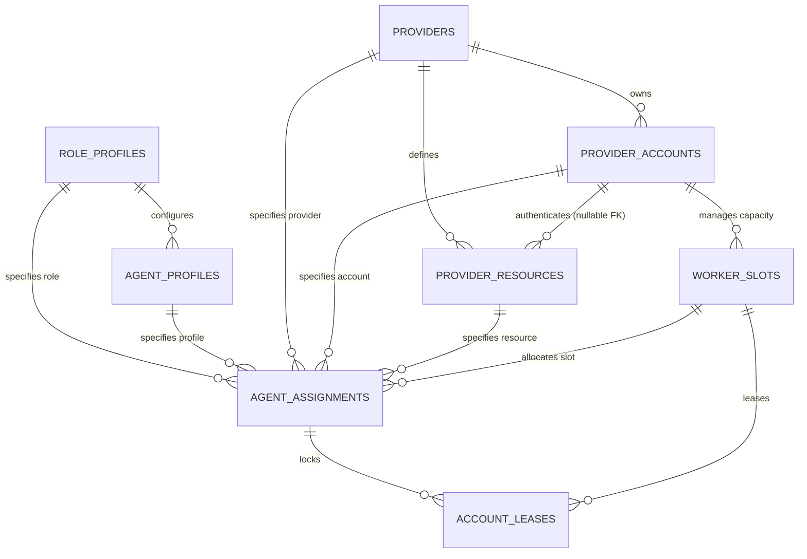
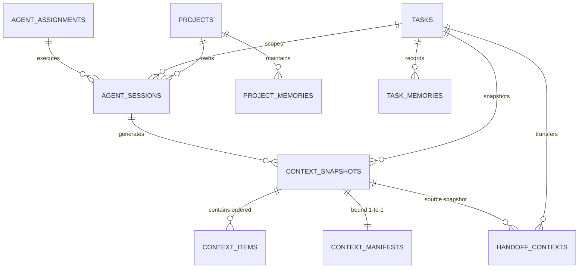

# R5 Role-Agnostic Agent Fabric Architecture

## 1. Executive Summary & Core Principle

The AgentForge R5 release family introduces a **Role-Agnostic Agent Fabric**, establishing a durable domain foundation that separates logical roles from specific AI providers, models, and accounts.

> [!NOTE]
> **R5-v1.1 Specification Alignment**:
> The R5-v1.1 specification supersedes the initial R5-v1.0 planning sequence, formally establishing durable local memory boundaries (R5B) and the complete 12-gate roadmap (R5A–R5L).

### The Fundamental Separation Invariant

$$\text{ROLE} \neq \text{AGENT PROFILE} \neq \text{PROVIDER} \neq \text{MODEL RESOURCE} \neq \text{PROVIDER ACCOUNT} \neq \text{SESSION / WORKER SLOT}$$

No provider-specific role classes (such as `ClaudeReviewer`, `CodexCoder`, or `GeminiManager`) exist. Any model resource backed by an authenticated provider account can serve any role for which it satisfies capability, policy, and separation constraints.

---

## 2. R5A Domain Entities & Schema

The R5A domain foundation introduces 8 new durable entities and extends the existing `provider_resources` table additively.



### Entity Specifications

### 1. `RoleProfile` (`role_profiles`)
Represents an abstract logical role independent of provider, model, or account.
- **Fields**: `id`, `role` (`MANAGER`, `PLANNER`, `CODER`, `REVIEWER`, `SECURITY_REVIEWER`, `RESEARCHER`, `RELEASE_MANAGER`, `MONITOR`, `TOOL`), `display_name`, `required_capabilities_json`, `preferred_capabilities_json`, `authority_scope_json`, `permissions_json`, `output_protocol`, `enabled`, `created_at`, `updated_at`.
- **Purpose**: Defines required and preferred capabilities, authority scope, and protocol requirements without hardcoding provider implementations.

### 2. `AgentProfile` (`agent_profiles`)
Represents reusable agent persona, prompting strategy, and behavioral configuration.
- **Fields**: `id`, `role_profile_id` (FK `role_profiles`), `name`, `prompt_template`, `config_json`, `enabled`, `created_at`, `updated_at`.
- **Purpose**: Decouples prompt engineering and runtime configuration from accounts and credentials.

### 3. `ProviderAccount` (`provider_accounts`)
Represents an authenticated credential boundary and quota scope under a provider.
- **Fields**: `id`, `provider_id` (FK `providers`), `label`, `auth_mode` (`NATIVE_PROFILE`, `API_CREDENTIAL`), `credential_ref`, `profile_ref`, `enabled`, `priority`, `health_status`, `cooldown_until`, `concurrency_limit`, `last_success_at`, `last_failure_at`, `last_failure_code`, `created_at`, `updated_at`.
- **Purpose**: Supports multi-account load balancing, independent rate limiting, and credential rotation.

### 4. Model Resource ↔ Account Linkage (`provider_resources.provider_account_id`)
- **Fields Added**: `provider_account_id` (nullable FK `provider_accounts`).
- **Compatibility Strategy (Option A)**: Append-only migration column. Pre-R5A `provider_resources` remain fully functional without account linkage (`NULL`). Future routers can optionally resolve account bindings.

### 5. `WorkerSlot` (`worker_slots`)
Represents a discrete unit of concurrency under a provider account.
- **Fields**: `id`, `provider_account_id` (FK `provider_accounts`), `provider_resource_id` (nullable FK `provider_resources`), `slot_index`, `status` (`IDLE`, `LEASED`, `RUNNING`, `COOLDOWN`, `OFFLINE`, `DISABLED`), `current_assignment_id`, `current_execution_id`, `heartbeat_at`, `created_at`, `updated_at`.
- **Constraint**: `UNIQUE(provider_account_id, slot_index)`.

### 6. `AgentAssignment` (`agent_assignments`)
The primary decoupling entity that binds a specific task and role to an allocated provider, account, resource, and worker slot.
- **Fields**: `id`, `project_id` (FK `projects`), `task_id` (FK `tasks`), `attempt_id` (nullable FK `task_attempts`), `role_profile_id` (FK `role_profiles`), `agent_profile_id` (nullable FK `agent_profiles`), `selected_provider_id` (FK `providers`), `selected_account_id` (FK `provider_accounts`), `selected_resource_id` (FK `provider_resources`), `selected_worker_slot_id` (nullable FK `worker_slots`), `routing_decision_id`, `preferred_metadata_json`, `status` (`ASSIGNED`, `RUNNING`, `COMPLETED`, `FAILED`, `CANCELLED`, `HANDED_OFF`), `created_at`, `ended_at`.

### 7. `AccountLease` (`account_leases`)
Durable concurrency lock over a worker slot during execution.
- **Fields**: `id`, `assignment_id` (FK `agent_assignments`), `provider_account_id` (FK `provider_accounts`), `worker_slot_id` (FK `worker_slots`), `lease_token` (UNIQUE), `acquired_at`, `expires_at`, `heartbeat_at`, `released_at`.
- **Concurrency Invariant**: `CREATE UNIQUE INDEX idx_active_slot_lease ON account_leases(worker_slot_id) WHERE released_at IS NULL;` ensures at most one active lease per worker slot.

### 8. `RoutePolicy` (`route_policies`)
Durable declarative routing criteria and failover configurations.
- **Fields**: `id`, `name`, `required_capabilities_json`, `preferred_capabilities_json`, `provider_account_policy_json`, `allow_manual_bridge`, `failover_policy_json`, `risk_policy_json`, `enabled`, `created_at`, `updated_at`.

### 9. `SeparationPolicy` (`separation_policies`)
Durable representation of review / coder separation and isolation rules.
- **Fields**: `id`, `name`, `same_execution_forbidden`, `same_session_forbidden`, `same_account_policy` (`ALLOW`, `PREFER_DIFFERENT`, `REQUIRE_DIFFERENT`), `same_provider_policy`, `same_model_policy`, `risk_threshold` (`LOW`, `MEDIUM`, `HIGH`, `CRITICAL`), `applicability_json`, `enabled`, `created_at`, `updated_at`.

---

## 3. Compatibility Bridge to Legacy Agent & ProviderResource

1. **Preserved Legacy Tables & Enums**: `Agent`, `AgentRole`, `Provider`, `ProviderResource`, `TaskLease`, and `ExecutionAuthorization` remain untouched in schema semantics.
2. **Immutable Migration Ledger**: Migration `008_r5a_role_agnostic_agent_fabric` was appended to the immutable migration list (v1 through v7 remain unmodified).
3. **Zero Routing Regression**: Legacy routing queries in `ProviderRoutingService` and `ProviderRegistry` continue to select provider resources directly without requiring `provider_account_id` bindings.
4. **Dual Migration Path Verification**: Verified for both fresh database initialization and historical step-by-step upgrade from v1 through v8.

---

## 4. Explicit Non-Goals for R5A

- **No Real AI Account Connections**: No live API keys, OAuth flows, or cloud calls.
- **No MCP Networking**: No MCP server initialization or network listeners.
- **No Production Execution Overhauls**: Codex, Gemini, Claude, and Manual Bridge runtime adapters are not modified.
- **No Local LLM Gateway**: No local inference proxy or runtime daemon.
- **No Multi-Agent Scheduling**: Current single-agent task execution and protocol state machines remain in place.

---

## 5. Security Invariants

> [!IMPORTANT]
> **Zero Plaintext Secrets In SQLite**:
> The schema and domain models strictly prohibit storing plaintext secrets.
> - Columns such as `password`, `access_token`, `refresh_token`, `bearer_token`, `api_key`, or `oauth_token` are forbidden.
> - Authentication is referenced solely via opaque handles (`credential_ref`, `profile_ref`).
> - No credential reading from the host system or writing to Windows Credential Manager occurs in R5A.

---

## 6. Durable Memory & Context Fabric (R5B Implementation)

In AgentForge R5-v1.1 / R5B, the relationship between operational execution and persistent memory is codified into 7 durable SQLite entities and a provider-neutral `ContextBuilderService`:



### 1. `AgentSession` (`agent_sessions`)
Represents a distinct logical execution session bound to a project, task, attempt, and assignment. Decoupled from external vendor conversation threads.
- **Fields**: `id`, `project_id`, `task_id`, `attempt_id`, `assignment_id`, `provider_id`, `provider_account_id`, `provider_resource_id`, `external_session_ref`, `status` (`ACTIVE`, `ENDED`, `FAILED`, `SUSPENDED`), `started_at`, `ended_at`, `created_at`, `updated_at`.

### 2. `ProjectMemory` (`project_memories`)
Represents durable, versioned project-level knowledge, architectural constraints, and repository facts.
- **Fields**: `id`, `project_id`, `memory_type` (`ARCHITECTURE`, `OWNER_POLICY`, `CONSTRAINT`, `DECISION`, `CONVENTION`, `REPOSITORY_FACT`, `CUSTOM`), `key`, `value_json`, `source_type`, `source_ref`, `revision`, `is_active`, `created_at`, `updated_at`.
- **Versioning Invariant**: Partial unique index `UNIQUE(project_id, memory_type, key) WHERE is_active = 1`. Updating memory deactivates previous revisions and increments `revision`.

### 3. `TaskMemory` (`task_memories`)
Represents durable, versioned task-specific operational memory (completed steps, remaining steps, acceptance criteria, known issues, verification facts).
- **Fields**: `id`, `project_id`, `task_id`, `attempt_id`, `assignment_id`, `memory_type` (`GOAL`, `ACCEPTANCE_CRITERION`, `CONSTRAINT`, `COMPLETED_STEP`, `REMAINING_STEP`, `KNOWN_ISSUE`, `DECISION`, `VERIFICATION_FACT`, `RECOMMENDED_NEXT_ACTION`, `CUSTOM`), `key`, `value_json`, `source_type`, `source_ref`, `revision`, `is_active`, `created_at`, `updated_at`.
- **Versioning Invariant**: Partial unique index `UNIQUE(task_id, memory_type, key) WHERE is_active = 1`.

### 4. `ContextSnapshot` (`context_snapshots`)
Represents an immutable, frozen compilation of context prepared for execution, review, research, or handoff.
- **Fields**: `id`, `project_id`, `task_id`, `attempt_id`, `assignment_id`, `session_id`, `purpose` (`EXECUTION`, `REVIEW`, `HANDOFF`, `MANAGER`, `RESEARCH`, `CUSTOM`), `snapshot_version`, `builder_version`, `content_hash`, `created_at`.

### 5. `ContextItem` (`context_items`)
Ordered elements belonging to a frozen ContextSnapshot.
- **Fields**: `id`, `snapshot_id`, `ordinal`, `item_type` (`PROJECT_CONTRACT`, `PROJECT_MEMORY`, `TASK_CORE`, `TASK_MEMORY`, `CHECKPOINT`, `HANDOFF`, `CONTEXT_FILE_REFERENCE`, `CUSTOM`), `source_type`, `source_ref`, `content_json`, `content_hash`, `token_estimate`, `created_at`.
- **Ordering Invariant**: `UNIQUE(snapshot_id, ordinal)`.

### 6. `ContextManifest` (`context_manifests`)
Canonical, reproducible manifest describing the immutable snapshot and its constituent items.
- **Fields**: `id`, `snapshot_id UNIQUE`, `manifest_version`, `item_count`, `manifest_json`, `manifest_hash`, `created_at`.
- **Hash Invariant**: SHA-256 over canonical deterministic JSON representation of manifest metadata + array of item hashes.

### 7. `HandoffContext` (`handoff_contexts`)
Durable bridge facilitating cross-agent, cross-model, or cross-provider task movement without data loss.
- **Fields**: `id`, `project_id`, `task_id`, `attempt_id`, `from_assignment_id`, `to_assignment_id`, `source_snapshot_id`, `handoff_snapshot_id`, `reason`, `status` (`PENDING`, `READY`, `CONSUMED`, `FAILED`, `CANCELLED`), `created_at`, `consumed_at`.

### 8. `ContextBuilderService` & Compilation Hierarchy
Deterministic, provider-neutral context aggregation compiler:
1. `PROJECT_CONTRACT`: Project contract truths and owner policies.
2. `PROJECT_MEMORY`: Active project memories sorted deterministically (`memory_type ASC, key ASC`).
3. `TASK_CORE`: Core task definition, state, revision, acceptance criteria, constraints.
4. `TASK_MEMORY`: Active task memories sorted deterministically (`memory_type ASC, key ASC`).
5. `CHECKPOINT`: Latest or explicit task checkpoints.
6. `HANDOFF`: Latest or explicit handoff contexts.
7. `CONTEXT_FILE_REFERENCE`: Sanitized repository-relative file paths sorted alphabetically.
8. `CUSTOM`: Custom domain items sorted by `sourceType ASC, sourceRef ASC`.

---

## 7. R5C Local Account & Credential Fabric Architecture

### 1. Executive Principle & Token Ownership

> [!IMPORTANT]
> **AGENTFORGE SHOULD PREFER SPAWNING A PROVIDER'S NATIVE CLI UNDER ITS SELECTED PROFILE RATHER THAN COPYING OR EXTRACTING THE PROVIDER'S OAUTH TOKENS.**

The R5C Local Account & Credential Fabric implements a strict security boundary ensuring that zero plaintext secrets enter SQLite persistence:

$$\text{ROLE} \neq \text{AGENT PROFILE} \neq \text{PROVIDER} \neq \text{MODEL RESOURCE} \neq \text{PROVIDER ACCOUNT} \neq \text{CREDENTIAL} \neq \text{NATIVE PROFILE} \neq \text{SESSION / WORKER SLOT}$$

### 2. SQLite vs Secure Store Ownership

- **SQLite Persistence**: Stores only opaque, non-sensitive reference pointers (`credential_ref` such as `wincred://agentforge/openai/api-01` or `profile_ref` such as `native-profile://codex/c01`). Zero API keys, passwords, bearer tokens, session cookies, or OAuth secrets are stored in SQLite database rows.
- **Windows Credential Manager (Production)**: Stores secret payloads under current-user scope via Win32 `advapi32.dll` generic credentials in the `AgentForge:` namespace. Secrets are piped via standard input to ensure no secret payload appears in process command-line arguments, environment logs, or task telemetry.
- **In-Memory Credential Store (Testing & CI)**: Pure in-memory dependency injection fake for hermetic automated tests and non-Windows CI runners.

### 3. CredentialRef Lifecycle & Canonical Identity

```
[User / Config] -> [parseCredentialRef(uri)] -> [CredentialRef (Canonical Lowercase)]
                                                    |
                                    +---------------+---------------+
                                    |                               |
                                    v                               v
                    [WindowsCredentialStore]              [provider_accounts table]
                    (Re-validates canonical ref           (SQLite: stores canonical
                     -> AgentForge:<ns>:<id>)              opaque URI only)
```

1. **Parse & Validate**: Scheme-aware parser (`wincred://agentforge/<namespace>/<credential-id...>`) enforces format hygiene, traversal rejection, colon/backslash rejection, and lowercase canonicalization.
2. **Canonical Lowercase Policy**: Microsoft Windows Credential Manager `TargetName` is case-insensitive. To prevent case-aliasing attacks, all credential target path segments are transformed to lowercase canonical form (`wincred://agentforge/OpenAI/Key` -> `wincred://agentforge/openai/key` -> `AgentForge:openai:key`).
3. **Validated Construction Boundary**: `CredentialRef` constructor accepts only raw URI strings and validates them directly. Public unchecked factory methods (`_createInternal`) are removed.
4. **Consumer Boundary Revalidation**: `WindowsCredentialStore` re-validates all references fail-closed before invoking OS commands, ignoring forged object properties.
5. **Safe Serialization**: `CredentialRef.toString()` and `toSafeString()` contain only pointer metadata.
6. **Fail-Closed Resolution**: Plaintext retrieval requires explicit `CredentialStore.get(ref)` returning a `SecretValue` wrapper using private `#secret` encapsulation whose `toString()`, `toJSON()`, spreading, and inspection hooks return `[REDACTED_SECRET]`.

### 4. NativeProfileRef & Resolver Lifecycle

```
[NativeProfileRef (native-profile://<provider>/<profileId>)]
           |
           v (Re-validated fail-closed)
[NativeProfileResolver] -> [Environment Overrides & Profile Dirs]
                           (e.g., CODEX_HOME, GEMINI_CLI_HOME, CLAUDE_CONFIG_DIR)
                           * Never reads, inspects, or copies OAuth tokens *
```

1. **Format & Case Canonicalization**: `native-profile://<provider>/<profileId>` (e.g. `native-profile://gemini/g01`). Because Windows filesystems are case-insensitive, provider and profile identifiers are canonicalized to lowercase to prevent directory aliasing.
2. **Construction Boundary & Revalidation**: `NativeProfileRef` validates and canonicalizes directly in its constructor. `NativeProfileResolver.resolve()` re-validates references fail-closed.
3. **Two-Tier Status Model**:
   - **Codex**:
     - `configurationStatus: DOCUMENTED_SUPPORTED`
     - `runtimeIsolationStatus: PENDING_R5D`
     - Sets `CODEX_HOME` to isolated profile directory.
   - **Gemini**:
     - `configurationStatus: DOCUMENTED_SUPPORTED`
     - `runtimeIsolationStatus: PENDING_R5D`
     - Sets `GEMINI_CLI_HOME` to isolated profile directory.
   - **Claude**:
     - `configurationStatus: EXPERIMENTAL_UNPROVEN`
     - `runtimeIsolationStatus: PENDING_R5D`
     - Sets `CLAUDE_CONFIG_DIR` to isolated profile directory.
   - **Unknown Providers**: Fail-closed with `UNSUPPORTED_NATIVE_PROFILE_PROVIDER` error; never invents ad-hoc environment variables.
4. **R5D Verification Boundary**: R5C establishes configuration mapping. All multi-profile runtime account isolation remains classified as `PENDING_R5D` until verified during live R5D execution proofs.
---

## 8. Next Gates (Authoritative R5-v1.1 Roadmap)

The R5 planning sequence is governed by the authoritative R5-v1.1 roadmap:

- **R5A — Role-Agnostic Domain Foundation** `[CLOSED_SUCCESSFULLY]`: Durable entity separation (`ROLE != PROFILE != PROVIDER != RESOURCE != ACCOUNT != SLOT`), schema migrations, relational provenance validation.
- **R5B — Durable Memory & Context Fabric** `[CLOSED_SUCCESSFULLY]`: Local structured task/project memory, versioned context snapshots, manifest hashing, deterministic context builders.
- **R5C — Local Account & Credential Fabric** `[CURRENT GATE]`: Secure credential references, Windows Credential Manager integration, profile resolvers, zero plaintext in SQLite.
- **R5D — Native Multi-Profile Execution Proof**: Multi-profile isolation and authentication validation across distinct provider accounts.
- **R5E — Role-Aware Router & Separation Policy**: Capability matching, conflict-of-interest enforcement (reviewer != coder), affinity policies.
- **R5F — Production CLI Runtime Adapters**: Live runtime execution bridges for Codex, Gemini, Claude, and Manual Bridge.
- **R5G — Concurrent Scheduler & Worktree Isolation**: Multi-agent slot allocation, isolated git worktrees, task concurrency control.
- **R5H — Quota / Account / Provider Failover**: Dynamic quota tracking, rate-limit backoff, multi-account failover handlers.
- **R5I — Cross-Agent / Cross-Provider Mid-Task Handoff**: Context preservation across agent handoffs and model transitions.
- **R5J — AgentForge MCP + IDE/Client Bridge**: MCP protocol servers and IDE integration endpoints.
- **R5K — Optional Local LLM Gateway**: Local inference adapter and model gateway integration.
- **R5L — Dynamic Multi-Role / Multi-Account / Context-Continuity Production Trial**: End-to-end multi-agent production verification.

---

## 9. R5H Provider Health Observation Ordering Authority

### 1. Authoritative Precedence Semantic: Durable Ingestion Order
- **Semantic Definition**: For two authenticated durable provider-health observations belonging to the same `ProviderAccount`, the observation assigned the greater account-local durable ingestion ordinal (`account_order`) is authoritative and newer.
- **Repository Authority**: Monotonic `account_order` is allocated exclusively by `Repository.claimProviderHealthObservation` inside an immediate transaction (`COALESCE(MAX(account_order), 0) + 1` per `account_id`). Callers, adapters, and services cannot supply or forge order values.
- **Ordering Scope**: Strictly scoped to `ProviderAccount` across all tasks and projects. Different provider accounts maintain independent integer sequences starting from 1.
- **Audit Chronology vs Precedence**: `observed_at` (ISO timestamp) is preserved for audit chronology only; it does not determine health precedence or act as an order tie-breaker.
- **Non-Precedence Signals**: External provider completion time, adapter completion/start time, execution authorization creation/claim time, dispatch entry, lease acquisition, and agent assignment creation are not health precedence authorities.
- **Legacy Observations**: Pre-migration observations remain with `account_order = NULL` and are not retroactively backfilled or automatically applied.
- **Boundaries & Open Areas**:
  - This ordering authority contract establishes durable observation ordering only and does NOT authorize automatic health status mutation.
  - Manual / administrative / non-execution health precedence remains unresolved.
  - Cooldown replay and absolute `cooldownUntil` timestamp authority remain unresolved.

---

## 10. R5H Provider Account Health Single-Writer Authority & Write-Surface Containment

### 1. Authoritative Architecture Model: Single Semantic Health Writer
- **Semantic Writer**: `AccountHealthService` is the single semantic production authority for existing `ProviderAccount` health mutations.
- **Storage Primitive**: `Repository.updateProviderAccountHealth` is a low-level storage primitive and not an independent semantic authority. Production code outside `AccountHealthService` must not call it.
- **Configuration Containment**: Generic configuration updates via `Repository.updateProviderAccount` are restricted strictly to configuration fields (`label`, `auth_mode`, `credential_ref`, `profile_ref`, `enabled`, `priority`, `concurrency_limit`) and can never write or clobber health fields (`health_status`, `cooldown_until`, `last_success_at`, `last_failure_at`, `last_failure_code`).
- **Control Plane Separation**: The administrative `enabled` field remains independent from health telemetry and status signals. Health mutations cannot modify `enabled`, and configuration updates cannot modify health signals.
- **Initialization Boundary**: Account creation via `Repository.createProviderAccount` may set initial health state upon creation, but all subsequent existing-account health updates must flow exclusively through the single health authority.
- **Manual Precedence & Future Application**:
  - No live manual health override exists in the shipped runtime.
  - Future manual/admin health features require a separate durable precedence contract.
  - Future automatic observation application must extend this single write authority model with durable `account_order` CAS / idempotency.

---

## 11. R5H Durable Provider Health Action Plan Authority & Frozen Routing Policy Snapshot

### 1. Authoritative Lifecycle Points & Durability
- **Policy Freeze Point**: `ROUTING_DECISION`. When `RoleAwareRoutingService` evaluates candidates, it parses and canonicalizes the `RoutePolicy`'s failover policy via `FailoverPolicyParser.parse()` into an immutable `FailoverPolicyAuthoritySnapshotV1` (`VALID`, `ABSENT`, or `INVALID`).
- **Policy Snapshot Authority**: `DURABLE_ROUTING_DECISION_EVENT`. The canonical snapshot is persisted directly in the `ROLE_AWARE_ROUTING_DECISION` structured event payload alongside `routePolicyId`.
- **Execution Binding Authority**: `ExecutionAuthorization.routing_decision_id`. Execution authorizations link immutably to the routing decision without replicating redundant mutable policy blobs.
- **Final Action Derivation Authority**: `Repository.claimProviderHealthObservation`. When an observation is claimed, the repository reconstructs the policy result from the durable routing event snapshot, passes it with the authentic `ProviderDispatchExecutionResult` to `FailureHealthMutationPolicyService.evaluate()`, and persists the resulting bounded `ProviderAccountHealthActionPlan` atomically into `provider_health_observations`.
- **Final Action Policy Engine**: `FailureHealthMutationPolicyService`. Pure, deterministic mapping of execution outcome and frozen policy snapshot to bounded health action plans.

### 2. Immutability & Replay Independence
- **Post-Routing Policy Mutation**: Any subsequent mutation to `RoutePolicy` (e.g. changing or removing `cooldown_duration_ms`) has zero effect on the historical snapshot captured at routing time.
- **Replay Independence**: Once persisted in `provider_health_observations` (`health_action_plan_version`, `health_action`, `health_action_cooldown_duration_ms`), future health state application requires neither the original raw `ProviderDispatchExecutionResult` nor current/historical policy evaluation.
- **Rate-Limit Distinguishability**: Durable action plans clearly distinguish `RECORD_RATE_LIMITED` (with explicit snapshotted `cooldown_duration_ms`) from `NO_MUTATION` (when cooldown is missing/disabled), resolving all rate-limit ambiguity.

### 3. Legacy and Fail-Closed Semantics
- **Legacy Routing Events**: Old routing events without a policy snapshot record observations normally with `account_order`, but persist `health_action_plan_version = NULL`, `health_action = NULL`, and `health_action_cooldown_duration_ms = NULL`.
- **NULL Plan vs NO_MUTATION**: A `NULL` action plan signifies missing historical authority (legacy observation) and is never equivalent to `NO_MUTATION`. Newly derived action plans always persist `health_action_plan_version = 1`.
- **NO_MUTATION Precedence & Watermarks**: `NO_MUTATION` is a valid durable action plan, but it does NOT supersede older unapplied actionable health evidence and must NOT advance the actionable health stale watermark.
- **Boundaries**:
  - No health application CAS or `AccountHealthService` mutation is performed during observation ingestion.

---

## 12. R5H Durable Provider Health Cooldown Replay Authority & Temporal Anchor

### 1. Authoritative Temporal Ingestion Model
- **Authoritative Cooldown Start**: `DURABLE_ACTION_PLAN_INGESTION_TIME`. Cooldown duration starts when the actionable health plan becomes durable (DURABLE EVIDENCE COMMIT TIME).
- **Single Trusted Allocator**: Inside `Repository.claimProviderHealthObservation()`, within the same `IMMEDIATE` transaction that allocates `account_order` and derives the action plan, the Repository generates an authoritative wall-clock timestamp (`health_action_cooldown_anchor_at = new Date().toISOString()`) for new `RECORD_RATE_LIMITED` actions with positive duration.
- **Non-Authorities**: The temporal anchor is explicitly NOT:
  - `observed_at`: caller-provided audit chronology only.
  - Provider completion time: not currently captured/bound.
  - Routing decision time: occurs before execution/failure.
  - Authorization time: occurs before execution/failure.
  - Application time: closes the application delay / restart extension hazard.
- **Observation Write Delay**: Cooldown duration starts at durable evidence commit time; observation persistence delay can shift the initial anchor.

### 2. Schema and Derived Absolute Until
- **Storage Model**: `health_action_cooldown_anchor_at` is persisted in `provider_health_observations` alongside `health_action_cooldown_duration_ms`.
- **No Duplicate Storage**: `cooldown_until` is not stored as a redundant column. The canonical absolute until is derived deterministically:
  $$\text{derivedCooldownUntilMs} = \text{Date.parse}(\text{health\_action\_cooldown\_anchor\_at}) + \text{health\_action\_cooldown\_duration\_ms}$$
- **Non-Rate-Limited Actions**: For `NO_MUTATION`, `RECORD_SUCCESS`, `RECORD_QUOTA_EXHAUSTED`, `RECORD_AUTH_ERROR`, and legacy action plans, `health_action_cooldown_anchor_at` is strictly `NULL`.

### 3. Legacy v13 & Upgrade Rules
- **No Backfill**: Migration 14 performs no backfill on existing v13 rows (`health_action_cooldown_anchor_at` remains `NULL`).
- **Temporal Authority Unknown**: Legacy v13 `RECORD_RATE_LIMITED` rows have known action authority but unknown temporal replay authority and are not automatically replay-applicable without explicit policy resolution.
- **Action Plan Version**: `health_action_plan_version` remains `1` because action derivation logic is unchanged.

### 4. Expired Rate-Limit Semantics & Precedence
- **Expiry Semantics**: When `derivedCooldownUntilMs <= now`, the temporary routing block has passed. Expiry does NOT convert the event into `NO_MUTATION`, `AVAILABLE`, or `SUCCESS`.
- **Precedence**: A newer `RECORD_RATE_LIMITED` observation (even if its derived cooldown has expired) represents valid newer actionable evidence that supersedes older actionable states (e.g., `RECORD_AUTH_ERROR`) and advances the actionable stale authority.
- **Router Behavior**: `RoleAwareRoutingService` evaluates active vs expired cooldowns dynamically during routing; expired cooldowns do not block routing, and the router does not mutate database health status.

### 5. Single-Writer & Application Boundaries
- **Single Semantic Writer**: `AccountHealthService` remains the sole semantic authority for health state mutations.
- **Historical Replay API Gap**: The current `AccountHealthService.recordRateLimited()` requires strictly future cooldowns; historical replay and atomic CAS application remain separate future gates.
- **No Ingestion Mutations**: Ingestion of observations and cooldown anchors performs zero health state mutations.

## 13. Ordered Provider Health Application & Idempotency Architecture (R5H4)

### 1. Authoritative Application Model & Precedence
- **Durable Input Authority**: Health application consumes strictly the persisted `ProviderHealthObservationRecord` (via `authorization_id`). It ignores raw provider responses, caller-supplied parameters, and current routing policies.
- **Precedence Model**: Governed by monotonic, account-local `account_order`.
- **Application Order Model**: `LATEST_EFFECTIVE_ACTIONABLE_WINS`. The newest effective actionable observation for an account determines its current operational health state.
- **Application State Model**: `PROVIDER_ACCOUNT_WATERMARK_ONLY`. Watermark state is maintained directly on `provider_accounts` via `last_applied_action_account_order` and `last_applied_action_authorization_id` (Migration 15).

### 2. Correctness Domain & Timestamp Semantics
- **Correctness Scope**: `CURRENT_OPERATIONAL_HEALTH_STATE_PLUS_ACTION_WATERMARK`. Correctness requires `health_status`, `cooldown_until`, and the applied actionable watermark to reflect the newest effective action.
- **Application-Time Metadata**: `last_success_at`, `last_failure_at`, `last_failure_code`, and `updated_at` represent applied mutation metadata generated at application time (`now()`). The durable `provider_health_observations` ledger remains the authoritative audit trail of all historical execution evidence.
- **Stale Actions**: Stale skipped actions perform zero writes and do not alter `last_*` metadata.

### 3. Resolution & Barrier Direction Rules
When evaluating a candidate observation against the account ledger:
- **NO_MUTATION Transparency**: `NO_MUTATION` rows have no health state impact and are transparent when scanning for newer actionable candidates.
- **Newer Known Action**: If a newer valid actionable observation exists (`RECORD_SUCCESS`, `RECORD_QUOTA_EXHAUSTED`, `RECORD_AUTH_ERROR`, or valid `RECORD_RATE_LIMITED`), the older candidate returns `STALE` with zero writes.
- **Newer Unresolved Barrier**: If a newer observation has unknown action authority (missing/invalid plan) or unknown temporal authority (rate limit with null anchor), an older action cannot safely leapfrog it and is `DEFERRED_BY_NEWER_UNKNOWN_AUTHORITY`.
- **Older Unresolved Non-Barrier**: An older unresolved observation does NOT block a newer valid actionable candidate from applying immediately.

### 4. Historical Expired Rate-Limit Application
- **Historical Replay**: Modern `RECORD_RATE_LIMITED` observations with positive duration and authoritative anchor derive `cooldown_until = anchor + duration`.
- **Expired Application**: If derived `cooldown_until <= now()`, the observation is successfully applied with `health_status = 'RATE_LIMITED'`, the derived past timestamp in `cooldown_until`, and `last_failure_code = 'RATE_LIMITED'`. Expired rate limits are never converted to `AVAILABLE`, `SUCCESS`, or `NO_MUTATION`.
- **Router Compatibility**: `RoleAwareRoutingService` evaluates `cooldown_until > now()` dynamically; expired cooldowns do not block routing.

### 5. Atomic Storage CAS & Idempotency
- **Single Immediate Transaction**: The entire resolution, stale check, duplicate check, health mutation, and watermark advancement occur in one atomic `BEGIN IMMEDIATE` transaction in `Repository.applyDurableProviderHealthObservation`.
- **Zero Crash Window**: Health-first or watermark-first partial commits are impossible.
- **Duplicate Idempotency**: If `target.account_order === watermark.order` and `target.authorization_id === watermark.auth`, returns `ALREADY_APPLIED` with zero database writes.
- **Watermark Pair Coherence**: The application watermark `(last_applied_action_account_order, last_applied_action_authorization_id)` is a logical pair where valid persisted states are strictly both NULL or both non-NULL. Migration 15 does not provide a DB-level pair constraint, but the application runtime enforces pair coherence at the start of transaction. Any malformed partial pair fails closed with `status = 'REJECTED'`, error code `WATERMARK_PAIR_INTEGRITY_MISMATCH`, and zero database writes.
- **SQLite Serialization**: SQLite `BEGIN IMMEDIATE` serializes write transactions at the database writer boundary. This contract does NOT claim physically parallel SQLite writes across accounts, and no dedicated account-level application lock exists.
- **State Isolation**: Same-account health application remains logically isolated because target resolution, health mutation, and watermark CAS occur in one `IMMEDIATE` transaction using account-local `account_order`. Different ProviderAccounts retain independent health state, account-order spaces, and watermarks.

### 6. Semantic Boundary & Production Wiring Scope
- **Single Semantic Entrypoint**: `AccountHealthService.applyDurableObservation(authorizationId)` is the sole public facade.
- **No Production Mutation Wiring**: Ingestion does not trigger synchronous application, and startup recovery does not execute health reconciliation in this contract phase. All production orchestration remains deferred to subsequent gates.
