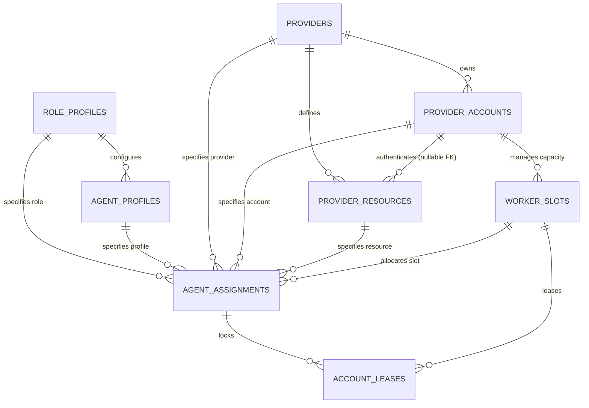
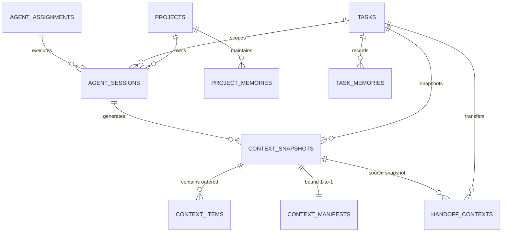

# R5 Role-Agnostic Agent Fabric Architecture

## 1. Executive Summary & Core Principle

The AgentForge R5 release family introduces a **Role-Agnostic Agent Fabric**, establishing a durable domain foundation that separates logical roles from specific AI providers, models, and accounts.

> [!NOTE]
> **R5-v1.1 Specification Alignment**:
> The R5-v1.1 specification supersedes the initial R5-v1.0 planning sequence, formally establishing durable local memory boundaries (R5B) and the complete 12-gate roadmap (R5A–R5L).

### The Fundamental Separation Invariant

$$\text{ROLE} \neq \text{AGENT PROFILE} \neq \text{PROVIDER} \neq \text{MODEL RESOURCE} \neq \text{PROVIDER ACCOUNT} \neq \text{SESSION / WORKER SLOT}$$

No provider-specific role classes (such as `ClaudeReviewer`, `CodexCoder`, or `GeminiManager`) exist. Any model resource backed by an authenticated provider account can serve any role for which it satisfies capability, policy, and separation constraints.

---

## 2. R5A Domain Entities & Schema

The R5A domain foundation introduces 8 new durable entities and extends the existing `provider_resources` table additively.

### Entity Specifications

### 1. `RoleProfile` (`role_profiles`)
Represents an abstract logical role independent of provider, model, or account.
- **Fields**: `id`, `role` (`MANAGER`, `PLANNER`, `CODER`, `REVIEWER`, `SECURITY_REVIEWER`, `RESEARCHER`, `RELEASE_MANAGER`, `MONITOR`, `TOOL`), `display_name`, `required_capabilities_json`, `preferred_capabilities_json`, `authority_scope_json`, `permissions_json`, `output_protocol`, `enabled`, `created_at`, `updated_at`.
- **Purpose**: Defines required and preferred capabilities, authority scope, and protocol requirements without hardcoding provider implementations.

### 2. `AgentProfile` (`agent_profiles`)
Represents reusable agent persona, prompting strategy, and behavioral configuration.
- **Fields**: `id`, `role_profile_id` (FK `role_profiles`), `name`, `prompt_template`, `config_json`, `enabled`, `created_at`, `updated_at`.
- **Purpose**: Decouples prompt engineering and runtime configuration from accounts and credentials.

### 3. `ProviderAccount` (`provider_accounts`)
Represents an authenticated credential boundary and quota scope under a provider.
- **Fields**: `id`, `provider_id` (FK `providers`), `label`, `auth_mode` (`NATIVE_PROFILE`, `API_CREDENTIAL`), `credential_ref`, `profile_ref`, `enabled`, `priority`, `health_status`, `cooldown_until`, `concurrency_limit`, `last_success_at`, `last_failure_at`, `last_failure_code`, `created_at`, `updated_at`.
- **Purpose**: Supports multi-account load balancing, independent rate limiting, and credential rotation.

### 4. Model Resource ↔ Account Linkage (`provider_resources.provider_account_id`)
- **Fields Added**: `provider_account_id` (nullable FK `provider_accounts`).
- **Compatibility Strategy (Option A)**: Append-only migration column. Pre-R5A `provider_resources` remain fully functional without account linkage (`NULL`). Future routers can optionally resolve account bindings.

### 5. `WorkerSlot` (`worker_slots`)
Represents a discrete unit of concurrency under a provider account.
- **Fields**: `id`, `provider_account_id` (FK `provider_accounts`), `provider_resource_id` (nullable FK `provider_resources`), `slot_index`, `status` (`IDLE`, `LEASED`, `RUNNING`, `COOLDOWN`, `OFFLINE`, `DISABLED`), `current_assignment_id`, `current_execution_id`, `heartbeat_at`, `created_at`, `updated_at`.
- **Constraint**: `UNIQUE(provider_account_id, slot_index)`.

### 6. `AgentAssignment` (`agent_assignments`)
The primary decoupling entity that binds a specific task and role to an allocated provider, account, resource, and worker slot.
- **Fields**: `id`, `project_id` (FK `projects`), `task_id` (FK `tasks`), `attempt_id` (nullable FK `task_attempts`), `role_profile_id` (FK `role_profiles`), `agent_profile_id` (nullable FK `agent_profiles`), `selected_provider_id` (FK `providers`), `selected_account_id` (FK `provider_accounts`), `selected_resource_id` (FK `provider_resources`), `selected_worker_slot_id` (nullable FK `worker_slots`), `routing_decision_id`, `preferred_metadata_json`, `status` (`ASSIGNED`, `RUNNING`, `COMPLETED`, `FAILED`, `CANCELLED`, `HANDED_OFF`), `created_at`, `ended_at`.

### 7. `AccountLease` (`account_leases`)
Durable concurrency lock over a worker slot during execution.
- **Fields**: `id`, `assignment_id` (FK `agent_assignments`), `provider_account_id` (FK `provider_accounts`), `worker_slot_id` (FK `worker_slots`), `lease_token` (UNIQUE), `acquired_at`, `expires_at`, `heartbeat_at`, `released_at`.
- **Concurrency Invariant**: `CREATE UNIQUE INDEX idx_active_slot_lease ON account_leases(worker_slot_id) WHERE released_at IS NULL;` ensures at most one active lease per worker slot.

### 8. `RoutePolicy` (`route_policies`)
Durable declarative routing criteria and failover configurations.
- **Fields**: `id`, `name`, `required_capabilities_json`, `preferred_capabilities_json`, `provider_account_policy_json`, `allow_manual_bridge`, `failover_policy_json`, `risk_policy_json`, `enabled`, `created_at`, `updated_at`.

### 9. `SeparationPolicy` (`separation_policies`)
Durable representation of review / coder separation and isolation rules.
- **Fields**: `id`, `name`, `same_execution_forbidden`, `same_session_forbidden`, `same_account_policy` (`ALLOW`, `PREFER_DIFFERENT`, `REQUIRE_DIFFERENT`), `same_provider_policy`, `same_model_policy`, `risk_threshold` (`LOW`, `MEDIUM`, `HIGH`, `CRITICAL`), `applicability_json`, `enabled`, `created_at`, `updated_at`.

---

## 3. Compatibility Bridge to Legacy Agent & ProviderResource

1. **Preserved Legacy Tables & Enums**: `Agent`, `AgentRole`, `Provider`, `ProviderResource`, `TaskLease`, and `ExecutionAuthorization` remain untouched in schema semantics.
2. **Immutable Migration Ledger**: Migration `008_r5a_role_agnostic_agent_fabric` was appended to the immutable migration list (v1 through v7 remain unmodified).
3. **Zero Routing Regression**: Legacy routing queries in `ProviderRoutingService` and `ProviderRegistry` continue to select provider resources directly without requiring `provider_account_id` bindings.
4. **Dual Migration Path Verification**: Verified for both fresh database initialization and historical step-by-step upgrade from v1 through v8.

---

## 4. Explicit Non-Goals for R5A

- **No Real AI Account Connections**: No live API keys, OAuth flows, or cloud calls.
- **No MCP Networking**: No MCP server initialization or network listeners.
- **No Production Execution Overhauls**: Codex, Gemini, Claude, and Manual Bridge runtime adapters are not modified.
- **No Local LLM Gateway**: No local inference proxy or runtime daemon.
- **No Multi-Agent Scheduling**: Current single-agent task execution and protocol state machines remain in place.

---

## 5. Security Invariants

> [!IMPORTANT]
> **Zero Plaintext Secrets In SQLite**:
> The schema and domain models strictly prohibit storing plaintext secrets.
> - Columns such as `password`, `access_token`, `refresh_token`, `bearer_token`, `api_key`, or `oauth_token` are forbidden.
> - Authentication is referenced solely via opaque handles (`credential_ref`, `profile_ref`).
> - No credential reading from the host system or writing to Windows Credential Manager occurs in R5A.

---

## 6. Durable Memory & Context Fabric (R5B Implementation)

In AgentForge R5-v1.1 / R5B, the relationship between operational execution and persistent memory is codified into 7 durable SQLite entities and a provider-neutral `ContextBuilderService`:

### 1. `AgentSession` (`agent_sessions`)
Represents a distinct logical execution session bound to a project, task, attempt, and assignment. Decoupled from external vendor conversation threads.
- **Fields**: `id`, `project_id`, `task_id`, `attempt_id`, `assignment_id`, `provider_id`, `provider_account_id`, `provider_resource_id`, `external_session_ref`, `status` (`ACTIVE`, `ENDED`, `FAILED`, `SUSPENDED`), `started_at`, `ended_at`, `created_at`, `updated_at`.

### 2. `ProjectMemory` (`project_memories`)
Represents durable, versioned project-level knowledge, architectural constraints, and repository facts.
- **Fields**: `id`, `project_id`, `memory_type` (`ARCHITECTURE`, `OWNER_POLICY`, `CONSTRAINT`, `DECISION`, `CONVENTION`, `REPOSITORY_FACT`, `CUSTOM`), `key`, `value_json`, `source_type`, `source_ref`, `revision`, `is_active`, `created_at`, `updated_at`.
- **Versioning Invariant**: Partial unique index `UNIQUE(project_id, memory_type, key) WHERE is_active = 1`. Updating memory deactivates previous revisions and increments `revision`.

### 3. `TaskMemory` (`task_memories`)
Represents durable, versioned task-specific operational memory (completed steps, remaining steps, acceptance criteria, known issues, verification facts).
- **Fields**: `id`, `project_id`, `task_id`, `attempt_id`, `assignment_id`, `memory_type` (`GOAL`, `ACCEPTANCE_CRITERION`, `CONSTRAINT`, `COMPLETED_STEP`, `REMAINING_STEP`, `KNOWN_ISSUE`, `DECISION`, `VERIFICATION_FACT`, `RECOMMENDED_NEXT_ACTION`, `CUSTOM`), `key`, `value_json`, `source_type`, `source_ref`, `revision`, `is_active`, `created_at`, `updated_at`.
- **Versioning Invariant**: Partial unique index `UNIQUE(task_id, memory_type, key) WHERE is_active = 1`.

### 4. `ContextSnapshot` (`context_snapshots`)
Represents an immutable, frozen compilation of context prepared for execution, review, research, or handoff.
- **Fields**: `id`, `project_id`, `task_id`, `attempt_id`, `assignment_id`, `session_id`, `purpose` (`EXECUTION`, `REVIEW`, `HANDOFF`, `MANAGER`, `RESEARCH`, `CUSTOM`), `snapshot_version`, `builder_version`, `content_hash`, `created_at`.

### 5. `ContextItem` (`context_items`)
Ordered elements belonging to a frozen ContextSnapshot.
- **Fields**: `id`, `snapshot_id`, `ordinal`, `item_type` (`PROJECT_CONTRACT`, `PROJECT_MEMORY`, `TASK_CORE`, `TASK_MEMORY`, `CHECKPOINT`, `HANDOFF`, `CONTEXT_FILE_REFERENCE`, `CUSTOM`), `source_type`, `source_ref`, `content_json`, `content_hash`, `token_estimate`, `created_at`.
- **Ordering Invariant**: `UNIQUE(snapshot_id, ordinal)`.

### 6. `ContextManifest` (`context_manifests`)
Canonical, reproducible manifest describing the immutable snapshot and its constituent items.
- **Fields**: `id`, `snapshot_id UNIQUE`, `manifest_version`, `item_count`, `manifest_json`, `manifest_hash`, `created_at`.
- **Hash Invariant**: SHA-256 over canonical deterministic JSON representation of manifest metadata + array of item hashes.

### 7. `HandoffContext` (`handoff_contexts`)
Durable bridge facilitating cross-agent, cross-model, or cross-provider task movement without data loss.
- **Fields**: `id`, `project_id`, `task_id`, `attempt_id`, `from_assignment_id`, `to_assignment_id`, `source_snapshot_id`, `handoff_snapshot_id`, `reason`, `status` (`PENDING`, `READY`, `CONSUMED`, `FAILED`, `CANCELLED`), `created_at`, `consumed_at`.

### 8. `ContextBuilderService` & Compilation Hierarchy
Deterministic, provider-neutral context aggregation compiler:
1. `PROJECT_CONTRACT`: Project contract truths and owner policies.
2. `PROJECT_MEMORY`: Active project memories sorted deterministically (`memory_type ASC, key ASC`).
3. `TASK_CORE`: Core task definition, state, revision, acceptance criteria, constraints.
4. `TASK_MEMORY`: Active task memories sorted deterministically (`memory_type ASC, key ASC`).
5. `CHECKPOINT`: Latest or explicit task checkpoints.
6. `HANDOFF`: Latest or explicit handoff contexts.
7. `CONTEXT_FILE_REFERENCE`: Sanitized repository-relative file paths sorted alphabetically.
8. `CUSTOM`: Custom domain items sorted by `sourceType ASC, sourceRef ASC`.

---

## 7. Next Gates (Authoritative R5-v1.1 Roadmap)

The R5 planning sequence is governed by the authoritative R5-v1.1 roadmap:

- **R5A — Role-Agnostic Domain Foundation** `[CLOSED_SUCCESSFULLY]`: Durable entity separation (`ROLE != PROFILE != PROVIDER != RESOURCE != ACCOUNT != SLOT`), schema migrations, relational provenance validation.
- **R5B — Durable Memory & Context Fabric** `[CURRENT GATE]`: Local structured task/project memory, versioned context snapshots, manifest hashing, deterministic context builders.
- **R5C — Local Account & Credential Fabric**: Secure credential references, Windows Credential Manager integration, profile resolvers.
- **R5D — Native Multi-Profile Execution Proof**: Multi-profile isolation and authentication validation across distinct provider accounts.
- **R5E — Role-Aware Router & Separation Policy**: Capability matching, conflict-of-interest enforcement (reviewer != coder), affinity policies.
- **R5F — Production CLI Runtime Adapters**: Live runtime execution bridges for Codex, Gemini, Claude, and Manual Bridge.
- **R5G — Concurrent Scheduler & Worktree Isolation**: Multi-agent slot allocation, isolated git worktrees, task concurrency control.
- **R5H — Quota / Account / Provider Failover**: Dynamic quota tracking, rate-limit backoff, multi-account failover handlers.
- **R5I — Cross-Agent / Cross-Provider Mid-Task Handoff**: Context preservation across agent handoffs and model transitions.
- **R5J — AgentForge MCP + IDE/Client Bridge**: MCP protocol servers and IDE integration endpoints.
- **R5K — Optional Local LLM Gateway**: Local inference adapter and model gateway integration.
- **R5L — Dynamic Multi-Role / Multi-Account / Context-Continuity Production Trial**: End-to-end multi-agent production verification.
