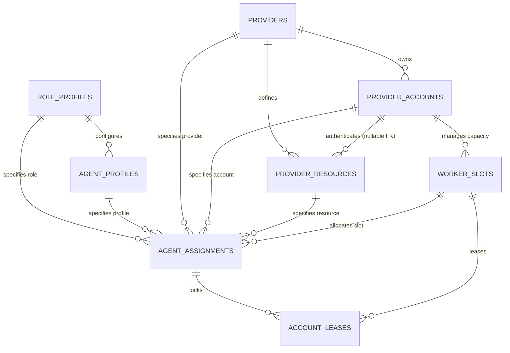

# R5 Role-Agnostic Agent Fabric Architecture

## 1. Executive Summary & Core Principle

The AgentForge R5 release family introduces a **Role-Agnostic Agent Fabric**, establishing a durable domain foundation that separates logical roles from specific AI providers, models, and accounts.

### The Fundamental Separation Invariant

$$\text{ROLE} \neq \text{AGENT PROFILE} \neq \text{PROVIDER} \neq \text{MODEL RESOURCE} \neq \text{PROVIDER ACCOUNT} \neq \text{SESSION / WORKER SLOT}$$

No provider-specific role classes (such as `ClaudeReviewer`, `CodexCoder`, or `GeminiManager`) exist. Any model resource backed by an authenticated provider account can serve any role for which it satisfies capability, policy, and separation constraints.

---

## 2. R5A Domain Entities & Schema

The R5A domain foundation introduces 8 new durable entities and extends the existing `provider_resources` table additively.

### Entity Specifications

### 1. `RoleProfile` (`role_profiles`)
Represents an abstract logical role independent of provider, model, or account.
- **Fields**: `id`, `role` (`MANAGER`, `PLANNER`, `CODER`, `REVIEWER`, `SECURITY_REVIEWER`, `RESEARCHER`, `RELEASE_MANAGER`, `MONITOR`, `TOOL`), `display_name`, `required_capabilities_json`, `preferred_capabilities_json`, `authority_scope_json`, `permissions_json`, `output_protocol`, `enabled`, `created_at`, `updated_at`.
- **Purpose**: Defines required and preferred capabilities, authority scope, and protocol requirements without hardcoding provider implementations.

### 2. `AgentProfile` (`agent_profiles`)
Represents reusable agent persona, prompting strategy, and behavioral configuration.
- **Fields**: `id`, `role_profile_id` (FK `role_profiles`), `name`, `prompt_template`, `config_json`, `enabled`, `created_at`, `updated_at`.
- **Purpose**: Decouples prompt engineering and runtime configuration from accounts and credentials.

### 3. `ProviderAccount` (`provider_accounts`)
Represents an authenticated credential boundary and quota scope under a provider.
- **Fields**: `id`, `provider_id` (FK `providers`), `label`, `auth_mode` (`NATIVE_PROFILE`, `API_CREDENTIAL`), `credential_ref`, `profile_ref`, `enabled`, `priority`, `health_status`, `cooldown_until`, `concurrency_limit`, `last_success_at`, `last_failure_at`, `last_failure_code`, `created_at`, `updated_at`.
- **Purpose**: Supports multi-account load balancing, independent rate limiting, and credential rotation.

### 4. Model Resource ↔ Account Linkage (`provider_resources.provider_account_id`)
- **Fields Added**: `provider_account_id` (nullable FK `provider_accounts`).
- **Compatibility Strategy (Option A)**: Append-only migration column. Pre-R5A `provider_resources` remain fully functional without account linkage (`NULL`). Future routers can optionally resolve account bindings.

### 5. `WorkerSlot` (`worker_slots`)
Represents a discrete unit of concurrency under a provider account.
- **Fields**: `id`, `provider_account_id` (FK `provider_accounts`), `provider_resource_id` (nullable FK `provider_resources`), `slot_index`, `status` (`IDLE`, `LEASED`, `RUNNING`, `COOLDOWN`, `OFFLINE`, `DISABLED`), `current_assignment_id`, `current_execution_id`, `heartbeat_at`, `created_at`, `updated_at`.
- **Constraint**: `UNIQUE(provider_account_id, slot_index)`.

### 6. `AgentAssignment` (`agent_assignments`)
The primary decoupling entity that binds a specific task and role to an allocated provider, account, resource, and worker slot.
- **Fields**: `id`, `project_id` (FK `projects`), `task_id` (FK `tasks`), `attempt_id` (nullable FK `task_attempts`), `role_profile_id` (FK `role_profiles`), `agent_profile_id` (nullable FK `agent_profiles`), `selected_provider_id` (FK `providers`), `selected_account_id` (FK `provider_accounts`), `selected_resource_id` (FK `provider_resources`), `selected_worker_slot_id` (nullable FK `worker_slots`), `routing_decision_id`, `preferred_metadata_json`, `status` (`ASSIGNED`, `RUNNING`, `COMPLETED`, `FAILED`, `CANCELLED`, `HANDED_OFF`), `created_at`, `ended_at`.

### 7. `AccountLease` (`account_leases`)
Durable concurrency lock over a worker slot during execution.
- **Fields**: `id`, `assignment_id` (FK `agent_assignments`), `provider_account_id` (FK `provider_accounts`), `worker_slot_id` (FK `worker_slots`), `lease_token` (UNIQUE), `acquired_at`, `expires_at`, `heartbeat_at`, `released_at`.
- **Concurrency Invariant**: `CREATE UNIQUE INDEX idx_active_slot_lease ON account_leases(worker_slot_id) WHERE released_at IS NULL;` ensures at most one active lease per worker slot.

### 8. `RoutePolicy` (`route_policies`)
Durable declarative routing criteria and failover configurations.
- **Fields**: `id`, `name`, `required_capabilities_json`, `preferred_capabilities_json`, `provider_account_policy_json`, `allow_manual_bridge`, `failover_policy_json`, `risk_policy_json`, `enabled`, `created_at`, `updated_at`.

### 9. `SeparationPolicy` (`separation_policies`)
Durable representation of review / coder separation and isolation rules.
- **Fields**: `id`, `name`, `same_execution_forbidden`, `same_session_forbidden`, `same_account_policy` (`ALLOW`, `PREFER_DIFFERENT`, `REQUIRE_DIFFERENT`), `same_provider_policy`, `same_model_policy`, `risk_threshold` (`LOW`, `MEDIUM`, `HIGH`, `CRITICAL`), `applicability_json`, `enabled`, `created_at`, `updated_at`.

---

## 3. Compatibility Bridge to Legacy Agent & ProviderResource

1. **Preserved Legacy Tables & Enums**: `Agent`, `AgentRole`, `Provider`, `ProviderResource`, `TaskLease`, and `ExecutionAuthorization` remain untouched in schema semantics.
2. **Immutable Migration Ledger**: Migration `008_r5a_role_agnostic_agent_fabric` was appended to the immutable migration list (v1 through v7 remain unmodified).
3. **Zero Routing Regression**: Legacy routing queries in `ProviderRoutingService` and `ProviderRegistry` continue to select provider resources directly without requiring `provider_account_id` bindings.
4. **Dual Migration Path Verification**: Verified for both fresh database initialization and historical step-by-step upgrade from v1 through v8.

---

## 4. Explicit Non-Goals for R5A

- **No Real AI Account Connections**: No live API keys, OAuth flows, or cloud calls.
- **No MCP Networking**: No MCP server initialization or network listeners.
- **No Production Execution Overhauls**: Codex, Gemini, Claude, and Manual Bridge runtime adapters are not modified.
- **No Local LLM Gateway**: No local inference proxy or runtime daemon.
- **No Multi-Agent Scheduling**: Current single-agent task execution and protocol state machines remain in place.

---

## 5. Security Invariants

> [!IMPORTANT]
> **Zero Plaintext Secrets In SQLite**:
> The schema and domain models strictly prohibit storing plaintext secrets.
> - Columns such as `password`, `access_token`, `refresh_token`, `bearer_token`, `api_key`, or `oauth_token` are forbidden.
> - Authentication is referenced solely via opaque handles (`credential_ref`, `profile_ref`).
> - No credential reading from the host system or writing to Windows Credential Manager occurs in R5A.

---

## 6. Next Gates (R5B – R5K Roadmap)

- **R5B**: Provider Account Manager & Secure Credential Reference Resolvers
- **R5C**: Worker Slot Allocator & Concurrency Limiter
- **R5D**: Decoupled Agent Fabric Router & Separation Policy Engine
- **R5E**: Multi-Account Health Monitoring & Cooldown State Machine
- **R5F**: MCP Tooling & Fabric Execution Bridges
- **R5G**: Role-Agnostic Context & System Prompt Compilers
- **R5H**: Multi-Agent Parallel Scheduling & Handoff Protocols
- **R5I**: Dynamic Quota Tracking & Account Failover Handlers
- **R5J**: Fabric Observability, Audit Logs & Metrics Dashboard
- **R5K**: End-to-End Multi-Account Fabric Verification & Stress Testing
