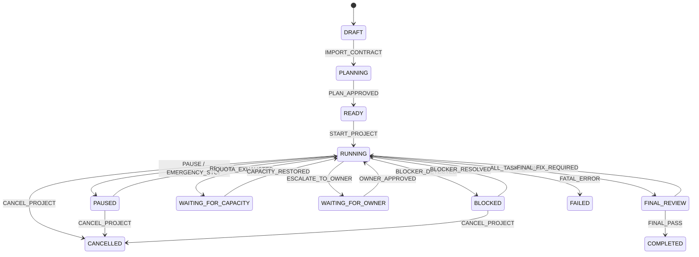
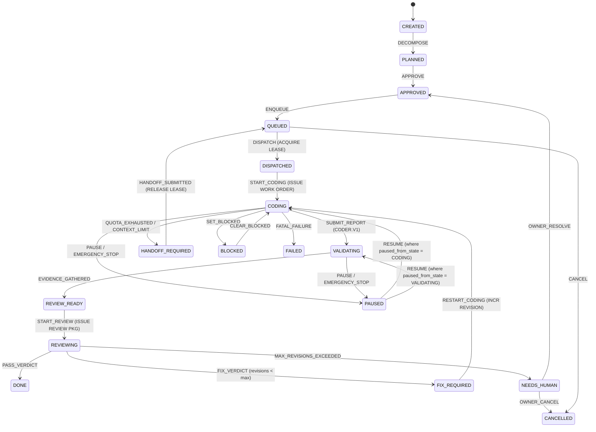

# State Machines & Lifecycle Specifications

Agent-Forge enforces strict, deterministic state machines for both **Projects** and **Tasks**. Arbitrary UI mutations are impossible; every transition is validated centrally by `ProjectStateMachine` and `TaskStateMachine`.

---

## 1. Project State Machine

### Project States
| State | Description |
| :--- | :--- |
| `DRAFT` | Initial state. Project settings, repositories, and contracts are configured. |
| `PLANNING` | Objectives imported; Manager decomposing initial milestone and tasks. |
| `READY` | Tasks planned and approved; awaiting owner start signal. |
| `RUNNING` | Active task dispatch and orchestration in progress. |
| `PAUSED` | Execution frozen by owner or Emergency Stop. State preserved. |
| `BLOCKED` | Unresolved blocking dependency or policy rejection halting project. |
| `WAITING_FOR_CAPACITY` | All eligible provider models exhausted; waiting for quota reset or reassignment. |
| `WAITING_FOR_OWNER` | High-authority decision required (e.g. architecture exception, production deploy). |
| `FINAL_REVIEW` | All tasks completed; owner performing final verification and sign-off. |
| `COMPLETED` | Project successfully finished and verified. |
| `FAILED` | Unrecoverable failure. |
| `CANCELLED` | Aborted by owner. |

### Project Transition Matrix

---

## 2. Task State Machine

### Task States
| State | Description |
| :--- | :--- |
| `CREATED` | Task initialized with basic description. |
| `PLANNED` | Manager decomposed task with acceptance criteria and constraints. |
| `APPROVED` | Task authorized for dispatch. |
| `QUEUED` | Placed into dispatch queue awaiting available agent slot. |
| `DISPATCHED` | Assigned to agent; lock acquired. |
| `CODING` | Work Order issued; coder actively implementing. |
| `VALIDATING` | Coder submitted report; automated Git diff & test verification running. |
| `REVIEW_READY` | Real evidence collected; Review Package prepared for Manager. |
| `REVIEWING` | Manager evaluating evidence against criteria. |
| `PAUSED` | Execution paused (Emergency Stop / manual). `paused_from_state` recorded. |
| `FIX_REQUIRED` | Manager returned fix request. `revision_count` incremented. |
| `HANDOFF_REQUIRED` | Quota/context exhausted or crash. Checkpoint & Handoff generated. |
| `WAITING_FOR_CAPACITY` | No capable coder available for this task. |
| `WAITING_FOR_AUTHORITY` | Requires higher decision authority approval. |
| `BLOCKED` | Blocked by failed prerequisite task or environment issue. |
| `NEEDS_HUMAN` | Revisions exceeded `max_revisions` (default 3) or fatal protocol error. |
| `DONE` | Manager issued `PASS` verdict. Evidence permanently sealed. |
| `FAILED` | Terminal task failure. |
| `CANCELLED` | Cancelled by owner. |

### Task Transition Matrix

---

## 3. Pause & Resume Semantics

### Deterministic State Preservation
When an Emergency Stop or manual Pause is triggered:
1. `tasks.paused_from_state` records the exact active state (`CODING`, `VALIDATING`, or `REVIEWING`).
2. Child processes attached to the task are cancelled safely.
3. The task state transitions to `PAUSED`.
4. The task lease is preserved (or extended with an emergency hold).

### Deterministic Resume
When the owner resumes the project or task:
1. Agent-Forge verifies that `paused_from_state` is valid.
2. The task transitions back to its previous state (`paused_from_state`).
3. `paused_from_state` is cleared to `NULL`.
4. Work orders / test commands resume execution cleanly.

---

## 4. Revision & Loop Protection

To prevent runaway AI loops and infinite retry ping-pong:

1. **Configurable Limit**: `max_revisions` defaults to `3` per task.
2. **Issue Severity Classification**:
   - `BLOCKER`: Core requirement violated, severe regression, or security flaw.
   - `REQUIRED`: Acceptance criteria missing or test failure.
   - `OPTIONAL`: Suggestion that does not block completion.
   - `NIT`: Minor styling or formatting remark.
3. **Trigger Rules**:
   - Only `BLOCKER` and `REQUIRED` issues can trigger a `FIX_REQUIRED` transition.
   - `OPTIONAL` and `NIT` issues are recorded as advisory notes and do not increment revisions.
4. **Escalation**:
   - If `revision_count >= max_revisions`, the task automatically transitions to `NEEDS_HUMAN`, freezing automated retry until the owner intervenes.
